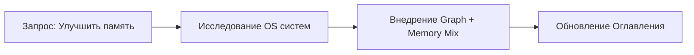

# Memory Snapshot: 2026-04-21_Memory_Upgrade_Session

## Контекст Сессии
Пользователь инициировал исследование и внедрение "top-tier" навыков памяти и разработки для ИИ.

## Ключевые Решения и Изменения
- **Анализ**: Сравнение MemGPT, MCP Memory и Zep с текущей системой AGrav.
- **Инфраструктура**: Согласовано внедрение "Микса" технологий:
    - **Граф Знаний**: Создан `00_Система/Relationships.md` для отслеживания архитектурных связей.
    - **Иерархия Памяти**: Создана структура `05_Память/Snapshots` для долгосрочного хранения контекста.
- **Навыки**: Обновлен файл `Скиллы_ИИ.md` с новыми инструкциями по поддержанию графа и компрессии памяти.

## Граф Связей (Обновление)

## Статус проекта
- [x] Создание Relationships.md 
- [x] Создание структуры Snapshots
- [x] Обновление Скиллы_ИИ.md
- [x] Обновление Оглавление.md
- [x] Первый снапшот памяти

---
*Сгенерировано Antigravity в рамках реализации навыка "Memory Compressor".*
