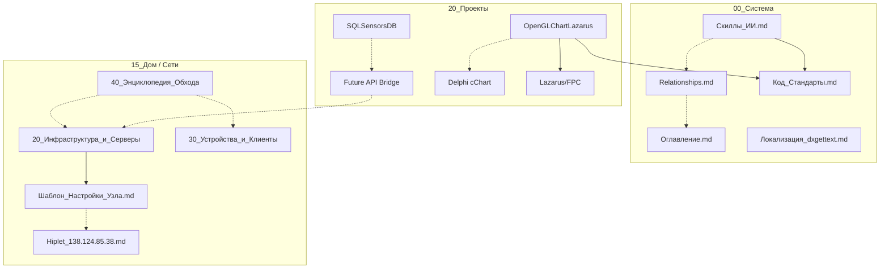

# Граф Знаний и Связей (Relationships)

Данный файл служит "картой памяти" репозитория AGrav, отслеживая зависимости между проектами, устройствами и методологиями.

## Легенда
- **Depends On** (-->): Компонент требует наличия другого для работы.
- **Implements** (--|>): Реализация абстрактной методики.
- **References** (-.-): Информационная связь.

## Карта Проектов и Систем

## Реестр Зависимостей (Log)

| Откуда | Куда | Тип связи | Описание |
| :--- | :--- | :--- | :--- |
| `Скиллы_ИИ.md` | `Код_Стандарты.md` | Depends On | Основные технические правила вынесены в стандарт. |
| `20_Инфраструктура_и_Серверы` | `Шаблон_Настройки_Узла.md` | Implements | Вся инфраструктура теперь строится по единому шаблону. |
| `SQLSensorsDB` | `15_Дом/Инфраструктура` | Potential Bridge | Планируемая связь для передачи данных с домашних датчиков в БД. |
| `OpenGLChartLazarus` | `Delphi cChart` | References | Новый Lazarus/FPC-компонент проектируется по мотивам существующего Delphi-компонента из `sharedUtils/компоненты/chart_dpk/chart`. |
| `OpenGLChartLazarus` | `Lazarus/FPC` | Depends On | Целевая среда разработки и компиляции кроссплатформенного компонента. |
| `40_Энциклопедия_Обхода` | `15_Дом/Сети` | Knowledge Source | Синтезированный справочник по методам обхода DPI. |
| `Локализация_dxgettext.md` | `Разработка_Delphi` | References | Инструмент для локализации проектов на Delphi. |

---
*Документ обновляется ИИ при каждом значимом изменении архитектуры или добавлении новых узлов.*
