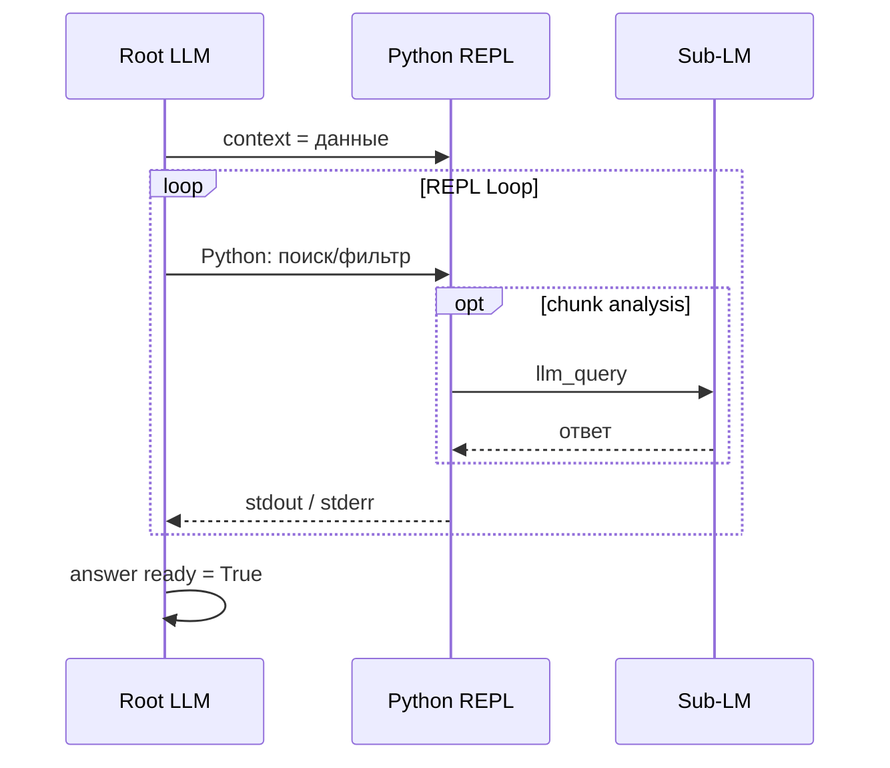

# RLM — справочник (теория и Python)

Связанные материалы:

- [Архитектура RLM](../../10_Работа/Программирование/Методологии/Recursive_Language_Models.md)
- [Навык для агентов](./SKILL.md) — краткий протокол выполнения задач
- Cursor: `~/.cursor/skills/rlm-search/SKILL.md`

## Суть (MIT CSAIL)

**Context rot:** при подаче всего текста в промпт модель теряет детали в середине и дорожает с каждым шагом.

**RLM:** контекст лежит в среде выполнения; Root LLM пишет код для фильтрации/поиска, вызывает `llm_query` для фрагментов и `rlm_query` для подзадач.

## API песочницы

| Имя | Назначение |
|-----|------------|
| `context` | Исходные данные (текст, пути, БЗ) |
| `answer` | `{"content": "", "ready": False}` — флаг завершения |
| `llm_query(prompt, chunk?)` | Дешёвая модель для анализа куска |
| `rlm_query(prompt)` | Дочерний RLM-агент |
| `SHOW_VARS()` | Состояние переменных сессии |

## Схема



## Ограничения

- `max_depth` для `rlm_query`: 3
- `max_steps` REPL-цикла: 5–10 на задачу
- Без деструктивных операций вне песочницы

## Python-обёртка (шаблон)

```python
import sys
import io
import traceback
from typing import Dict, Any

class AnswerDict(dict):
    def __init__(self, callback):
        super().__init__()
        super().__setitem__("content", "")
        super().__setitem__("ready", False)
        self._callback = callback

    def __setitem__(self, key, value):
        super().__setitem__(key, value)
        if key == "ready" and value:
            self._callback(self.get("content", ""))

SAFE_BUILTINS = {
    "print": print, "len": len, "str": str, "int": int, "float": float,
    "list": list, "dict": dict, "set": set, "tuple": tuple, "bool": bool,
    "enumerate": enumerate, "zip": zip, "range": range, "min": min, "max": max,
    "abs": abs, "sum": sum, "Exception": Exception, "ValueError": ValueError,
}

class RLMEnvironment:
    def __init__(self, context_payload: Any):
        self.globals = {"__builtins__": SAFE_BUILTINS, "__name__": "__main__"}
        self.locals = {}
        self.globals["llm_query"] = self.llm_query
        self.globals["rlm_query"] = self.rlm_query
        self.globals["SHOW_VARS"] = self.show_vars
        self.locals["context"] = context_payload
        self.locals["answer"] = AnswerDict(callback=self._capture_answer)
        self.final_answer = None

    def _capture_answer(self, content: str):
        self.final_answer = content

    def show_vars(self) -> str:
        vars_dict = {
            k: type(v).__name__
            for k, v in self.locals.items()
            if not k.startswith("_") and k != "answer"
        }
        return f"Variables: {vars_dict}" if vars_dict else "No variables yet."

    def llm_query(self, prompt: str, chunk: str = "") -> str:
        return f"[Sub-LM stub: {prompt[:60]}]"

    def rlm_query(self, prompt: str) -> str:
        child_env = RLMEnvironment(context_payload=self.locals["context"])
        child_code = (
            "answer['content'] = 'subtask done'; answer['ready'] = True"
        )
        result = child_env.execute(child_code)
        return result.get("final_answer") or ""

    def execute(self, code_str: str) -> Dict[str, Any]:
        stdout_buf = io.StringIO()
        stderr_buf = io.StringIO()
        old_stdout, old_stderr = sys.stdout, sys.stderr
        sys.stdout, sys.stderr = stdout_buf, stderr_buf
        try:
            ns = {**self.globals, **self.locals}
            exec(code_str, ns, ns)
            for k, v in ns.items():
                if k not in self.globals and not k.startswith("_"):
                    self.locals[k] = v
            stdout, stderr = stdout_buf.getvalue(), stderr_buf.getvalue()
        except Exception:
            stdout = stdout_buf.getvalue()
            stderr = stderr_buf.getvalue() + traceback.format_exc()
        finally:
            sys.stdout, sys.stderr = old_stdout, old_stderr
        return {
            "stdout": stdout,
            "stderr": stderr,
            "final_answer": self.final_answer,
        }
```

## Интеграция в AGrav

1. Длинные vault-экспорты и логи — не в промпт целиком, а через RLM-цикл.
2. `rlm_query` — отдельные ветки (один модуль, один стенд).
3. Итоги durable — в `90_Архив/История_изменений.md` и `Relationships.md`.
