# 🔍 Индексатор БЗ: Описание Работы Инструмента и Навыка ИИ

В данном документе описывается технический принцип работы инструментария индексации базы знаний (БЗ) и практическое применение соответствующего системного навыка ИИ.

---

## 1. Как работает Инструмент (Под капотом)

Процесс синхронизации и обслуживания векторной БД выполняется скриптом `vault_indexer.py` в локальном режиме. 

### 1.1. Двухэтапная сверка изменений (YAML + MD5)
Для предотвращения избыточной отправки файлов на эмбеддинг используется пофайловое сравнение:
1. **Чтение метаданных**: Скрипт парсит YAML frontmatter в начале каждого файла `.md`. Если блока нет, генерируется новый `memory_id` (UUIDv4).
2. **Хэширование контента**: Вычисляется MD5-хэш от текста заметки *после* YAML frontmatter.
3. **Сравнение**: Вычисленный хэш сверяется со значением `hash` из frontmatter.
   - Если хэши совпадают — файл пропускается (уже проиндексирован).
   - Если хэши различаются (или файла не было в БД) — файл отправляется на генерацию эмбеддингов, а обновленный YAML-блок (`memory_id`, `hash`, `last_indexed`) вшивается обратно в начало файла.

### 1.2. Смысловой чанкинг (Markdown Chunker)
Подача всей большой заметки на векторный поиск неэффективна (размывается смысл). Поэтому текст разбивается на чанки:
- **Граница разделов**: Текст режется по заголовкам Markdown (символы `# `, `## `, `### `).
- **Склеивание контекста**: В начало каждого чанка принудительно подмешивается имя файла и название текущего заголовка (например: `В файле "15_Дом/Сети.md", раздел "Настройка Reality": <текст чанка>`), чтобы вектор эмбеддинга точнее отражал контекст.
- **Ограничение длины**: Если раздел превышает **3000 символов**, он разбивается по границам параграфов (`\n\n`) на части `(часть 1)`, `(часть 2)`.

### 1.3. Локальные Эмбеддинги и Хранилище (FastEmbed + Qdrant)
- Векторизация выполняется библиотекой `fastembed` через ONNX-модель `sentence-transformers/paraphrase-multilingual-MiniLM-L12-v2`. Она полностью автономна и не требует доступа в интернет.
- Векторы размерностью 384 сохраняются в коллекцию `vault_notes` в файловой Qdrant БД (`memory_store.db` на базе SQLite).
- Детерминированные UUID для точек Qdrant генерируются на основе `uuid.uuid5(UUID(memory_id), "chunk_<index>")`. Это позволяет легко перезаписывать или удалять чанки для конкретного файла без дублирования.

---

## 2. Как работает Навык ИИ (Сценарий Взаимодействия)

Навык использования векторного поиска предназначен для экономии токенов и ускорения ответов ИИ-агента. 

### 2.1. Алгоритм поиска знаний для ИИ
Когда пользователь ставит перед агентом задачу (например, "Как настроить VLESS в роутере?"), агент действует по следующему сценарию:

```mermaid
sequenceDiagram
    participant User as Пользователь
    participant Agent as ИИ-Агент
    participant DB as MCP: MemoryDB
    participant Disk as Локальный Диск (Filesystem)

    User->>Agent: Задает вопрос по БЗ (VLESS Reality)
    
    rect rgb(30, 41, 59)
        Note over Agent: Шаг 1: Семантический поиск
        Agent->>DB: search_vault_notes("настройка VLESS Reality")
        DB-->>Agent: Возвращает топ-3 релевантных чанка с путями к файлам
    end
    
    rect rgb(30, 41, 59)
        Note over Agent: Шаг 2: Анализ фрагментов
        Agent->>Agent: Выделяет ключевые факты из чанков
        opt Если в чанках не хватает деталей
            Agent->>Disk: view_file("15_Дом/Сети/12_Настройка_VLESS_Reality.md", StartLine, EndLine)
            Disk-->>Agent: Читает только нужный кусок кода/конфига
        end
    end
    
    Agent-->>User: Выдает точный, краткий ответ
```

### 2.2. Порядок действий при изменении базы знаний
Если ИИ-агент создает новые инструкции или изменяет существующие файлы заметок:
1. Агент сохраняет изменения в файл `.md` на диске.
2. Агент **обязательно** вызывает инструмент `sync_vault_notes()`.
3. Индексатор сканирует этот файл, видит несовпадение хэшей, пересчитывает эмбеддинги чанков в Qdrant и вшивает в файл актуальный `hash` и `last_indexed`.
4. Индекс обновлен и готов к семантическому поиску в последующих сессиях.
