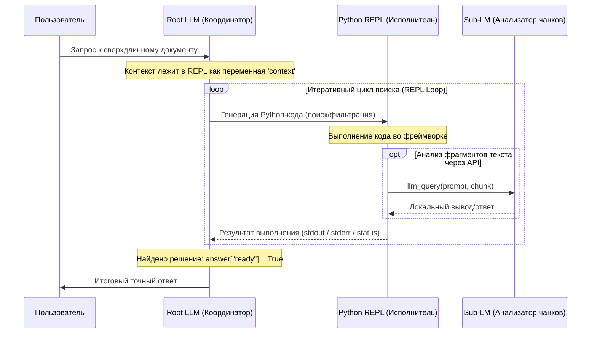

# 🧠 Архитектура RLM (Recursive Language Models)

Методология интерактивного и рекурсивного управления сверхдлинным контекстом на базе исследования **MIT CSAIL** ("Recursive Language Models") для решения проблемы **Context Rot** (деградации фокуса модели в длинных диалогах) и ограничений классического RAG.

---

## 🎯 Суть проблемы и решение

### Проблема (Context Rot & Lost in the Middle)
Современные LLM (Claude, GPT) имеют контекстные окна до 1-2 млн токенов. Однако при передаче гигантских объемов текста напрямую в промпт:
1. **Качество падает**: ИИ теряет фокус, упускает детали в середине текста ("lost in the middle").
2. **Стоимость растет**: Каждый новый шаг диалога требует повторной обработки всего контекста, что экспоненциально увеличивает расходы.
3. **Теряется структура**: Обычный поиск (RAG) делит текст на несвязанные куски (chunks), теряя глобальную структуру документа.

### Решение (RLM)
Вместо передачи всего контекста в промпт ИИ, текст загружается в изолированную среду выполнения (**Python REPL**). 
* **Root LLM** выступает в роли "программиста/исследователя", генерируя Python-код для обработки контекста.
* Через API среды выполнения Root LLM может вызывать дешевые и быстрые вспомогательные модели (**Sub-LMs**) для локального анализа частей текста.
* При необходимости Root LLM может запускать **рекурсивный поиск** (новый дочерний RLM-агент) для глубокого анализа подзадач.

---

## 🏗️ Архитектура и компоненты системы

### Схема взаимодействия (Mermaid)



---

## 🔌 API Среды Выполнения (REPL Environment)

Внутри REPL Root-модели доступны следующие переменные и методы:

1. `context`: Исходный сверхдлинный текст (или структурированный объект).
2. `answer`: Специальный словарь `{"content": "", "ready": False}`. Для завершения работы модель обязана установить `answer["ready"] = True`.
3. `llm_query(prompt)`: Вызов быстрой/дешевой вспомогательной модели без инструментов. Используется для суммаризации или извлечения данных из найденного куска.
4. `rlm_query(prompt)`: Рекурсивный вызов нового экземпляра RLM (дочернего агента) со своим REPL-циклом для решения сложной подзадачи.
5. `SHOW_VARS()`: Вывод списка всех объявленных в сессии переменных для отслеживания состояния.

---

## 📝 Системный промпт для Root LLM

```markdown
Вы — агент-исследователь RLM (Recursive Language Model).
Вам доступен сверхдлинный контекст, который загружен в локальную среду выполнения Python в переменной `context`.
Ваша задача — ответить на вопрос пользователя, используя интерактивное написание кода в блоках ```repl ... ```.

Правила работы:
1. Вы не видите весь контекст напрямую. Вы должны писать код на Python для его фильтрации, поиска по ключевым словам, регулярным выражениям или разбиения на части.
2. Для анализа фрагментов текста вы можете использовать функцию `llm_query(prompt)`, которая вызывает вспомогательный ИИ.
3. Если перед вами стоит сложная логическая подзадача, вызовите `rlm_query(prompt)` для запуска дочернего RLM-агента.
4. Переменные сохраняются между шагами выполнения кода.
5. Для завершения работы запишите ответ в словарь `answer` следующим образом:
   answer["content"] = "Ваш финальный ответ..."
   answer["ready"] = True
```

---

## 💻 Python-реализация REPL-обертки (Пример кода)

```python
import sys
import io
import traceback
from typing import Dict, Any

class AnswerDict(dict):
    """Специальный словарь с коллбэком для перехвата флага завершения."""
    def __init__(self, callback):
        super().__init__()
        super().__setitem__("content", "")
        super().__setitem__("ready", False)
        self._callback = callback

    def __setitem__(self, key, value):
        super().__setitem__(key, value)
        if key == "ready" and value:
            self._callback(self.get("content", ""))

# Безопасные встроенные функции Python (блокируем eval/exec/compile напрямую в коде модели)
SAFE_BUILTINS = {
    "print": print, "len": len, "str": str, "int": int, "float": float,
    "list": list, "dict": dict, "set": set, "tuple": tuple, "bool": bool,
    "enumerate": enumerate, "zip": zip, "range": range, "min": min, "max": max,
    "abs": abs, "sum": sum, "Exception": Exception, "ValueError": ValueError,
}

class RLMEnvironment:
    def __init__(self, context_payload: Any):
        self.globals = {
            "__builtins__": SAFE_BUILTINS,
            "__name__": "__main__"
        }
        self.locals = {}
        
        # Инъекция RLM API
        self.globals["llm_query"] = self.llm_query
        self.globals["rlm_query"] = self.rlm_query
        self.globals["SHOW_VARS"] = self.show_vars
        
        # Инъекция переменных данных
        self.locals["context"] = context_payload
        self.locals["answer"] = AnswerDict(callback=self._capture_answer)
        
        self.final_answer = None

    def _capture_answer(self, content: str):
        self.final_answer = content

    def show_vars(self) -> str:
        vars_dict = {k: type(v).__name__ for k, v in self.locals.items() if not k.startswith("_") and k != "answer"}
        return f"Variables: {vars_dict}" if vars_dict else "No variables created yet."

    def llm_query(self, prompt: str) -> str:
        """Интерфейс обращения к дешевой вспомогательной модели."""
        # Реальная интеграция: вызов OpenAI API / Anthropic API (например, Claude 3.5 Haiku)
        return f"[Ответ вспомогательного ИИ на запрос: {prompt[:60]}...]"

    def rlm_query(self, prompt: str) -> str:
        """Рекурсивный запуск дочернего RLM агента."""
        print(f"--> [RLM] Запуск дочерней сессии для подзадачи: {prompt[:60]}...")
        child_env = RLMEnvironment(context_payload=self.locals["context"])
        
        # Пример: дочерняя сессия выполняет свой код (имитируем работу дочернего ИИ)
        child_code = "answer['content'] = 'Данные подзадачи успешно извлечены'; answer['ready'] = True"
        result = child_env.execute(child_code)
        return result["final_answer"]

    def execute(self, code_str: str) -> Dict[str, Any]:
        """Запуск блока кода в персистентном контексте locals."""
        stdout_buf = io.StringIO()
        stderr_buf = io.StringIO()
        
        old_stdout, old_stderr = sys.stdout, sys.stderr
        sys.stdout, sys.stderr = stdout_buf, stderr_buf
        
        try:
            # Слияние контекстов для выполнения
            combined_namespace = {**self.globals, **self.locals}
            exec(code_str, combined_namespace, combined_namespace)
            
            # Сохранение созданных моделью переменных обратно в locals
            for k, v in combined_namespace.items():
                if k not in self.globals and not k.startswith("_"):
                    self.locals[k] = v
            
            # Защита системных переменных от случайного удаления/затирания моделью
            self.locals["context"] = self.locals.get("context_0", self.locals.get("context"))
            if not isinstance(self.locals.get("answer"), AnswerDict):
                old_ans = self.locals.get("answer")
                self.locals["answer"] = AnswerDict(callback=self._capture_answer)
                if isinstance(old_ans, dict) and old_ans.get("ready"):
                    self._capture_answer(old_ans.get("content", ""))
            
            stdout, stderr = stdout_buf.getvalue(), stderr_buf.getvalue()
        except Exception as e:
            stdout = stdout_buf.getvalue()
            stderr = stderr_buf.getvalue() + traceback.format_exc()
        finally:
            sys.stdout, sys.stderr = old_stdout, old_stderr
            
        return {
            "stdout": stdout,
            "stderr": stderr,
            "final_answer": self.final_answer
        }

# ==========================================
# ПРИМЕР ИСПОЛЬЗОВАНИЯ
# ==========================================
if __name__ == "__main__":
    # Сверхдлинный контекст
    env = RLMEnvironment(context_payload="База данных содержит секретный код в секции #99: 'AGrav_Active_2026'")
    
    # Модель генерирует код для поиска информации
    model_generated_code = """
print("Анализ контекста...")
if "секции #99" in context:
    # Запускаем рекурсивный агент для точечной работы
    res = rlm_query("Найти точное значение секретного кода в секции #99")
    print(f"Результат дочерней сессии: {res}")
    
    # Формируем ответ
    answer["content"] = f"Код найден: {res} (из секции #99)"
    answer["ready"] = True
"""
    result = env.execute(model_generated_code)
    print("STDOUT:", result["stdout"])
    print("ФИНАЛЬНЫЙ ОТВЕТ:", result["final_answer"])
```

---

## 🛠️ Как интегрировать RLM в систему AGrav

Для применения RLM на практике в AGrav-агентах необходимо:
1. **Написать Docker-контейнер**: Python REPL среда должна исполняться в изолированной от хоста песочнице (sandbox), чтобы предотвратить вредоносные действия генерируемого кода.
2. **Определить протокол обмена**:
   * Root-модель получает на вход пользовательский промпт и историю REPL-вывода.
   * Root-модель возвращает либо блок кода ` ```repl ... ``` `, либо финальный ответ.
3. **Оптимизировать расходы**:
   * Ограничивать максимальное количество итераций (max REPL steps = 5..10).
   * Ограничивать вложенность рекурсивных RLM-вызовов (max depth = 2..3).
   * Использовать дешевые модели для `llm_query` (например, Gemini Flash или Claude Haiku).

---

## 🔗 Relationships
- [🤖 Инструкция AI (README)](../../../README_AI.md)
- [⚙️ Системное Оглавление](../../../00_Система/Оглавление.md)
