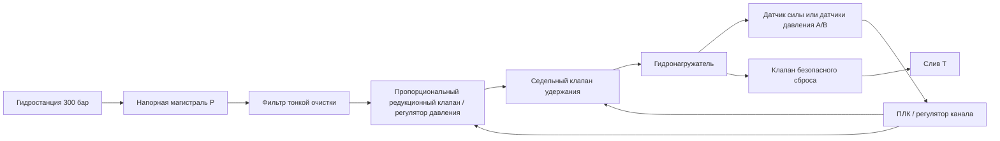
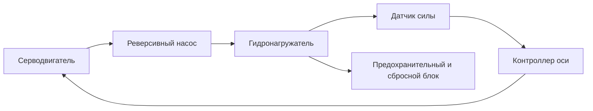
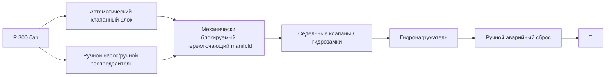
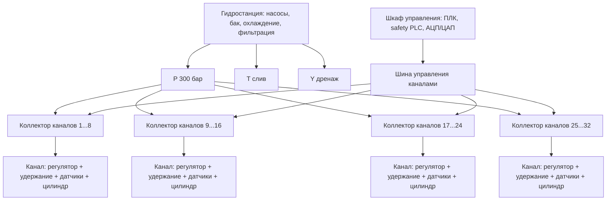
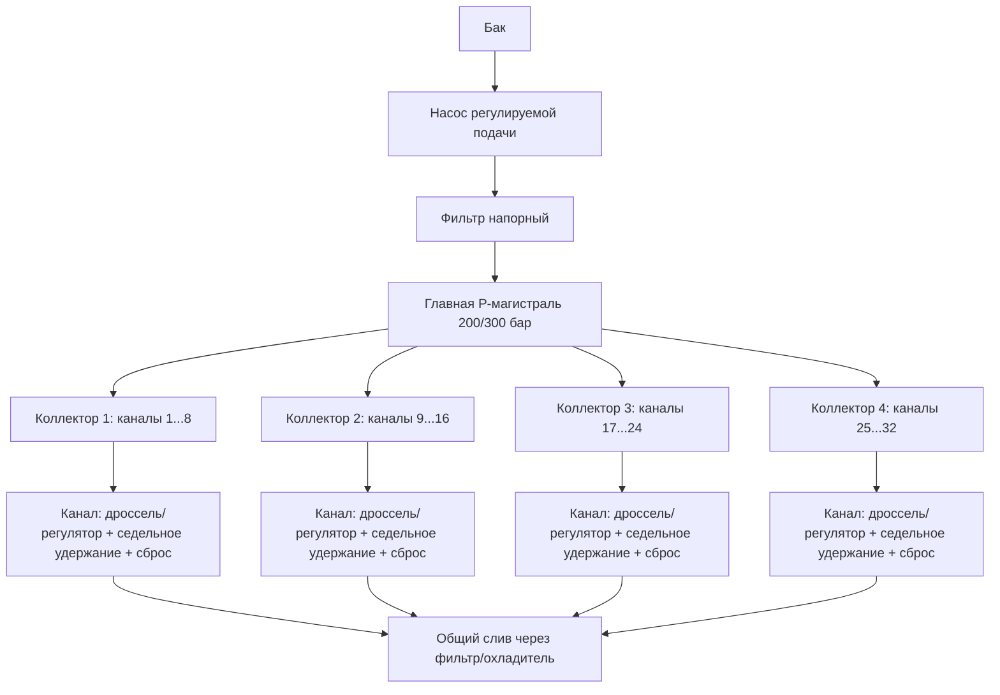

# Анализ построения статзала на гидронагружателях

Дата: 2026-05-05  
Исходные данные: ТЗ - давление 300 бар, режимы статические, перемещения малые, усилия 1...50 тс, 32 канала.  
Проанализированный файл: `C:\Users\SkripnikAA\Desktop\сравнение.html`.

## 1. Короткий вывод

Отчет Qwen полезен как справка по клапанам Duplomatic DSH5, DS5, DXJ5, но не решает задачу статзала. В нем сравниваются распределители, а для статического нагружения главным является не направление потока, а точное и безопасное удержание силы на 32 независимых каналах при малых перемещениях.

Для такого статзала лучше строить канал как сервогидравлический модуль усилия:

- гидроцилиндр/гидронагружатель, рассчитанный на 300 бар с запасом по давлению;
- датчик силы или два датчика давления на полостях цилиндра;
- пропорциональный редукционный/серво-пропорциональный контур давления для плавного набора усилия;
- гидрозамки или седельные клапаны удержания нагрузки;
- отдельный клапан безопасного сброса/разгрузки;
- ручной резерв не как параллельный DSH5 к тому же исполнительному органу, а как изолируемый аварийный режим с механической блокировкой автоматического контура.

DXJ5 можно рассматривать для точного управления расходом/скоростью/положением, но как базовый клапан для 32 статических каналов он избыточен и проблемен: дорогой, требовательный к чистоте, имеет утечки золотникового типа и сам по себе не удерживает статическую силу без закрывающих клапанов.

## 2. Проверка исходного HTML-отчета

### Что в отчете верно

- Правильно выделены классы клапанов: DSH5 - ручной распределитель, DS5 - дискретный электромагнитный, DXJ5 - сервоклапан/серво-пропорциональный клапан с обратной связью по золотнику.
- Верно отмечено, что DS5/DSH5 относятся к ISO 4401-05 и дают расход порядка 150 л/мин, а DXJ5 относится к точному пропорциональному управлению.
- Верно замечено, что для ручного резерва нужна блокировка одновременной работы автоматического и ручного контуров.

### Основные ошибки и слабые места

1. Задача статзала подменена задачей выбора распределителя. Для усилий 1...50 тс надо считать цилиндры, датчики силы/давления, удержание нагрузки, утечки, гидравлическую жесткость, безопасность и одновременность работы 32 каналов.

2. Схема резервирования с параллельными DXJ5 и DSH5 некорректна. Для двустороннего цилиндра нельзя ограничиться "3-ходовым переключателем потока". Нужно развязывать как минимум линии P/T/A/B, либо применять отдельный изолируемый ручной контур через 6/2, 4/2, блок кранов/седельных клапанов или сменный сервисный manifold. Иначе возможны перетечки, обратное питание, конфликт золотников и неконтролируемое движение.

3. Нет удержания нагрузки. Золотниковые распределители и сервоклапаны имеют внутренние утечки. Для статического удержания силы нужны гидрозамки, управляемые обратные клапаны, седельные клапаны или отдельная схема "нагрузить - закрыть - контролировать падение".

4. DXJ5 в отчете выбран как основной вариант почти автоматически. Для статического нагружения он не всегда лучший: при малых перемещениях чаще рациональнее регулировать давление/силу, а не расход. Нужны пропорциональные редукционные клапаны, сервоклапан давления, насос с регулируемым давлением на группу каналов или электрогидростатические оси, если требуется высокая независимость.

5. Расчеты расхода через клапан почти не связаны с ТЗ. В статике расход нужен только на подвод, компенсацию деформаций и утечек. Основные расчеты: диаметр цилиндра, минимально управляемое давление для 1 тс, разрешение датчиков, сжимаемость масла/рукавов, тепловыделение от дросселирования и утечки.

6. Расчет "усилия на золотнике" не нужен для выбора статзала и может вводить в заблуждение. Нужен расчет усилия на штоке:

   `F = pA * Aпоршня - pB * Aкольцевая`

7. Не учтен диапазон 1...50 тс. Это отношение 1:50. Если одним цилиндром на 300 бар получать 50 тс, то 1 тс соответствует примерно 6 бар в поршневой полости. Это уже зона, где трение уплотнений, гистерезис, разрешение датчика и перепады в линиях могут стать соизмеримыми с полезным сигналом.

8. Не учтена чистота масла. Для сервоклапанов нужна более жесткая фильтрация, чем для обычных распределителей. В 32-канальной системе это влияет на стоимость фильтрации, промывку трубопроводов, регламент обслуживания и отказоустойчивость.

9. Не разделены режимы "набор усилия", "удержание", "сброс", "аварийный сброс", "ручное управление". Для статзала эти режимы надо проектировать явно.

10. В таблице есть риск смешения серий/каталогов. На официальной странице Duplomatic для DSH* указаны `Max Operating Pressure: 350 bar`, `Max Flow: 150 l/min`, а для DS5 - `320 bar`, `150 l/min`. Для DXJ5 в текущем списке сервоклапанов Duplomatic указано до `350 bar` и `160 l/min`. В отчете DXJ5 приведен как 60...100 л/мин, что может относиться к конкретной старой серии или исполнению. При заказе надо фиксировать полный код изделия и актуальный PDF-каталог.

Источники для сверки:

- Duplomatic DSH*: https://duplomaticmotionsolutions.com/en/dsh.html
- Duplomatic DS5: https://duplomaticmotionsolutions.com/en/ds5.html
- Duplomatic servo-proportional valves, DXJ5: https://duplomaticmotionsolutions.com/en/servo-proportional-valves.html

## 3. Расчетная оценка гидронагружателя

При давлении 300 бар:

`p = 300 бар = 30 МПа`

`A = F / p`

| Усилие | Усилие, Н | Требуемая площадь | Эквивалентный диаметр поршня |
| --- | ---: | ---: | ---: |
| 1 тс | 9 807 Н | 327 мм2 | 20,4 мм |
| 10 тс | 98 066 Н | 3 269 мм2 | 64,5 мм |
| 25 тс | 245 166 Н | 8 172 мм2 | 102 мм |
| 50 тс | 490 333 Н | 16 344 мм2 | 144 мм |

Практический вывод: для 50 тс при 300 бар нужен цилиндр примерно 145 мм по поршню, но с учетом трения, потерь, запаса и стандартных размеров вероятнее смотреть 150...160 мм. Для нижней границы 1 тс такой цилиндр будет работать на низком давлении около 6 бар, поэтому точность силы по давлению может быть плохой. Если нужна хорошая точность на 1 тс и 50 тс, лучше делить каналы по диапазонам или применять датчик силы.

## 4. Предлагаемая архитектура канала

### Вариант А - точное статическое усилие

Подходит, если главное - удерживать заданную силу, а скорость перемещения мала и не критична.

Плюсы: проще удерживать силу, меньше расход в статике, можно закрыть канал и контролировать падение усилия.  
Минусы: хуже для быстрого позиционирования, нужна грамотная логика разгрузки и компенсации ползучести/утечек.

### Вариант Б - сервоклапан расхода/положения плюс контур силы

Подходит, если кроме силы нужна динамика, позиционирование или профили перемещения.

Плюсы: универсальность, точное движение, можно делать профили нагружения.  
Минусы: дорого на 32 канала, высокие требования к фильтрации, нагрев от дросселирования, утечки не позволяют считать клапан элементом удержания.

### Вариант В - насос/сервонасос на канал или группу каналов

Подходит, если важна энергоэффективность и долгое удержание силы.

Плюсы: мало дроссельных потерь, хорошее удержание при малых скоростях, меньше общий расход станции.  
Минусы: дороже по приводам, сложнее компоновка 32 каналов.

## 5. Ручной резерв

Ручной резерв должен отвечать на вопрос: что оператор делает вручную - нагружает, удерживает, разгружает или только переводит канал в безопасное состояние?

Для 32 каналов полноценное ручное управление каждым цилиндром через DSH5 может стать громоздким и опасным. Лучше разделить:

- аварийное ручное разгружение каждого канала;
- ручной сервисный подвод/отвод на малой скорости;
- ручная фиксация/изоляция канала;
- запрет одновременного ручного и автоматического управления.

Принципиальная схема ручного резерва:

Ключевой нюанс: резерв должен быть не просто "еще один распределитель рядом", а гидравлически развязанный режим. Нужны блокировки, чтобы оператор не мог открыть ручной контур при активном автоматическом давлении без понятного сценария.

## 6. Общая схема 32-канального статзала

Для 32 каналов стоит группировать манифолды по 4 или 8 каналов. Это упростит трубопроводы, диагностику, промывку, ремонт и локализацию утечек.

## 7. Нюансы, которые надо учесть в ТЗ

1. Точность усилия: абсолютная ошибка в тс или проценты от диапазона. Без этого нельзя выбрать датчики и клапаны.

2. Одновременность: могут ли все 32 канала одновременно набирать усилие, или нагружение последовательное. Это определяет расход, насосы, аккумуляторы и тепловую мощность.

3. Скорость набора усилия и допустимое перерегулирование. Для статзала часто важнее мягкий подход к заданию, чем быстродействие 20 мс.

4. Нужен ли контроль перемещения. Даже при "малых перемещениях" нужен датчик хода для ограничения, диагностики заклинивания, контакта с объектом и аварий.

5. Диапазон 1...50 тс одним цилиндром может дать плохую точность внизу. Надо решить: один универсальный гидронагружатель или несколько типоразмеров.

6. Измерение силы лучше делать тензодатчиком/датчиком нагрузки. Расчет по давлению годится для грубой оценки, но зависит от трения, давления в обратной полости, ориентации цилиндра, уплотнений и температуры.

7. Если сила считается по давлению, нужны датчики на обеих полостях цилиндра, а не один датчик в напорной линии.

8. Компоненты при 300 бар лучше выбирать с номиналом не ниже 350 бар, а для импульсов и ресурса рассмотреть 420 бар на критичных элементах.

9. Линия T и дренаж Y не должны получать недопустимое противодавление. Для сервоклапанов и части пропорциональных клапанов это критично.

10. В статике надо ограничивать тепловыделение: не держать давление через постоянно приоткрытый дроссель без необходимости.

11. Нужны предохранительные клапаны на каждом канале или группе каналов, а не только общий клапан станции.

12. Нужна процедура удаления воздуха. Воздух резко снижает жесткость канала, портит точность и может давать рывки.

13. Рукава на 300 бар при 32 каналах дадут заметную упругость. Для точной статики лучше короткие жесткие трубки, минимальный объем масла между клапаном и цилиндром.

14. Обязательна логика безопасного сброса: при потере питания клапаны должны перейти в понятное состояние, а нагрузка не должна самопроизвольно сорваться.

15. Для сервоклапанов нужна чистота масла уровня примерно ISO 17/15/12 или лучше, отдельная промывка трубопроводов и контроль фильтров.

16. Нужна диагностика утечек: падение усилия при закрытом удерживающем клапане, дрейф давления, перегрев, недостижение задания.

17. Нужно заранее определить, что делать при отказе одного канала: останов всего стенда или изоляция канала и продолжение.

18. Для ручного резерва нужны механические указатели состояния клапанов/кранов, маркировка каналов и защита от ошибочного открытия.

## 8. Что я бы поменял в концепции Qwen

Вместо схемы "DXJ5 основной + DSH5 резервный" я бы принял такую базовую структуру:

- центральная гидростанция 300 бар с регулируемым насосом, фильтрацией, охлаждением и аккумулятором для пиков;
- 4 манифолда по 8 каналов;
- на каждом канале пропорциональный регулятор давления или сервоклапан только там, где нужна динамика;
- на каждом канале датчик силы или пара датчиков давления;
- седельный клапан удержания и отдельный клапан сброса;
- ручной режим через изолируемый сервисный manifold, а не через постоянно подключенный параллельный распределитель;
- программный контур управления силой с ограничением скорости нарастания давления;
- safety-контур, который аппаратно снимает команды и переводит каналы в безопасное состояние.

## 9. Минимальный набор вопросов перед проектированием

1. Требуемая точность усилия на 1 тс, 10 тс и 50 тс.
2. Максимальный ход гидронагружателя и типовое рабочее перемещение.
3. Сколько каналов одновременно набирают усилие.
4. Нужна ли синхронизация усилий между каналами.
5. Допустимо ли падение усилия при удержании, например за 1 минуту и за 1 час.
6. Нужен ли датчик силы на каждом канале или допустим расчет по давлению.
7. Что именно должен делать ручной резерв: нагружать, разгружать, удерживать или только аварийно освободить объект.
8. Требуется ли сертифицируемая safety-логика, защитные ограждения, двухканальные аварийные цепи.
9. Ограничения по шуму, тепловыделению и габаритам гидростанции.
10. Предпочтения по поставщикам гидроаппаратуры и доступности сервиса.

## 10. Итоговая рекомендация

Не стоит принимать HTML-отчет как готовую концепцию статзала. Его надо использовать только как справочный материал по семействам клапанов. Для ТЗ "300 бар, 32 канала, 1...50 тс, малые статические перемещения" базовая концепция должна идти от измерения и удержания силы, а не от выбора распределителя.

Оптимальный первый шаг - сделать один опытный канал: цилиндр 50 тс, датчик силы, пропорциональный регулятор давления, седельное удержание, аварийный сброс и ручной сервисный режим. После испытания точности, дрейфа, нагрева и удобства ручного резерва масштабировать на 32 канала.

## 11. Законодательство, магистрали 300 бар и аттестация стенда

Этот раздел не заменяет юридическое заключение и проект промышленной безопасности. Его задача - зафиксировать, что при 300 бар гидравлика уже должна проектироваться как опасный источник энергии, даже если рабочая среда - масло, а не газ.

### Нормативная рамка

Для России/ЕАЭС надо смотреть минимум следующие документы:

- `ТР ТС 010/2011 "О безопасности машин и оборудования"` - стенд в целом как машина/оборудование. Требует идентификации опасностей, оценки риска, обоснования безопасности, руководства по эксплуатации, безопасного монтажа, наладки, обслуживания и утилизации.
- `ТР ТС 032/2013 "О безопасности оборудования, работающего под избыточным давлением"` - сосуды, трубопроводы, арматура, элементы и устройства безопасности, если они попадают в область регламента по давлению, объему, диаметру и среде. При 300 бар отдельное внимание: гидроаккумуляторы, коллекторы, ресиверы, фильтры, теплообменники, трубопроводы крупного DN.
- ФНП Ростехнадзора, приказ №536 от 15.12.2020 - правила промышленной безопасности при использовании оборудования под избыточным давлением. На 2026 год приказ действует до 31.12.2026, поэтому при проекте надо проверить актуальную замену/продление перед вводом в эксплуатацию.
- `ISO 4413:2010` - базовый международный стандарт по безопасности гидравлических систем и компонентов. Он прямо рассматривает опасности гидросистем при проектировании, сборке, установке, наладке, эксплуатации и обслуживании.
- `ГОСТ Р 8.568-2017` - аттестация испытательного оборудования. Для стенда это основной путь подтверждения, что он воспроизводит заданные силы/давления/перемещения с нормированной точностью.
- `102-ФЗ "Об обеспечении единства измерений"` - датчики силы, давления, перемещения и измерительные каналы должны иметь поверку/калибровку в зависимости от области применения и статуса измерений.

Практический вывод: стенд надо вести двумя пакетами документов. Первый - как машину по `ТР ТС 010/2011`. Второй - как набор оборудования под давлением по `ТР ТС 032/2013` и ФНП, если конкретные сосуды/трубопроводы/аккумуляторы попадают в область учета и подтверждения соответствия.

### Как вести коммуникации 300 бар

1. Не применять обычные водогазопроводные трубы, сантехническую арматуру, случайные переходники и фитинги "по резьбе подошло". Все элементы линии должны иметь паспорт/каталог с рабочим давлением не ниже расчетного давления стенда и запасом на импульсы.

2. Для жестких магистралей использовать бесшовные холоднотянутые гидравлические трубы, рассчитанные по давлению, наружному диаметру, толщине стенки, материалу и радиусу гиба. Для 300 бар лучше сразу проектировать на компонентную линейку 350/420 бар, чтобы не жить на пределе.

3. Резьбовые соединения минимизировать. Предпочтительны промышленные гидравлические соединения с контролируемым уплотнением: врезное кольцо/двухкромочное кольцо, ORFS, SAE-фланцы, конусные соединения, картриджные блоки. Конические трубные резьбы использовать только если они прямо предусмотрены изготовителем компонента.

4. Рукава высокого давления применять только там, где нужна подвижность или компенсация вибрации. Рукав должен иметь паспорт, маркировку, дату изготовления, рабочее давление, разрывное давление, допустимый радиус изгиба и совместимость с маслом. На 300 бар обязательны защита от перехлеста, перетирания и вырывания: рукавные хомуты, страховочные тросы/чулки, экраны.

5. Разводку делать короткой и жесткой: клапанный блок как можно ближе к гидронагружателю, минимум объема масла между удерживающим клапаном и цилиндром. Это повышает жесткость, снижает запасенную энергию и улучшает точность силы.

6. Магистрали группировать по коллекторам 4/8 каналов, но каждый канал должен иметь собственную изоляцию, сброс и контроль давления. Общий коллектор без локальной защиты опасен: отказ одного участка может разрядить или дернуть соседние каналы.

7. Обязательно разделять линии `P`, `T`, `Y/дренаж`, `A`, `B`. Дренажи сервоклапанов, гидрозамков и редукционных клапанов не объединять с нагруженным сливом без проверки допустимого противодавления.

8. Трассы вести вне зон прохода персонала и вне плоскости возможного разрыва рукава. Где это невозможно - закрывать металлическими кожухами или прозрачными ударопрочными экранами. Струя масла 300 бар может пробить кожу, а сорвавшийся рукав работает как ударный элемент.

9. На каждой ветви предусмотреть точки безопасного сброса давления и контрольные порты. Манометрический порт должен подключаться через миниметрический штуцер/кран, а не через разбор линии под давлением.

10. Трубопроводы должны иметь постоянные опоры и хомуты. Нельзя, чтобы фитинг держал вес трубы или рукава. Нужны компенсация теплового расширения, радиусы гиба без овальности и доступ для осмотра.

11. Все линии и арматуру маркировать: канал, назначение линии, направление, максимально допустимое давление, состояние кранов. Для ручного резерва особенно важна физическая маркировка, а не только экран ПЛК.

### Изготовление магистралей и клапанных блоков

1. Для каждого типа магистрали нужен комплект КД: гидросхема, изометрия/трассировка, спецификация труб/рукавов/фитингов, расчет прочности, перечень сварных/резьбовых соединений, карта маркировки.

2. Если делается сверленый manifold, он должен проектироваться как деталь под давлением: расчет минимальных перемычек между каналами, заглушек, резьб, местных напряжений, крепления к раме, испытательного давления. Все технологические заглушки должны быть доступны для контроля или надежно закрыты по технологии изготовителя.

3. Сварку труб на 300 бар лучше избегать за счет стандартных гидрофитингов. Если сварка неизбежна, нужны утвержденная технология сварки, квалифицированные сварщики, прослеживаемость материалов, визуально-измерительный контроль и НК по категории соединения.

4. Гибка труб выполняется с контролем радиуса, овальности и отсутствия трещин. После резки/гибки/сборки - обязательная промывка и консервация. Стружка в 32-канальной системе с сервоклапанами почти гарантирует дорогие отказы.

5. Перед монтажом все трубы и рукава закрывать заглушками. Открытые концы в цехе считать загрязненными и промывать заново.

6. После сборки выполнять промывку контуров через байпас чувствительной аппаратуры: сервоклапаны и прецизионные регуляторы ставить после промывки или защищать промывочными плитами.

7. Документировать момент затяжки фитингов, результат опрессовки, протокол промывки, класс чистоты масла, перечень замененных фильтроэлементов.

### Испытания давления и ввод в эксплуатацию

1. Назначить расчетное, рабочее, максимальное допустимое и испытательное давление в КД. Для стенда с рабочими 300 бар компоненты разумно выбирать не ниже 350 бар, а критичные элементы - с запасом до 420 бар, если это доступно без сильного удорожания.

2. Гидравлические испытания проводить водой или безопасной рабочей жидкостью по утвержденной программе. Пневматические испытания для 300 бар крайне опасны из-за запасенной энергии газа и должны исключаться, если нет специальной камеры/методики.

3. Испытательное давление задавать по применимому стандарту и паспортам компонентов. Как инженерный ориентир для гидросистем часто используют 1,25...1,5 от рабочего давления, но итоговое значение должно быть в программе испытаний и не превышать допустимое для самого слабого компонента.

4. Во время опрессовки персонал должен находиться вне опасной зоны. Осмотр под давлением - только дистанционно или после выдержки и снижения давления до безопасного уровня, если методика не требует иного.

5. После опрессовки нужен протокол: схема испытываемого участка, давление, время выдержки, температура, среда, приборы, погрешности, падение давления, обнаруженные течи, подписи ответственных.

6. Отдельно испытать аварийный сброс, удержание нагрузки, отключение питания, отказ датчика, отказ клапана, обрыв рукава/быстрое падение давления, ошибку оператора в ручном режиме.

### Безопасность жизнедеятельности

Главные опасности статзала:

- инъекционная травма струей масла 300 бар;
- разрушение рукава/трубы/фитинга;
- неконтролируемое движение гидронагружателя с усилием до 50 тс;
- запасенная энергия в гидроаккумуляторах, полостях цилиндров и упругих рукавах;
- раздавливание, защемление, выброс обломков оснастки;
- скользкий пол и пожарная нагрузка от масла;
- электрические риски шкафа управления и датчиков;
- ошибочное ручное управление при включенной автоматике.

Минимальные защитные меры:

1. Жесткие защитные ограждения вокруг зоны нагружения. Операторский пульт - вне плоскости возможного разрушения образца, оснастки или рукава.

2. Двухуровневый останов: обычный `Стоп` для управляемой остановки и `Аварийный стоп` с аппаратным снятием команд, разгрузкой/удержанием по заранее заданной безопасной логике.

3. Блокировки дверей/экранов, разрешение давления только при закрытой зоне, режим наладки с пониженным давлением и удерживаемой кнопкой разрешения.

4. Аппаратные предохранительные клапаны на станции, группах каналов и, при необходимости, на каждом канале. Программное ограничение давления не считать защитой от механического отказа.

5. Гидрозамки/седельные клапаны удержания нагрузки плюс управляемый безопасный сброс. Нейтраль золотникового клапана не считать надежной фиксацией нагрузки.

6. Датчики давления в критичных точках: общий `P`, слив/дренаж, полости цилиндра или давление канала. Для контроля силы по давлению нужны обе полости цилиндра.

7. Логика `LOTO`: перед обслуживанием отключить питание, остановить насосы, сбросить давление, разрядить аккумуляторы, проверить нулевое давление, заблокировать краны и вывесить предупреждение.

8. Запрет поиска течи рукой. Проверка течей только картоном/бумагой/дистанционным осмотром и после снижения давления. Инъекционная травма маслом требует немедленной медицинской помощи даже при маленьком проколе.

9. Регламент замены рукавов по сроку службы и состоянию, журнал осмотров, запрет эксплуатации при потертостях, вздутиях, коррозии фитинга, следах подтекания.

10. Поддон/лотки для масла, сорбент, негорючие экраны в зоне горячих поверхностей, огнетушители подходящего класса, вентиляция при нагреве масла.

### Аттестация и приемка стенда

Аттестацию лучше разделить на несколько уровней.

1. Подтверждение соответствия изделия:
   - если стенд изготавливается для передачи заказчику или выпуска в обращение, готовить пакет по `ТР ТС 010/2011`: обоснование безопасности, эксплуатационная документация, оценка рисков, протоколы испытаний, декларация/сертификат по применимой схеме;
   - компоненты под давлением, попадающие под `ТР ТС 032/2013`, должны иметь свои документы соответствия, паспорта и маркировку;
   - если в составе есть гидроаккумуляторы/сосуды, заранее проверить категорию, необходимость учета и порядок ввода по ФНП.

2. Заводские приемочные испытания:
   - проверка сборки и маркировки;
   - промывка и подтверждение чистоты масла;
   - опрессовка магистралей;
   - проверка предохранительных клапанов и датчиков;
   - проверка аварийных сценариев;
   - пробный набор усилия на каждом канале;
   - проверка одновременной работы расчетного числа каналов.

3. Метрологическая часть:
   - датчики силы, давления и перемещения должны иметь поверку или калибровку;
   - измерительные каналы стенда должны иметь протокол калибровки с неопределенностью/погрешностью;
   - если результаты испытаний идут в официальные протоколы, надо определить, попадают ли измерения в сферу государственного регулирования по `102-ФЗ`.

4. Аттестация испытательного оборудования по `ГОСТ Р 8.568-2017`:
   - разработать программу и методику аттестации;
   - задать нормированные характеристики: диапазон усилий, давление, ход, скорость набора, допустимое перерегулирование, стабильность удержания, погрешность синхронизации каналов;
   - провести первичную аттестацию после монтажа;
   - установить межаттестационный интервал;
   - проводить повторную аттестацию после ремонта, замены датчиков, клапанов, ПЛК, гидроцилиндров, изменения ПО управления или гидросхемы.

5. Ввод в эксплуатацию:
   - приказ о вводе;
   - назначение ответственных за безопасную эксплуатацию;
   - инструкции оператора и ремонтного персонала;
   - обучение и проверка знаний;
   - журнал осмотров, журнал дефектов, журнал аварийных остановов;
   - перечень предельных состояний, при которых стенд запрещено включать.

### Что добавить в ТЗ поставщику

В ТЗ желательно явно прописать:

- все коммуникации 300 бар проектируются, изготавливаются и испытываются как высоконапорные гидравлические линии;
- запрещены непаспортизованные трубы, рукава, фитинги, переходники и арматура;
- поставщик предоставляет расчет прочности магистралей и manifold-блоков;
- поставщик предоставляет протоколы опрессовки, промывки, настройки предохранительных клапанов и проверки аварийных режимов;
- поставщик готовит комплект документов для `ТР ТС 010/2011`, а по компонентам под давлением - документы `ТР ТС 032/2013`;
- в комплект входит программа и методика аттестации стенда по `ГОСТ Р 8.568-2017`;
- в комплект входит ведомость средств измерений с поверкой/калибровкой;
- ручной резерв допускается только через механически или гидравлически изолируемый режим с блокировкой автоматического контура;
- эксплуатация разрешена только при исправных ограждениях, блокировках, датчиках давления, аварийном останове и системе сброса давления.

### Дополнительные источники для нормативной части

- ЕЭК: `ТР ТС 010/2011 "О безопасности машин и оборудования"` - https://eec.eaeunion.org/comission/department/deptexreg/tr/bezopMashines.php
- ЕЭК: `ТР ТС 032/2013 "О безопасности оборудования, работающего под избыточным давлением"` - https://eec.eaeunion.org/comission/department/deptexreg/tr/%D0%A2%D0%A0-%D0%A2%D0%A1-032.php
- Официальное опубликование: приказ Ростехнадзора №536 от 15.12.2020 - https://publication.pravo.gov.ru/Document/View/0001202012310079
- Ростехнадзор: разъяснение по учету оборудования под давлением - https://www.gosnadzor.ru/industrial/equipment/faq/equipment_under_pressure/Categorization/
- ISO: `ISO 4413:2010` - https://www.iso.org/standard/44781.html
- ФГБУ "Институт стандартизации": `ГОСТ Р 8.568-2017` - https://www.gostinfo.ru/catalog/Details/?id=6343928
- `102-ФЗ "Об обеспечении единства измерений"`, статья 13 о поверке средств измерений - https://www.consultant.ru/document/cons_doc_LAW_77904/3bfb763ea01f7fc945dd7b589037fea5b6c90643/
## 12. Разница между статзалом 200 бар и 300 бар

Ключевая разница: при 300 бар та же сила получается меньшим цилиндром, но система становится жестче по требованиям к безопасности, качеству коммуникаций, утечкам, фильтрации, опрессовке и культуре монтажа. При 200 бар гидравлика спокойнее и дешевле, но цилиндры и силовая рама крупнее.

### Усилие и размеры цилиндров

Для усилия 50 тс:

| Рабочее давление | Требуемая площадь поршня | Эквивалентный диаметр поршня |
| --- | ---: | ---: |
| 200 бар | 24 517 мм2 | 177 мм |
| 300 бар | 16 344 мм2 | 144 мм |

Для 1 тс на цилиндре, рассчитанном на 50 тс:

| Максимум канала | Давление для 1 тс | Доля от диапазона |
| --- | ---: | ---: |
| 50 тс при 200 бар | около 4 бар | 2% |
| 50 тс при 300 бар | около 6 бар | 2% |

Вывод: 300 бар позволяет уменьшить диаметр цилиндра примерно на 18-20%, а площадь - на 33%. Но нижняя граница 1 тс все равно остается сложной: 4...6 бар на большом цилиндре - зона, где трение уплотнений, гистерезис и разрешение датчиков сильно влияют на точность. Для хорошей точности внизу нужен датчик силы или разные типоразмеры гидронагружателей.

### Насосная станция и энергетика

Гидравлическая мощность считается как:

`N = p * Q / 600`, где `p` - бар, `Q` - л/мин, `N` - кВт.

При одинаковом расходе 300 бар требует в 1,5 раза большую мощность, чем 200 бар. Но для одинаковой скорости перемещения меньшего 300-барного цилиндра нужен меньший расход. Поэтому в динамике может получиться близко, а в статике главный вопрос не мощность, а утечки, нагрев и способ удержания.

Практически:

- 200 бар проще для насосов, фильтров, теплообменников, рукавов и арматуры;
- 300 бар требует более дорогой станции и аккуратнее настроенных предохранительных клапанов;
- если стенд долго держит усилие, нужно избегать постоянного дросселирования и переходить в режим закрытого удержания.

### Магистрали и арматура

200 бар - это все еще высокое давление, но компонентов больше, они дешевле, а требования к монтажной культуре чуть мягче. 300 бар уже лучше проектировать как систему класса 350/420 бар:

- меньше случайных фитингов и переходников;
- выше требования к рукавам, радиусам изгиба, защитным чулкам и креплению;
- важнее качество резьб, момент затяжки и совместимость уплотнений;
- опаснее разрыв рукава и струя масла;
- выше требования к опрессовке и документированию.

Если много каналов и длинные трассы, 300 бар лучше реализовывать через манифолды рядом с цилиндрами, а не тянуть множество длинных рукавов по залу.

### Рама, оснастка и габариты

При 200 бар цилиндры крупнее. Это ведет к:

- большему диаметру шарниров/проушин;
- большей массе гидронагружателей;
- большей осевой жесткости требований к креплениям;
- большей длине и объему масла в полостях;
- большей инерции подвижных частей.

При 300 бар цилиндры компактнее, легче встроить 32 канала, меньше расход на тот же ход, проще компоновка. Но сама силовая рама от максимального усилия 50 тс почти не становится легче: она все равно должна держать 50 тс на канал и возможные комбинации нагрузок.

### Точность и управляемость

300 бар не делает стенд автоматически точнее. Часто наоборот: чем выше давление, тем заметнее становятся утечки, микроподвижки, упругость креплений и требования к клапанам. Точность определяется датчиком силы, гидравлической схемой удержания и алгоритмом управления.

Для управления по давлению:

- на 200 бар давление для малых сил ниже, значит относительная ошибка датчика давления может быть хуже;
- на 300 бар давление для той же силы выше, но требования к датчикам и арматуре жестче;
- в обоих случаях для 1...50 тс лучше иметь тензодатчик силы или отдельные диапазоны.

Для удержания:

- 200 бар проще удерживать дешевыми клапанами;
- 300 бар требует более качественных седельных клапанов/гидрозамков, иначе дрейф силы и утечки будут заметнее.

### Безопасность

Оба варианта опасны. Но 300 бар заметно хуже по последствиям отказа:

- выше энергия в сжатом объеме масла и рукавах;
- выше скорость струи при микропробое;
- выше риск инъекционной травмы;
- жестче требования к ограждениям, дистанционному управлению и запрету ручного поиска течи;
- критичнее процедура сброса давления перед обслуживанием.

Для 300 бар я бы закладывал более строгую защиту по умолчанию: закрытая зона нагружения, аппаратные блокировки, защитные экраны рукавов, LOTO, дистанционная опрессовка, отдельный безопасный сброс каждого канала.

### Стоимость и доступность компонентов

200 бар обычно дешевле:

- шире выбор стандартных цилиндров и гидроаппаратуры;
- дешевле рукава, фитинги, фильтры, насосы;
- ниже требования к манифолдам и контролю монтажа;
- проще сервис.

300 бар дороже, но может окупаться, если важны компактность, масса, меньший расход, меньшее количество масла в канале и удобная компоновка 32 гидронагружателей.

### Аттестация и документы

С точки зрения `ТР ТС 010/2011` стенд остается машиной в обоих случаях. С точки зрения оборудования под давлением важно не только 200/300 бар, а сочетание давления, объема, диаметра, рабочей среды и категории конкретных элементов.

Но при 300 бар выше вероятность, что отдельные элементы попадут в более строгую категорию или потребуют более внимательного подтверждения:

- гидроаккумуляторы;
- крупные коллекторы/сосуды;
- трубопроводы большого диаметра;
- фильтры и теплообменники под давлением;
- предохранительная арматура.

Аттестация испытательного оборудования по `ГОСТ Р 8.568-2017` нужна в обоих вариантах. Отличаться будут нормированные характеристики: допустимый дрейф силы, скорость набора, стабильность удержания, погрешность каналов и программа проверки аварийных режимов.

### Практический выбор

200 бар лучше, если:

- есть место под крупные цилиндры;
- важна простота, стоимость и ремонтопригодность;
- стенд в основном статический и не требует компактной компоновки;
- максимальная сила 50 тс встречается редко или допускается более крупный гидронагружатель.

300 бар лучше, если:

- 32 канала надо компактно разместить;
- важна меньшая масса цилиндров и меньший расход на перемещение;
- есть культура изготовления высоконапорной гидравлики;
- готовы платить за качественные рукава, фитинги, манифолды, фильтрацию и безопасность;
- нужна перспектива расширения усилий без радикального роста габаритов.

Мой инженерный вывод: для первого опытного канала стоит рассмотреть оба давления на одинаковом сценарии нагружения. Если 200 бар проходит по габаритам и усилию, он технологически спокойнее. Если компоновка 32 каналов становится тяжелой, тогда 300 бар оправдан, но только при переходе к полноценной высоконапорной культуре проектирования: манифолды, короткие жесткие линии, седельное удержание, защита рукавов и строгая приемка.
## 13. Система подачи гидрожидкости для статического статзала

Условия задачи: статика, медленный набор силы, минимальные перемещения. Это сильно меняет подход к гидросистеме. Нужен не большой расход, а жесткая, чистая, безопасная и малодрейфующая система, которая умеет плавно набрать давление, закрыть канал и удерживать силу без постоянного дросселирования.

### Главный принцип

Для статического стенда лучше проектировать подачу не как "много расхода к 32 цилиндрам", а как систему малых дозированных объемов:

- общий источник давления создает запас по давлению;
- канал медленно получает небольшой объем масла для набора силы;
- после достижения задания канал закрывается седельным клапаном/гидрозамком;
- дальнейшая коррекция выполняется малыми импульсами или малым регулируемым расходом;
- аварийный сброс у каждого канала остается независимым.

Чем меньше объем масла между регулирующим/удерживающим клапаном и цилиндром, тем выше жесткость канала и меньше дрейф усилия.

### Рекомендуемая архитектура подачи

Станция должна давать стабильное давление и небольшой регулируемый расход. Пиковый расход нужен только если много каналов одновременно быстро подводятся. Для медленного статического нагружения лучше ограничить скорость набора силы программно и гидравлически.

### Разделение на магистрали

1. `P` - напорная магистраль. Общая магистраль может быть одна, но лучше делить ее на 4 коллектора по 8 каналов. На входе каждого коллектора: кран изоляции, обратный клапан/защита от обратного питания, датчик давления, локальный предохранительный клапан или ограничитель.

2. `T` - слив. Слив не должен становиться нагруженной линией. Для пропорциональной аппаратуры важно низкое и стабильное противодавление. Сливные коллекторы групп делать достаточно большого сечения, с мягким входом в бак, фильтрацией и контролем температуры.

3. `Y/дренаж` - отдельная дренажная линия для клапанов, если она требуется. Ее нельзя считать обычным сливом: противодавление в дренаже может нарушить работу сервоклапана, редукционного клапана или гидрозамка.

4. `A/B` - рабочие линии цилиндра. Их надо делать максимально короткими, особенно участок после удерживающего клапана. Идеально: клапанный блок расположен прямо на цилиндре или на жесткой раме рядом с ним.

5. `M` - измерительные точки. На каждом коллекторе и канале нужны миниметрические порты для диагностики без разборки труб.

### Трубы

Для статического режима трубы предпочтительнее рукавов:

- меньше упругая деформация;
- меньше дрейф силы;
- выше повторяемость;
- проще закрепить и защитить;
- меньше старение по сроку службы.

Рекомендации:

1. Главную `P`-магистраль вести жесткой бесшовной гидравлической трубой. Диаметр выбирать не по максимальному расходу клапанов из каталога, а по реальному сценарию: сколько каналов одновременно набирают силу и с какой скоростью.

2. Не делать трубу слишком тонкой только потому, что расход малый. Малый внутренний диаметр дает потери давления, усложняет промывку и повышает чувствительность к загрязнениям. Но и чрезмерно большой диаметр вреден: растет объем масла и запасенная энергия.

3. Рабочие линии от клапанного блока до цилиндра делать минимальной длины. Если цилиндр подвижен, жесткая труба подводится до неподвижной точки рядом с ним, затем короткий рукав.

4. Трубы крепить хомутами на раме через расчетный шаг. Нельзя оставлять трубу висеть на фитинге.

5. Избегать высоких точек без возможности развоздушивания. Воздух в статическом канале ухудшает жесткость и вызывает рывки при наборе силы.

### Рекомендуемые Ду, наружные диаметры и стенки труб

В высоконапорной гидравлике лучше задавать трубу не как `Ду`, а как `наружный диаметр x толщина стенки`: например `12x2`, `16x2`, `20x3`. Условный проход `Ду/DN` удобен для общей компоновки, но для прочности, фитингов и гибки критичны именно наружный диаметр и стенка.

Ориентировочная таблица для статического стенда 200/300 бар:

| Участок                              | Назначение                          |   Ориентировочный расход в статике | Рекомендуемая труба                       | Примерный внутренний диаметр | Комментарий                                                          |
| ------------------------------------ | ----------------------------------- | ---------------------------------: | ----------------------------------------- | ---------------------------: | -------------------------------------------------------------------- |
| Главная `P` от станции к зоне стенда | Питание 32 каналов                  | 5...25 л/мин, если набор медленный | `25x3` или `30x4`                         |                   19...22 мм | Если одновременно быстро подводятся многие каналы - считать отдельно |
| Групповая `P` на 8 каналов           | Питание манифолда                   |                       2...10 л/мин | `16x2`, `18x2.5` или `20x3`               |                   12...14 мм | Для 300 бар лучше не мельчить ниже `16x2` на группу                  |
| Индивидуальная `P/A/B` линия канала  | Малый дозированный объем к цилиндру |                      0.1...2 л/мин | `8x1.5`, `10x1.5`, `12x2`                 |                     5...8 мм | Чем ближе клапан к цилиндру, тем меньше вред от малого диаметра      |
| Линия после удерживающего клапана    | Запертый объем цилиндра             |                 минимальный расход | `8x1.5` или `10x1.5`, максимально коротко |                     5...7 мм | Критичен минимальный объем, а не пропускная способность              |
| Общий `T` от группы                  | Слив группы                         |                   по сумме сбросов | `20x2.5`, `25x3`, иногда больше           |                   15...19 мм | Слив не должен создавать противодавление                             |
| Дренаж `Y`                           | Дренаж клапанов                     |                       малый расход | `8x1`, `10x1`, `12x1.5`                   |                     6...9 мм | Вести отдельно от нагруженного слива                                 |
| Диагностические линии                | Манометры/датчики                   |                         почти ноль | `6x1`, миниметрические шланги/трубки      |                         4 мм | Только через штатные измерительные порты                             |

Это стартовая компоновочная оценка. Итоговые размеры надо считать по фактической скорости набора силы, длине трасс, вязкости масла, допустимому падению давления, пульсациям и каталожному давлению конкретной трубы/фитинга. Для статического режима лучше принять умеренно малый диаметр рабочих линий, но не превращать систему в капилляр: слишком тонкие линии плохо промываются, чувствительны к грязи и дают заметные потери при сбросе.

Для 300 бар ориентироваться на рабочее давление компонентов не ниже 350 бар, а для магистралей с импульсами, вибрацией и ручным вмешательством - смотреть серию 420 бар. Для 200 бар допустимы более легкие серии, но унификация на 350 бар часто удобнее: меньше ошибок при монтаже и запас на будущую модернизацию.

### Материал труб

Базовый вариант для промышленной гидравлики:

- бесшовная холоднотянутая прецизионная гидравлическая труба по `EN 10305-4 / DIN EN 10305-4`;
- материал `E235+N` для обычных линий, `E355+N` если нужна большая прочность или стенка получается неудобно большой;
- поставка фосфатированная и промасленная или оцинкованная/пассивация по условиям коррозии;
- длины обычно 6 м, с паспортом/сертификатом материала.

Для коррозионной среды или открытых участков можно рассматривать нержавеющие трубы, но они дороже, требуют своих фитингов и другой культуры гибки/сварки. Для стенда в помещении обычно достаточно стальных гидравлических труб с нормальной окраской/защитой и контролем протечек.

Не использовать:

- водогазопроводные трубы;
- электросварные строительные трубы без гидравлического стандарта;
- трубы неизвестной стали и толщины;
- старые трубы после демонтажа без промывки, паспорта и контроля коррозии.

### Толщина стенок

Для 300 бар типовые безопасные стартовые размеры такие:

| Наружный диаметр | Рекомендуемая стенка для 300 бар | Где применять |
| ---: | ---: | --- |
| 6 мм | 1 мм | датчики, пилотные/диагностические линии |
| 8 мм | 1.5 мм | короткие линии малых расходов, каналы управления |
| 10 мм | 1.5...2 мм | индивидуальные линии каналов |
| 12 мм | 2 мм | индивидуальные линии, короткие A/B |
| 16 мм | 2 мм | групповые линии малых расходов |
| 18 мм | 2.5 мм | групповые линии |
| 20 мм | 3 мм | групповые P/T, небольшие коллекторные подводы |
| 25 мм | 3 мм | главная P или T при умеренных расходах |
| 30 мм | 4 мм | главная P, длинные участки, запас по жесткости |
| 38 мм | 5 мм | крупный общий слив/напор при больших одновременных расходах |

Эта таблица не является расчетом прочности. Для заказа нужно брать каталожную таблицу производителя трубы и фитингов. Особенно важно: изгибы, развальцовка, врезные кольца, резьбовые переходники и вибрация снижают реальный запас по сравнению с прямой трубой.

### Как прокладывать трубы

1. Сначала делать трассировку на схеме и в 3D/эскизе: станция, главная магистраль, групповые манифолды, каналы, зоны обслуживания, опасные зоны.

2. Главную магистраль вести по раме или по стене в защищенном канале, но не по полу и не через проходы. Если пересечение прохода неизбежно - только в металлическом коробе/лотке с защитой от удара.

3. Рабочие линии `A/B` вести от манифолда к цилиндру кратчайшим путем, с плавными изгибами. Не делать лишних петель "про запас": они добавляют объем и упругость.

4. Крепить трубы парными/групповыми гидравлическими хомутами. На прямых участках ставить хомуты регулярно; рядом с изгибом, фитингом и клапанным блоком - дополнительная опора, чтобы фитинг не нес нагрузку от трубы.

5. Разносить напорные трубы и электрические кабели датчиков. Если идут рядом - использовать отдельные лотки и пересечения под углом.

6. Предусматривать доступ к каждому фитингу, датчику, крану и измерительному порту. Нельзя проектировать соединение, которое можно подтянуть только после демонтажа соседней гидролинии.

7. Делать уклоны и точки развоздушивания там, где возможны воздушные карманы. Для статического стенда воздух особенно вреден: сила начинает "плыть" и появляются рывки.

8. Не располагать трубы в плоскости лица/груди оператора. Участки, обращенные к человеку, закрывать экраном.

9. Маркировать каждую линию: `P`, `T`, `Y`, `A12`, `B12`, номер канала, максимальное давление. Маркировку делать стойкой к маслу.

### Как сгибать трубы

Гнуть трубы нужно трубогибом с оправкой или качественным роликовым/дорновым инструментом под конкретный наружный диаметр. Тиски, нагрев горелкой и "аккуратно руками" для 300 бар недопустимы.

Правила:

- использовать трубу в состоянии `+N` или ином состоянии, разрешенном поставщиком для гибки;
- минимальный радиус гиба брать из каталога трубы/фитингов; как практический ориентир - не меньше `3D`, лучше `4D...5D` для сохранения прохода и ресурса;
- после гибки контролировать овальность, складки, трещины, задиры, уменьшение прохода;
- не гнуть близко к зоне врезного кольца/фитинга;
- не делать повторные перегибы туда-сюда;
- после гибки обязательно удалять стружку, продувать/промывать и закрывать концы заглушками.

Для серийных 32 каналов лучше изготовить шаблоны труб: канал 1...8 типовой формы, затем повторять. Это уменьшает ошибки и упрощает ремонт.

### Кто обычно изготавливает такие трубные магистрали

Обычно это делают не обычные сантехники и не сварочный участок "общего назначения", а специализированные подрядчики по гидравлике:

- сервисные центры гидравлики, которые изготавливают РВД и жесткие трубные обвязки;
- интеграторы гидростанций и гидроприводов;
- поставщики Parker, Hansa-Flex, Hydroscand, Bosch Rexroth, Stauff, Eaton/Walterscheid и аналогичных систем, если у них есть локальный монтажный участок;
- машиностроительные производства с трубогибочным оборудованием, промывочным стендом, опрессовкой и опытом гидравлики 300+ бар.

Критерии выбора подрядчика:

- умеет работать с трубами `EN 10305-4`, а не только с РВД;
- имеет трубогибы под нужные диаметры;
- умеет делать промывку и опрессовку;
- выдает протоколы испытаний;
- работает с паспортными фитингами, а не с россыпью случайных переходников;
- может приехать на объект и выполнить трассировку по месту.

### Сварка труб

Для гидролиний 200/300 бар сварку лучше не закладывать как основной способ сборки. Предпочтительнее:

- бесшовная труба + врезные/двухкромочные кольца;
- ORFS;
- SAE-фланцы;
- готовые manifold-блоки;
- приварные фланцевые/стыковые фитинги только там, где это оправдано диаметром и компоновкой.

Если сварка неизбежна:

1. Сваривать только по утвержденной технологии: WPS/технологическая карта, квалифицированный сварщик, понятный материал трубы и фитинга.

2. Для тонкостенных гидравлических труб предпочтительна TIG/аргонодуговая сварка или орбитальная сварка, если есть оборудование. Ручная дуговая сварка на малых диаметрах часто дает прожоги, наплывы и шлак внутри.

3. Нельзя оставлять внутренний грат, шлак, окалину и брызги. После сварки - зачистка, промывка, контроль прохода, затем опрессовка.

4. Для нержавейки - отдельные требования по присадке, защите корня шва, травлению/пассивации.

5. Сварные соединения контролировать визуально-измерительным контролем, а для ответственных участков - капиллярным/радиографическим/ультразвуковым контролем по принятой категории.

6. Не варить трубы на собранном стенде рядом с клапанами и датчиками без демонтажа/защиты: окалина и сварочная грязь потом убьют клапаны.

7. После любой сварки участок считать загрязненным и промывать как новый.

Практический вывод: сварка допустима на крупных коллекторах, рамах, кронштейнах и специальных приварных фитингах, но индивидуальные линии каналов лучше делать гнутыми цельными трубками с нормальными гидрофитингами.

### Документы на трубную обвязку

В комплекте на магистрали желательно требовать:

- спецификацию труб с материалом, размером и стандартом;
- сертификаты на трубы и фитинги;
- схему трассировки;
- карту гибки или хотя бы эскизы труб;
- перечень моментов затяжки фитингов;
- протокол промывки;
- протокол опрессовки;
- акт скрытых работ, если трубы уходят в короба/кожухи;
- маркировочную ведомость линий.
### Коллекторы

Для 32 каналов коллекторы лучше делать модульными:

- 4 блока по 8 каналов;
- или 8 блоков по 4 канала, если расстояния до гидронагружателей большие.

На каждом групповом коллекторе желательно иметь:

- входной запорный кран `P`;
- датчик давления `P`;
- локальный предохранительный клапан;
- сливной коллектор `T`;
- отдельный дренаж `Y`, если есть клапаны с дренажом;
- фильтр/сетку или промывочную плиту на время наладки;
- точки отбора давления;
- табличку с номерами каналов и схемой.

Канал на коллекторе:

Важное решение: удерживающий клапан должен стоять как можно ближе к цилиндру. Если он стоит далеко в шкафу гидравлики, длинная линия до цилиндра остается упругой и потенциально опасной.

### Фитинги и соединения

Для статического стенда фитинг - это не мелочь, а элемент точности и безопасности.

Предпочтительно:

- ORFS для разборных соединений с хорошей герметичностью;
- SAE-фланцы на крупных линиях;
- метрические гидравлические соединения с врезным/двухкромочным кольцом для труб;
- картриджные клапаны в manifold-блоках вместо россыпи резьбовых переходников;
- минимальное число адаптеров между стандартами.

Нежелательно:

- цепочки переходников;
- смешение BSP/NPT/метрических резьб без явной спецификации;
- конические резьбы в алюминиевых или слабых корпусах;
- соединения, где уплотнение зависит от "дотянуть посильнее";
- фитинги без паспорта/маркировки давления.

Каждое соединение должно быть доступно для осмотра. Если фитинг закрыт кожухом, кожух должен сниматься без разборки гидролинии.

### Рукава

Рукава применять только как короткие гибкие вставки:

- на подвижных гидронагружателях;
- для компенсации вибрации насоса;
- там, где нужна сервисная съемность.

Для статического удержания длинный рукав плох:

- он растягивается под давлением;
- добавляет упругий объем;
- ухудшает стабильность силы;
- стареет;
- опасен при разрыве.

Если рукав неизбежен:

- выбирать рабочее давление с запасом;
- ставить защитный чулок/экран;
- крепить от рывка;
- не допускать скручивания;
- соблюдать минимальный радиус изгиба;
- маркировать дату установки и плановую замену.

### Подача при медленном наборе силы

Для медленного набора силы не нужен большой расход на каждый канал. Нужен управляемый малый расход и ограничение скорости роста давления.

Возможные решения:

1. Пропорциональный редукционный клапан на канал. Хорош для управления давлением/силой, особенно если после набора канал закрывается седельным клапаном.

2. Малый пропорциональный расходный клапан + датчик силы. Хорош, если нужно аккуратно подводить цилиндр и затем переходить в удержание.

3. Общий регулируемый насос + индивидуальные клапаны каналов. Дешевле, но каналы влияют друг на друга при одновременной работе.

4. Насосная группа на 4/8 каналов. Хороший компромисс: меньше взаимное влияние, проще масштабирование.

5. Электрогидростатический канал. Самый независимый вариант, но дороже и сложнее для 32 каналов.

Для нашего случая я бы не начинал с сервоклапана расхода как основного элемента. Лучше сначала рассмотреть пропорциональное давление/малый расход + тензодатчик + седельное удержание.

### Минимальные перемещения и объем масла

При малых перемещениях объем подачи мал. Например, цилиндр 50 тс при 300 бар имеет площадь около 16 344 мм2. Перемещение на 1 мм требует около 16,3 см3 масла. Даже 32 канала по 1 мм - это около 0,52 л масла, без учета сжимаемости и растяжения рукавов.

Отсюда выводы:

- насос на сотни литров в минуту для статического режима не нужен;
- важнее точное дозирование и стабильное давление;
- объемы линий и рукавов могут стать сравнимыми с полезным объемом перемещения;
- длинная гидролиния может "съесть" точность больше, чем ошибка клапана.

### Промывка и чистота

Чистота для статического стенда важна даже без высокодинамических сервоклапанов:

- мелкая стружка заклинит седельный клапан удержания;
- загрязнение даст дрейф силы через микропротечки;
- грязный редукционный клапан будет плохо повторять давление.

Нужно предусмотреть:

- промывочные перемычки вместо чувствительных клапанов на этапе промывки;
- фильтр напорный и сливной;
- индикаторы загрязнения фильтров;
- пробоотборник масла;
- промывку до заданного класса чистоты;
- запрет монтажа открытых труб без заглушек.

### Практическая компоновка

Для 32 каналов оптимально:

1. Гидростанция отдельно: бак, насос, охлаждение, фильтрация, аккумулятор при необходимости.
2. Главная напорная труба до зоны стенда.
3. 4 локальных манифолда по 8 каналов рядом с группами гидронагружателей.
4. От манифолда до каждого цилиндра - короткая жесткая линия.
5. Если нужен рукав - только короткая вставка у цилиндра.
6. Удерживающий клапан - рядом с цилиндром.
7. Датчик силы - в силовой цепи, датчики давления - на полостях/канале.
8. Слив и дренаж - отдельными коллекторами обратно на станцию.
9. Все ручные краны - вне опасной зоны или с дистанционной рукояткой/защитой.

### Что записать в ТЗ

- Подача гидрожидкости проектируется под медленный статический набор усилия, а не под максимальный расход распределителей.
- Для каждого канала задаются максимальная скорость роста усилия и максимальное допустимое перерегулирование.
- Участок между удерживающим клапаном и гидронагружателем должен иметь минимальный объем.
- Длинные рукава в рабочих линиях запрещены без обоснования.
- Коллекторы выполнять модульно: 4x8 или 8x4 канала.
- На каждом канале: изоляция, регулирование подачи/давления, удержание, сброс, контроль давления, диагностический порт.
- Все трубы, фитинги, рукава и manifold-блоки должны иметь расчет/паспорт на рабочее давление и испытание.
- Поставщик обязан дать схему промывки, класс чистоты масла после промывки и протоколы опрессовки.

## 14. Предварительный перечень оборудования статзала

Это не финальная спецификация для закупки, а инженерный состав системы для проработки ТЗ и запроса КП. Артикулы подбираются после расчета давления, расхода, точности, одновременности каналов, компоновки и требований к аттестации. Для 32 каналов я бы сразу делил оборудование на: общую гидростанцию, 4 групповых манифолда по 8 каналов, 32 одинаковых канала управления и отдельный комплект монтажа/проверки.

### Общесистемное оборудование

| Назначение                              | Тип (реальные примеры)                                                                                                      |             Количество | Примечание                                                                                                                                                    |
| --------------------------------------- | --------------------------------------------------------------------------------------------------------------------------- | ---------------------: | ------------------------------------------------------------------------------------------------------------------------------------------------------------- |
| Бак гидравлический                      | Сварной бак 150...400 л с перегородками, люками, уровнемером, сливом, сапуном-фильтром                                      |                      1 | Объем уточнить по тепловому расчету и регламенту обслуживания. Для статики не нужен огромный бак, но нужен запас на охлаждение, дегазацию и удобство сервиса. |
| Насос основной регулируемый             | Bosch Rexroth `A4VSO` 40...1000, 350 бар; альтернатива для 200 бар/мягкого режима - `A10VSO` с учетом номинального давления |                      1 | Для 300 бар лучше серия с номиналом 350 бар. Расход ориентировочно 10...30 л/мин, если набор силы медленный; считать по одновременности каналов.              |
| Электродвигатель насоса                 | Асинхронный 15...30 кВт или сервопривод насоса                                                                              |                      1 | Мощность: `N = p*Q/600`. Для 300 бар и 20 л/мин теоретически около 10 кВт без КПД, практически 15 кВт и выше.                                                 |
| Муфта насос-двигатель                   | Эластичная муфта KTR/Rexnord/аналог, кожух муфты                                                                            |                      1 | Обязателен защитный кожух, центровка, доступ для обслуживания.                                                                                                |
| Предохранительный клапан станции        | Duplomatic `RQ*-P` 350 бар; Bosch Rexroth DB/DBW; Parker аналог                                                             |                  1...2 | Аппаратное ограничение давления независимо от ПЛК. Настройка с пломбировкой/фиксацией.                                                                        |
| Пропорциональный клапан общего давления | Duplomatic `PRE*` или `PRE*J` 350 бар; Bosch Rexroth `DBET` до 350 бар                                                      |                      1 | Нужен, если общая станция должна плавно задавать давление группы/системы. Не заменяет индивидуальное управление каналов.                                      |
| Разгрузочный клапан насоса              | Rexroth DBW / Duplomatic разгрузочный клапан / CETOP-разгрузка                                                              |                      1 | Для холостого хода, запуска, аварийного снятия давления с главной магистрали.                                                                                 |
| Напорный фильтр                         | HYDAC `DF` / `DFBH`, до 420 бар, 5...10 мкм, индикатор загрязнения                                                          |                  1...2 | Ставить после насоса. Для чувствительных клапанов лучше 5...10 мкм и контроль перепада.                                                                       |
| Сливной фильтр                          | HYDAC `RFN/RFND`, 10 бар, 10 мкм, индикатор загрязнения                                                                     |                  1...2 | Фильтрует все возвращаемое масло перед баком.                                                                                                                 |
| Сапун-фильтр бака                       | HYDAC BF / Stauff SMB / аналог                                                                                              |                      1 | Лучше с влагопоглотителем, если стенд стоит долго и масло дорогое.                                                                                            |
| Охладитель масла                        | Воздушно-масляный или водомасляный теплообменник HYDAC / ASA / Parker                                                       |                      1 | В статике нагрев меньше, если каналы закрываются на удержание. Но при дросселировании 32 каналов тепла будет много.                                           |
| Нагреватель масла                       | ТЭН бака с термостатом                                                                                                      |                      1 | Если запуск при низкой температуре и вязком масле.                                                                                                            |
| Гидроаккумулятор станции                | Bladder-аккумулятор 1...10 л, 350 бар, например Bosch Rexroth `HAB`, HYDAC SB330/SBO                                        |                  0...2 | Нужен для сглаживания пульсаций/кратких пиков, но увеличивает запасенную энергию. Обязателен блок безопасности аккумулятора.                                  |
| Блок безопасности аккумулятора          | HYDAC SAF/DSV или аналог: отсечной кран, сброс, предохранительный клапан, манометр                                          | По числу аккумуляторов | Без такого блока аккумулятор опасен при обслуживании.                                                                                                         |
| Главная P-магистраль                    | Труба `25x3`, `30x4` EN 10305-4, E235/E355 + фитинги ORFS/SAE                                                               |             1 комплект | Размер по трассе и расходу. Для 300 бар не делать из случайных труб.                                                                                          |
| Сливная T-магистраль                    | Труба `25x3` или больше, низкое противодавление                                                                             |             1 комплект | Слив считать отдельно, особенно при аварийном сбросе нескольких каналов.                                                                                      |
| Дренажная Y-магистраль                  | Труба `10x1`...`12x1.5`, отдельный возврат в бак                                                                            |             1 комплект | Для клапанов с дренажом не объединять с нагруженным сливом.                                                                                                   |
| Групповой манифолд 8 каналов            | Сверленый стальной/чугунный блок или плита CETOP/картриджный manifold                                                       |                      4 | На входе P/T/Y, датчик давления, кран изоляции, локальная защита.                                                                                             |
| Запорная арматура групп                 | Шаровые краны высокого давления 350/420 бар, например Stauff / Parker / Hydac                                               |                 4...12 | На P, при необходимости T/Y, с блокировкой от случайного закрытия/открытия.                                                                                   |
| Датчики давления станции                | HYDAC `HDA 4000`, WIKA A-10/S-20, IFM PN/PI серия                                                                           |                  3...6 | `P`, `T`, фильтр до/после, давление насоса, давление аккумулятора.                                                                                            |
| Манометры                               | WIKA / Hydac / Stauff, 0...400 или 0...600 бар, с демпфером и краном                                                        |                  3...8 | Для наладки и независимой проверки датчиков.                                                                                                                  |
| Шкаф управления                         | ПЛК + аналоговые входы/выходы + safety-реле/ПЛК + силовая часть                                                             |                      1 | 32 канала требуют достаточного числа AI/AO/DI/DO, диагностику обрыва датчиков и аварийную логику.                                                             |
| Панель оператора                        | HMI/SCADA                                                                                                                   |                      1 | Задания усилий, тренды, аварии, ручной режим, протоколы.                                                                                                      |
| Силовая рама и ограждения               | Расчетная металлоконструкция, защитные экраны, блокировки дверей                                                            |             1 комплект | Рама считается по максимальным комбинациям усилий, не по давлению гидравлики.                                                                                 |

### Оборудование одного канала управления

В таблице указан состав одного канала. Для 32 каналов количество умножается на 32, кроме групповых элементов, которые удобнее ставить на манифолды по 4/8 каналов.

| Назначение | Тип (реальные примеры) | Количество на 1 канал | Примечание |
| --- | --- | ---: | --- |
| Гидронагружатель | Гидроцилиндр 50 тс, 200/300 бар; для 300 бар поршень ориентировочно 150...160 мм | 1 | Лучше с шарнирными опорами, датчиком хода или местом под него, дренажом утечек при необходимости. |
| Датчик силы | HBK `U10M` растяжение/сжатие до 500 кН/1.25 МН; HBK `C10` для сжатия; российский/локальный тензодатчик аналогичного класса | 1 | Для диапазона 1...50 тс датчик силы предпочтительнее расчета по давлению. Нужна поверка/калибровка. |
| Датчик перемещения | LVDT/магнитострикционный датчик Temposonics / Balluff / Gefran, ход по механике | 0...1 | Нужен для ограничения хода, диагностики контакта и аварий. Даже если управление по силе. |
| Датчик давления A | HYDAC `HDA 4000`, WIKA S-20, IFM PN, диапазон 0...400/600 бар | 1 | Для диагностики и резервного расчета силы. |
| Датчик давления B | То же | 1 | Нужен, если цилиндр двусторонний и сила считается с учетом обеих полостей. |
| Пропорциональный регулятор давления/подачи | Duplomatic `PRE*J`/`PRE*`, Bosch Rexroth `DBET`, Parker proportional pressure valve; либо малый пропорциональный расходный клапан 350 бар | 1 | Для медленного набора силы лучше управление давлением или малым расходом. Точный тип зависит от схемы канала. |
| Усилитель/драйвер клапана | Встроенная OBE-электроника клапана или внешний усилитель Rexroth/Duplomatic/Parker | 1 | Предпочтительно OBE, чтобы меньше проблем с аналоговыми токами и настройкой. |
| Седельный клапан удержания | Картриджный poppet/seat valve 350/420 бар, Sun Hydraulics / HydraForce / Rexroth / Duplomatic | 1...2 | Ключевой элемент статики. Золотник не считать надежным удержанием. Для двустороннего цилиндра может потребоваться два. |
| Гидрозамок/управляемый обратный клапан | Rexroth / Sun / HydraForce pilot operated check valve | 1...2 | Альтернатива или дополнение к седельному клапану. Уточнять логику безопасного сброса. |
| Клапан аварийного сброса канала | Нормально-открытый или нормально-закрытый 2/2 seat valve по принятой safety-логике | 1 | Должен переводить канал в безопасное состояние. Для нагруженного объекта иногда безопаснее удержать, а не сбросить. |
| Дроссель тонкой настройки/ограничитель расхода | Дроссель с обратным клапаном, например Bosch Rexroth Z2FS / Sun needle valve | 1...2 | Ограничивает скорость набора/сброса силы аппаратно. |
| Обратный клапан | Картриджный check valve 350/420 бар | 1...2 | Защита от обратного питания и перетоков между каналами. |
| Локальный предохранительный клапан | Картриджный relief valve 350/420 бар, Sun/Rexroth/Duplomatic | 1 | Защита канала от превышения давления независимо от общего клапана станции. |
| Запорный кран канала | Шаровой кран 350/420 бар | 1...2 | Для обслуживания и изоляции канала. Рукоятка должна быть маркирована. |
| Миниметрический порт | Stauff `SMK`, Hydrotechnik `Minimess` или аналог | 2...4 | Для подключения манометра/датчика без разборки магистрали. |
| Линии A/B | Труба `8x1.5`, `10x1.5`, `12x2` EN 10305-4 + фитинги | 1 комплект | Коротко, жестко, удерживающий клапан ближе к цилиндру. |
| Короткий РВД у цилиндра | РВД 2SN/4SP/compact 350/420 бар с защитным чулком | 0...2 | Только если нужна подвижность. Длинные РВД ухудшают статику. |
| Клеммная коробка канала | Коробка IP65/IP67, разъемы M12, экраны | 1 | Разнести силовые кабели клапанов и слабые сигналы датчиков. |
| Кабель датчика силы | Экранированный кабель/штатный кабель HBK | 1 | Вести отдельно от катушек клапанов и силовых цепей. |
| Местная маркировка | Табличка канала, направление A/B, давление, предупреждения | 1 комплект | Нужна для ручного режима и обслуживания. |

### Оборудование для монтажа, промывки, опрессовки и проверки

| Назначение | Тип (реальные примеры) | Количество | Примечание |
| --- | --- | ---: | --- |
| Трубогиб | Ручной/гидравлический/электрический трубогиб под `6...30 мм`, с оснасткой под каждый диаметр | 1 комплект | Гнуть без заломов и перегибов. Для 32 каналов лучше делать шаблоны труб. |
| Резак для труб | Орбитальный резак/качественный труборез для гидравлических труб | 1 | Болгарка допустима только с последующей обработкой и промывкой, но лучше избегать. |
| Станок подготовки концов | Инструмент для снятия фаски, удаления заусенцев, подготовки под врезное кольцо/развальцовку | 1 комплект | Критично для герметичности и чистоты. |
| Пресс/инструмент врезных колец | Parker EO/EO2, Stauff, Walterscheid или аналог | 1 комплект | Для повторяемой сборки трубных соединений. |
| Ключи динамометрические | Набор под фитинги и крепеж | 1 комплект | Моменты затяжки фиксировать в карте сборки. |
| Приспособления для РВД | Обжимной пресс РВД или услуги сертифицированного РВД-сервиса | 1 или подрядчик | РВД лучше заказывать у сервиса с паспортом и испытанием. |
| Промывочная станция | Внешняя фильтровальная/промывочная установка с расходом выше рабочего, фильтры 3...10 мкм | 1 | Промывать до установки чувствительных клапанов или через промывочные плиты. |
| Фильтровальная тележка | HYDAC / MP Filtri / Parker filter cart | 1 | Для заправки и периодической фильтрации масла. |
| Счетчик частиц масла | PAMAS / HYDAC FCU / Parker icount | 1 или услуга лаборатории | Нужен протокол класса чистоты масла. |
| Вакуумный/тонкий заправочный насос | Заправка через фильтр, не через открытое ведро | 1 | Уменьшает риск занести грязь в бак. |
| Опрессовочная станция | Ручной/электрический гидравлический насос 0...500/700 бар | 1 | Для гидроиспытаний участков. Пневмоиспытания 300 бар не применять без спецметодики. |
| Эталонный манометр | Цифровой манометр 0...400/600 бар, класс 0.05...0.1 | 1...2 | Для настройки клапанов и проверки датчиков. |
| Набор контрольных манометров | Аналоговые/цифровые 0...60, 0...250, 0...400/600 бар | 1 комплект | Разные диапазоны нужны для точности на малых давлениях. |
| Миниметрические шланги | Hydrotechnik Minimess / Stauff SMK, 400/630 бар | 1 комплект | Подключение к диагностическим портам. |
| Калибратор электрических сигналов | 4...20 мА, 0...10 В, ±10 В, HART при необходимости | 1 | Проверка датчиков и входов/выходов ПЛК. |
| Мост/усилитель тензодатчиков | HBK QuantumX / PMX / ClipX или аналог | 1 комплект | Для датчиков силы mV/V. Если датчики с IO-Link/4...20 мА - другой интерфейс. |
| Нагрузочная/поверочная оснастка | Эталонный датчик силы, калибровочная траверса, силовая скоба | 1 комплект или услуга | Для аттестации канала по силе. |
| Переносной расходомер | Hydrotechnik / Parker Service Master / Webtec | 1 | Для проверки насоса и ограничения расхода. |
| Тепловизор/термометры | Fluke/Testo/аналог | 1 | Поиск перегрева дросселирования, фильтров, подшипников, масла. |
| Лотки и заглушки чистого монтажа | Заглушки JIC/ORFS/BSP/метрика, чистые пакеты, бирки | 1 комплект | Все открытые концы труб закрывать сразу. |
| Средства поиска течей | Картон, зеркала, фонарь, УФ-добавка по необходимости | 1 комплект | Рукой течи не искать. |
| Защитные экраны и ограждения на время опрессовки | Мобильные щиты, дистанционный пульт насоса | 1 комплект | Персонал вне опасной зоны. |
| Сорбент и аварийный комплект масла | Сорбирующие маты, гранулы, тара для загрязненного масла | 1 комплект | Обязателен для цеховой эксплуатации. |
| Документация сборки | Карты труб, моменты затяжки, протоколы промывки/опрессовки, журнал дефектов | 1 комплект | Без документов стенд потом сложно аттестовать и обслуживать. |

### Источники по примерам оборудования

- Bosch Rexroth `A4VSO`/`A4V..HS5(E)` 350 бар: https://www.boschrexroth.com/en/gb/connected-hydraulics/products/a4v-hs5e/
- Bosch Rexroth `A10VSO`: https://boschrexroth.africa/en/axial-piston-variable-pump-a10vso
- HYDAC напорные фильтры `DF` до 420 бар: https://www.hydac.com.au/inline-filter-df.html
- HYDAC сливные фильтры `RFN/RFND`: https://www.hydac.com.au/return-line-filter-tank-mounted-to-din-24550-rfn.html
- HYDAC датчики давления `HDA 4000`: https://www2.hydac.com/_de-en/products/sensors/pressure-sensors/pressure-transmitters.html
- Bosch Rexroth `HAB` bladder-аккумуляторы 350 бар: https://hydraulicsonline.com/product/bosch-rexroth-bladder-type-accumulators-hab/
- Duplomatic `PRE*` пропорциональные клапаны давления 350 бар: https://duplomaticmotionsolutions.com/en/pre.html
- Duplomatic `RQ*P` предохранительные клапаны 350 бар: https://duplomaticmotionsolutions.com/en/rq-p.html
- HBK `U10M` датчики силы до 2.5 МН: https://www.hbkworld.com/en/products/transducers/force/u10m
- HBK `C10` датчики сжатия до 1 МН: https://www.hbkworld.com/en/products/transducers/force/c10
- STAUFF хомуты труб: https://stauff.com/en/category/001000
## Relationships
- Системное оглавление: [Оглавление](../00_Система/Оглавление.md)
- Системные инструкции: [Скиллы ИИ](../00_Система/Скиллы_ИИ.md)
- Рабочий раздел: [10_Работа](./)
- Смежные знания: [Control Valve Handbook RU](../30_Библиотека/Книги/Control_Valve_RU/Control_Valve_Handbook_RU.md), [Расчеты тензодатчиков](./Оборудование/Датчики/Общая%20информация/Расчеты%20тензодатчиков.md)
