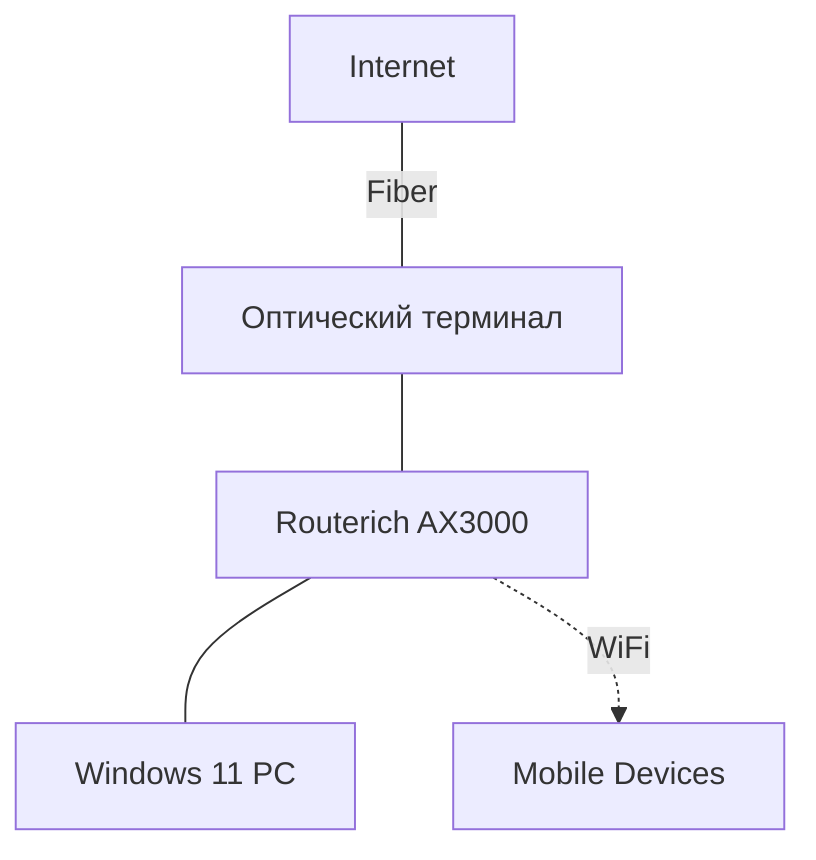

# Сетевая инфраструктура и Оборудование

Учет настроек роутеров, модемов и топологии домашней сети.

## Роутеры
### [Название/Модель]
- **Адрес**: `192.168.1.1`
- **Логин/Пароль**: См. заметку [[Аккаунты.md]]
- **Роль**: Основной шлюз / Точка доступа
- **Особенности**: 
    - Настроен обход блокировок (DPI Bypass).
    - Разделение диапазонов 2.4/5 ГГц.

## Топология (Mermaid)

## Журнал обслуживания
- [2026-04-12]: Обновление конфигурации DPI Bypass для стабильной работы YouTube.
