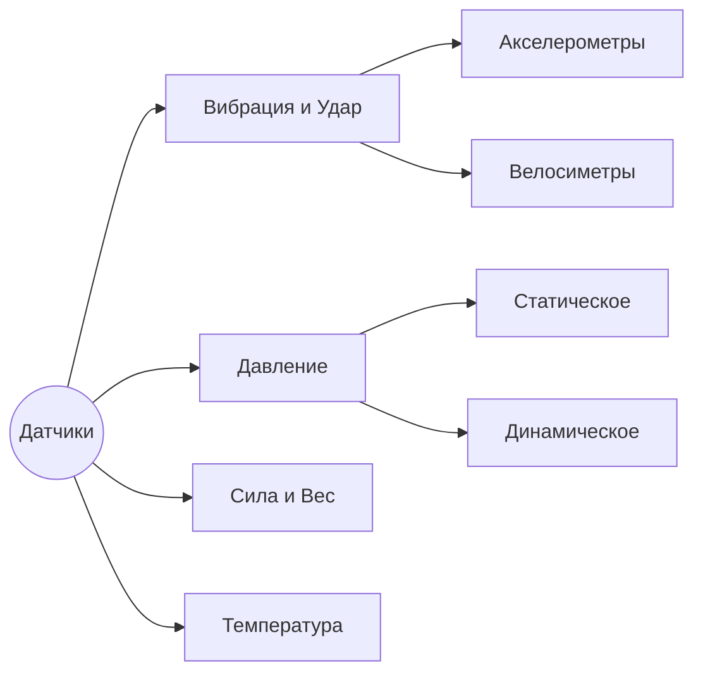

# Техническая спецификация: SQLSensorsDB

Этот документ является «Библией» проекта, объединяющей требования к данным, структуру БД и логику нормализации.

---

## 💾 Модель данных (Core Architecture)

Система использует **SQLModel** для управления схемой SQLite. Основной акцент сделан на гибкости характеристик через **[[EAV_Модель.md| паттерн EAV]]**.

### Таблицы:
1.  **`Manufacturers`**: Реестр брендов. Ключевые поля: `name`, `country`.
2.  **`Categories`**: Иерархическое дерево измерений. Поддерживает `parent_id`.
    - *Пример*: Вибрация -> Акселерометры.
3.  **`Products`**: Основной реестр моделей. Хранит модель, наименование, описание и ссылки на изображения.
4.  **`Product_Specs`**: Характеристики (EAV). 
    - Каждая запись содержит текстовое значение (`param_value`) и **типизированные числовые поля** (`nominal_value`, `numeric_value_min`, `numeric_value_max`, `unit`) для математического поиска.

---

## 📏 Стандарт нормализации (SI & Canonical)

Для обеспечения работы «Умных фильтров» (слайдеров) все данные из Obsidian проходят через процесс канонизации.

### 1. Единицы СИ (Система Интернациональная)
Это директивное требование для всех расчетов в БД:
- **Ускорение**: м/с² (Коэффициент: $1 \text{ g} = 9.80665 \text{ м/с²}$).
- **Чувствительность**: мВ/(ед.СИ) (напр. мВ/(м/с²)).
- **Давление**: Па (Паскаль).
- **Температура**: °C.

### 2. Маппинг параметров (Canonical Selection)
Из ~190 вариантов написания параметров в Obsidian, система выделяет **15 ключевых ключей**, по которым строится поиск:

| Категория       | SQL-ключ (Internal) | Метка UI            | Единицы (SI)        | Назначение                      |
| :-------------- | :------------------ | :------------------ | :------------------ | :------------------------------ |
| **Метрология**  | `range_measure`     | Диапазон измерений  | м/с², Па, мкм и др. | Основной физический диапазон    |
|                 | `sensitivity`       | Чувствительность    | мВ/(ед.СИ)          | Коэффициент преобразования      |
|                 | `frequency_range`   | Полоса частот       | Гц                  | Рабочий диапазон частот (АЧХ)   |
|                 | `accuracy_rel`      | Погрешность (отн.)  | %                   | Относительная нелинейность      |
|                 | `accuracy_abs`      | Погрешность (абс.)  | ед.СИ               | Абсолютное отклонение           |
|                 | `accuracy_fs`       | Погрешность (ПШ)    | %                   | Приведенная к полной шкале      |
| **Электрика**   | `power_supply`      | Питание             | В                   | Напряжение питания (DC/IEPE)    |
|                 | `input_current`     | Потребляемый ток    | мА                  | Ток питания / Входной ток       |
|                 | `output_signal`     | Тип сигнала         | -                   | Формат выхода (mV, mA, Digital) |
|                 | `output_range`      | Выходной диапазон   | -                   | Диапазон сигнала (напр. 0-5V)   |
| **Условия**     | `temp_operating`    | Рабочая температура | °C                  | Температурный коридор           |
|                 | `humidity`          | Влажность           | %                   | Допустимая влажность            |
| **Конструктив** | `weight_sensor`     | Масса               | кг                  | Вес датчика без кабеля          |
|                 | `dims_case`         | Габариты            | мм                  | Размеры корпуса                 |
|                 | `connector`         | Разъём              | -                   | Тип электрического стыка        |
|                 | `mounting`          | Монтаж              | -                   | Метод крепления на объект       |

> [!TIP]
> **Вариант А**: Все прочие параметры сохраняются в группу «Прочее» и отображаются в карточке товара, но не загромождают панель фильтров.

---

## 🏗 Логика "Пригодности" (Capability Sourcing)

Для технических характеристик реализована логика «Покрытия потребности»:
Датчик отображается в результатах, только если его физический диапазон **шире или равен** запросу пользователя.
*Формула*: `sensor_min <= user_min` AND `sensor_max >= user_max`.

---

## 🌲 Дерево категорий (Иерархия)

---

## 🔗 Связанные разделы
- [[Summary.md|Обзор проекта]]: Главная страница.
- [[Roadmap.md|План развития]]: Текущий прогресс.
- [[История_изменений.md|История измерений]]: Как менялся проект.
