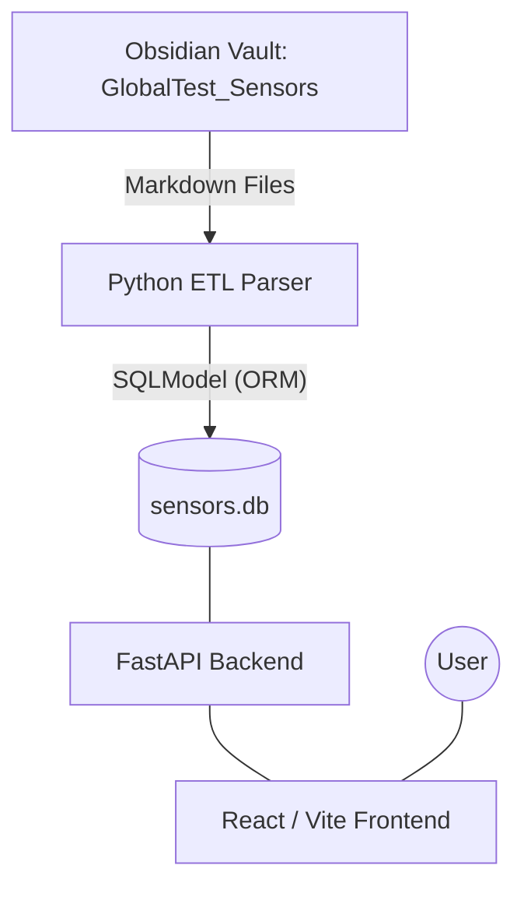
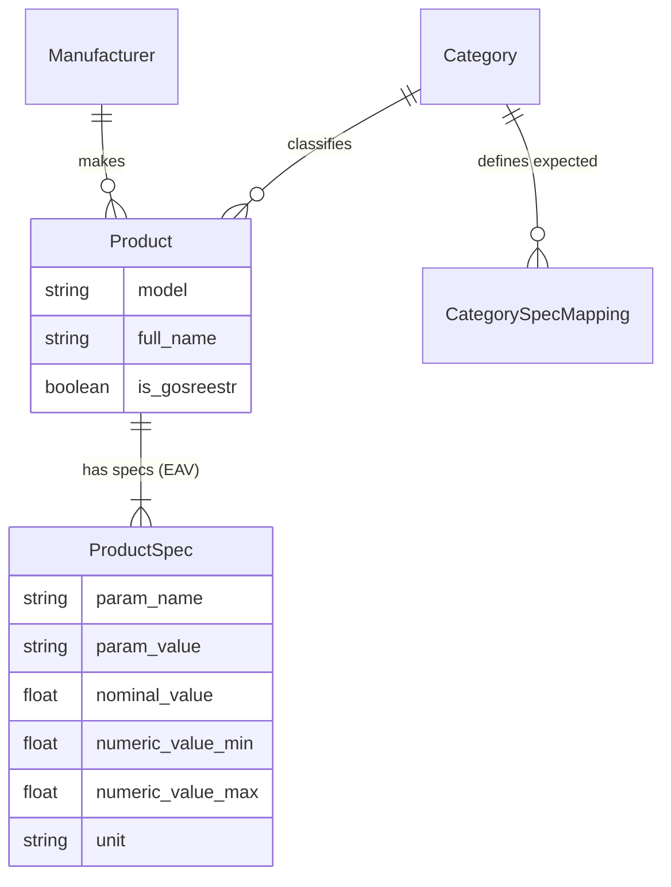

# Архитектура проекта SQLSensorsDB

Проект представляет собой комплексное решение для сбора, хранения и интеллектуального поиска информации о датчиках физических величин.

---

## 🏛 Общая схема (System Overview)

Архитектура построена по классической многослойной схеме с выделенным ETL-процессом (Extract, Transform, Load).

---

## ⚙️ ETL Процесс (Парсинг данных)

Парсер (`import_obsidian.py`) является критическим компонентом, решающим проблемы "грязных" исходных данных.

### Ключевые алгоритмы:
1. **Каскадная кодировка (Cascade Encoding)**:
   - Проверка: UTF-8 -> CP1251 -> CP1251 (errors=replace).
   - Это предотвращает потерю данных при наличии смешанных кодировок в Markdown.

2. **Интеллектуальный захват характеристик (Regex + Units)**:
   - Извлечение номиналов, минимумов и максимумов из текстовых строк (например, "от -40 до 125 С" -> `min:-40, max:125`).
   - Защита габаритов от "откусывания" цифр регулярками при наличии знаков `x` или `×`.

3. **Алгоритм Range-Priority (Приоритет диапазонов)**:
   - При слиянии данных из нескольких файлов (например, общего описания и детальной спецификации) система отдает предпочтение записям с диапазонами перед одиночными значениями.

---

## 💾 Модель данных (Database Schema)

Используется гибридный подход: реляционные таблицы для метаданных и **EAV (Entity-Attribute-Value)** для гибких характеристик.

---

## 🔍 Логика поиска и UI

Фронтенд реализован на **React + Vite** с использованием компонентов фильтрации.

### Механизм фильтрации:
- **Многокритериальный отбор**: Сочетание фильтров по производителю, стране (Manufacturer), типу величины (Category) и конкретным метрологическим характеристикам (ProductSpec).
- **Поиск по диапазонам**: Т.к. парсер выделил `numeric_min/max`, пользователь может искать датчики, работающие в заданном температурном коридоре.

---

## 📂 Важные компоненты (в AGrav)
- [[Specification.md|Техническая спецификация]]: Схема БД, канонизация параметров и стандарты СИ.
- [[Project_Structure.md|Устройство проекта]]: Детальное описание файлов, Vite и архитектуры.
- [[Roadmap.md|План развития]]: Достигнутые вехи и будущие цели.
- [[import_obsidian.py|import_obsidian.py]]: Полная логика парсера и ETL.
- [[models.py|Scripts/models.py]]: Схема базы данных SQLModel.

---

## 🛠 Системные требования
- **Python 3.10+**: Обязательно для поддержки современных аннотаций типов в SQLModel/FastAPI.
- **Node.js 18+**: Рекомендуемая версия для сборщика Vite.
- **SQLite**: База данных хранится в локальном файле `sensors.db` в корне проекта.

---

## 🏗 Стандарты разработки

Для обеспечения качества кода проекта мы придерживаемся общих стандартов AGrav:
- **[[Стандарт_Логирования.md|Стандарт логирования]]**: Обязательная трассировка и Thread ID.
- **[[Память_и_Потоки.md|Работа с памятью]]**: Принципы безопасности в многопоточной среде.
- **[[Specification.md|Стандарты измерений]]**: Все внутренние расчеты ведутся строго в единицах СИ.

---

## 🔗 Связанные разделы
- [[Specification.md|Техническая спецификация]]: Глубокое погружение в архитектуру.
- [[Roadmap.md|План развития]]: Будущее проекта.
- [[../../../10_Работа/Оборудование/Датчики/Notes|База знаний датчиков]]: Исходные данные для импорта.
- [[Навигация.md|🧭 Навигация]]: Вернуться в главное меню.
