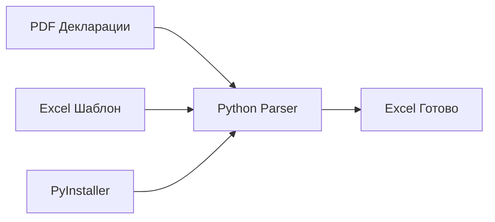

# 📋 Парсер ГТД (GTD Parser)

Инструмент для автоматического сопоставления и переноса данных из таможенных деклараций (ГТД) в рабочие Excel-таблицы отдела логистики.

---

## 🚀 Основные возможности
- **PDF Extraction**: Извлечение кодов ТН ВЭД и номеров товаров из официальных бланков ГТД и многостраничных дополнений.
- **Smart Linking**: Автоматическое создание гиперссылок в Excel на конкретные PDF-файлы для быстрого контроля.
- **Портативность**: Возможность сборки в единый EXE-файл (через PyInstaller), работающий без предустановленного Python.
- **Zero-Config**: Автоматическая установка Python и необходимых библиотек при запуске скрипта на новой машине.

## 🏗 Архитектура решения

## 📂 Расположение
- **Рабочая область**: `AGrav/temp/Декларации/`
- **Основные файлы**:
    - `fill_tnved.py` — ядро парсера.
    - `ЗАПУСК_ПАРСЕРА.bat` — универсальный лончер.
    - `BUILD_EXE.bat` — скрипт сборки портативной версии.

## 🕒 История изменений
- **2026-05-09**: Внедрена система авто-установки Python и сборка в EXE для решения проблем совместимости с Excel 2010 на разных ПК.
- **2026-04-27**: Инициализация проекта, базовая логика PDF-парсинга.

---
[[../Цех_Проектов.md|🧭 Назад в Цех Проектов]]
