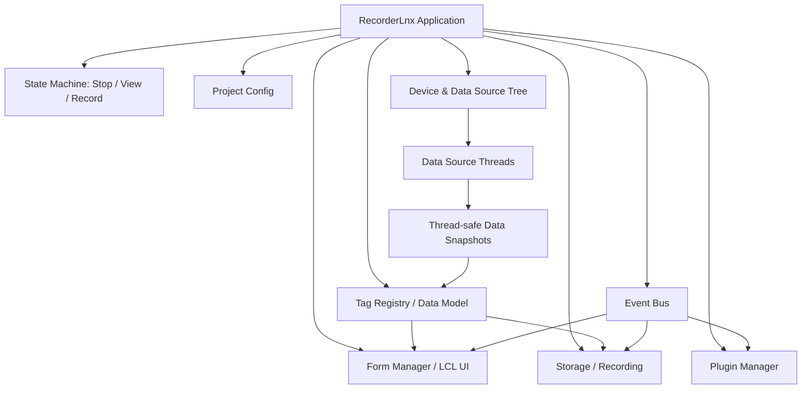

# RecorderLnx: архитектура приложения

## Архитектурный принцип

RecorderLnx строится вокруг явных слоёв: ядро состояния, модель данных, источники данных, UI-формуляры, запись, плагины и сервисы. Слои общаются через типизированные интерфейсы и событийную шину. UI не владеет сбором данных, потоки сбора не трогают визуальные компоненты.

## Машина состояний

Минимальные состояния первой версии:

- `rsStop` — конфигурация разрешена, потоки источников остановлены, запись закрыта.
- `rsView` — конфигурация заблокирована или ограничена, источники данных активны, запись не ведётся.
- `rsRecord` — источники активны, запись активна, UI работает как в `rsView`.

Переходы:

- `Stop -> View`: проверить конфигурацию, построить дерево источников, создать теги, стартовать потоки источников, запустить UI-таймер/обновления.
- `View -> Record`: открыть хранилище записи, отправить событие старта записи группам/тегам/плагинам, начать сохранение снимков.
- `Record -> View`: завершить запись, сбросить буферы, оставить сбор и отображение активными.
- `View -> Stop`: остановить потоки источников, дождаться завершения, разблокировать конфигурацию.
- `Record -> Stop`: сначала корректно завершить запись, затем остановить сбор.

Позже добавляются подрежимы: `Pause`, `Playback`, `Calibration`, `Fault`, `Warning`, `NeedDeviceReset`, `NeedConfigRefresh`.

## Дерево устройств и источников данных

Windows Recorder оперировал устройствами, модулями и аппаратными каналами. В RecorderLnx вводим общий термин `источник данных`:

- `TDeviceNode` — физическое или логическое устройство.
- `TDataSourceNode` — узел, который производит данные с периодом `UpdateTime`.
- `TChannelNode` / `TTagBinding` — привязка источника к измерительному каналу/тегу.

Источник данных должен иметь уникальный `SourceId`, человекочитаемое имя, тип источника, настройки подключения, `UpdateTime`, состояние связи и диагностики, список публикуемых каналов и метод запуска/остановки рабочего потока.

## Модель данных

Базовая единица данных — тег/канал. В Windows-интерфейсах это `ITag`, связанный с `ISignal` и группами `ITagsGroup`.

В RecorderLnx разделяем:

- `TTag` — метаданные канала: имя, единицы, диапазон, источник, состояние, настройки записи.
- `TSignalBuffer` — буфер значений/времени для канала или блока каналов.
- `TDataFrame` — снимок данных от одного источника за один цикл обновления.
- `TTagRegistry` — единый реестр тегов с поиском по имени/id/source.

Данные между потоками передаются снимками или очередями. Нельзя отдавать UI прямую изменяемую ссылку на буфер рабочего потока.

## Потоки

Планируется минимум три класса потоковой активности:

- UI thread — LCL-формы, формуляры, команды пользователя, перерисовка.
- Data source threads — отдельные потоки источников с собственным `UpdateTime`.
- Processing/recording workers — обработка, запись, экспорт, тяжёлые вычисления.

Правила:

- Рабочие потоки не меняют LCL-компоненты напрямую.
- UI получает данные через очередь событий, `TThread.Queue/Synchronize` или безопасный диспетчер снимков.
- Каждый поток обязан поддерживать мягкую остановку через флаг завершения и ограниченное ожидание `WaitFor`.
- В Linux-проектах с потоками учитывать `cthreads` в ранней инициализации приложения.

## Событийная модель

В Windows Recorder плагины получали `PN_*` уведомления: старт/стоп, обновление данных, смена текущего тега, импорт/экспорт, сохранение конфигурации, события формуляров и т.д.

В RecorderLnx вводим типизированную шину событий: `OnBeforeStartView`, `OnStartView`, `OnBeforeStop`, `OnStop`, `OnBeforeRecord`, `OnStartRecord`, `OnStopRecord`, `OnDataUpdated`, `OnConfigChanged`, `OnCurrentTagChanged`, `OnFormChanged`, `OnAlarm`, `OnFault`.

Главное событие для плагинов обработки — `OnDataUpdated`. Оно вызывается с периодичностью обновления источника или агрегированного диспетчера и содержит список обновлённых источников/тегов.

## Формуляры отображения

Windows `IVForm` показывает нужную модель: формуляр имеет имя, инициализацию, подготовку, обновление, перерисовку, привязку к тегам, активацию, редактирование и уведомления.

В RecorderLnx формуляр — LCL-компонент/фрейм с интерфейсом: имя и тип, режим редактирования мнемосхемы, список привязанных тегов, `Prepare`, `UpdateData`, `RepaintView`, `Activate/Deactivate`, сериализация настроек формуляра.

Формуляров может быть много. Они перерисовываются только в UI-потоке и получают не сырые буферы потоков, а подготовленные снимки/модели.

## Плагины без COM

В Linux нет COM как естественной платформенной опоры. Возможные варианты расширяемости без пересборки основного приложения:

1. Динамические библиотеки `.so` с C ABI и экспортированными функциями.
2. FPC packages/plugins, если удастся обеспечить стабильность ABI и версий компилятора.
3. Внешние процессы-плагины через IPC: pipes, sockets, gRPC-like протокол, shared memory.
4. Скриптовые плагины через встроенный интерпретатор только если исходники и лицензия под контролем.

Базовое решение для первой архитектуры: плагин как `.so` с минимальным C ABI. Внутри плагин может быть написан на FPC/Lazarus, но граница между ядром и плагином должна быть стабильной и не передавать управляемые строки/объекты FPC напрямую без строгого соглашения.

Минимальный контракт плагина: `RecorderPlugin_GetInfo`, `RecorderPlugin_Create`, `RecorderPlugin_Destroy`, `RecorderPlugin_Notify`, `RecorderPlugin_Config`.

Для первой итерации допускается начать с статически подключаемых модулей, но проектировать интерфейсы так, чтобы позже вынести их в `.so`.

## Запись данных

Подсистема записи должна быть отделена от источников и UI: принимает `TDataFrame` / `TSignalBuffer`, знает текущий кадр/измерение, ведёт метаданные проекта и конфигурации, поддерживает flush и корректное закрытие при остановке, не блокирует поток источника на долгую запись.

Формат файлов пока открыт. Решение фиксируется отдельно после анализа требований к совместимости с существующими данными Recorder/MERA.

## Relationships

- [Summary](../Summary.md)
- [Правила разработки](./02_Правила_Разработки.md)
- [Карта интерфейсов Windows Recorder](./03_Карта_Интерфейсов.md)