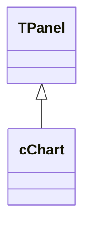
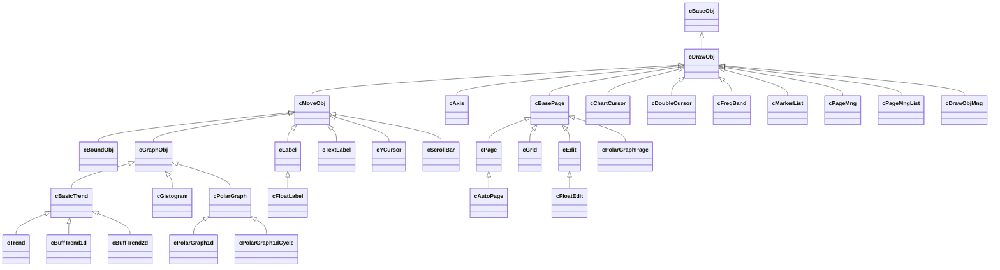

# Заметка: иерархия классов cChart

Первая заметка по Delphi-прототипу `cChart`. Цель - зафиксировать исходную классовую карту до проектирования Lazarus-версии.

Важно: это историческая карта старого компонента, а не целевая архитектура. Новая структура ведется отдельно: [Классовая структура OpenGLChartLazarus](../Классовая_структура.md).

Источник анализа:

`C:\Oburec\OburecGH\sharedUtils\компоненты\chart_dpk\chart`

## Главный компонент

`cChart` сейчас совмещает UI-контрол, владельца OpenGL-контекста, менеджер графических объектов, обработчик событий и точку интеграции с редакторскими формами.

## Основная иерархия объектов графика

Эта схема собрана по объявлениям `= class(...)` и требует уточнения после чтения методов, владельцев объектов и жизненного цикла.

## Вспомогательные классы

- `cLegend` - легенда, наследуется от `tbtnlistview`.
- `cFontMng` - менеджер шрифтов на базе `TStringList`.
- `cLineLgShader`, `cLineLgShader1d` - shader-слой для отрисовки линий.
- `cClickFrListener`, `cObjFrListener`, `cPageFrListener`, `cCursorFrameListener`, `cDoubleCursorFrameListener` - обработчики событий и интерактивных режимов.

## Формы и редакторы

В прототипе есть набор VCL-форм и фреймов:

- `TChartCfgForm`
- `TEditMenuChartForm`
- `TEditDrawObjFrame`
- `TChartInputFrame`
- `TTrendFrame`
- `TDrawObjFrame`
- `TPageForm`
- `TAxisForm`
- `TCursorForm`
- `TDoubleCursorForm`

Для Lazarus их нельзя считать переносимыми автоматически. Их стоит рассматривать как описание сценариев настройки, а не как готовую UI-архитектуру.

## Риски переноса

- Прямая зависимость от `windows`, `messages`, `HDC`, `HGLRC`.
- Наследование главного компонента от `TPanel`, а не от OpenGL-aware LCL-контрола.
- Смешение модели, рендера и UI-событий в одном классе.
- Возможные зависимости от Delphi-only модулей и старых DCU.
- Кодировка комментариев в исходниках требует отдельной проверки перед переносом.

## Следующие заметки

- Разобрать жизненный цикл `cChart.Create/destroy`, `CreateEngStructs`, `CreateFrameListeners`, `lincEvents`.
- Разобрать объектную модель `cDrawObj`, `cMoveObj`, `cGraphObj`, `cBasicTrend`.
- Разобрать работу страниц `cBasePage`, `cPage`, `cPageMngList`.
- Разобрать OpenGL-контекст и shader-слой.

## Relationships

- [Оглавление](../Оглавление.md) - вход в документацию.
- [Описание](../Описание.md) - зачем переносим компонент.
- [Структура компонента](../Структура_компонента.md) - куда раскладываем старую иерархию в новой архитектуре.
- [Классовая структура OpenGLChartLazarus](../Классовая_структура.md) - целевая архитектура новой версии.
