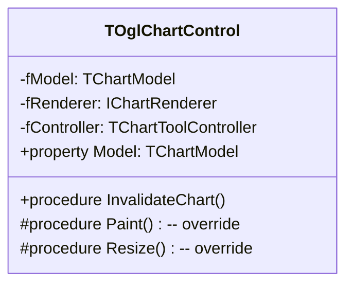
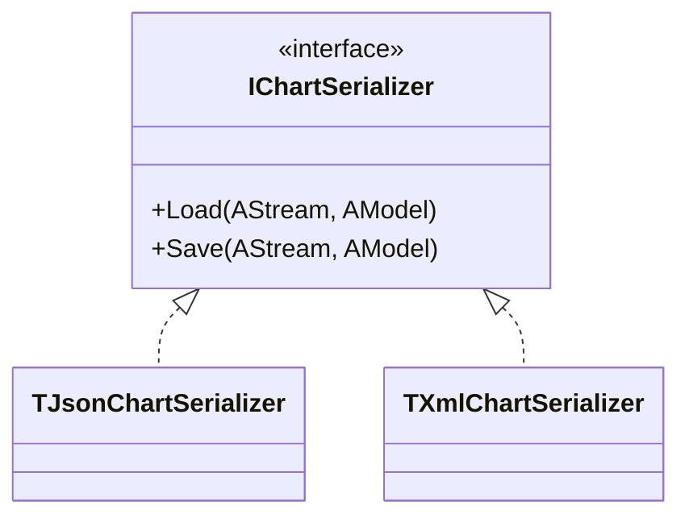
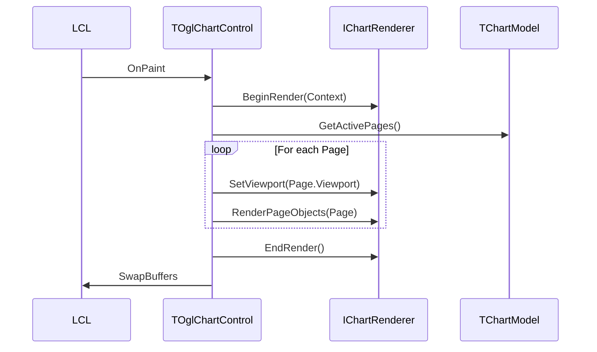

# Skeleton Architecture: Каркас компонента

Этот документ описывает минимально необходимый "движок" компонента, обеспечивающий его работу в Lazarus, инициализацию OpenGL и цикл отрисовки.

## 1. Контрол (TOglChartControl)

В отличие от Delphi-версии (`TPanel`), в Lazarus мы используем `TOpenGLControl` (из пакета `LazOpenGLContext`) как базу. Это гарантирует кроссплатформенное создание контекста OpenGL.

**Ответственность:**
- Владение жизненным циклом `Model`, `Renderer` и `Controller`.
- Трансляция событий LCL (Paint, Resize, Mouse, Key) во внутренние вызовы.
- Предоставление публичного API для пользователя.



## 2. Инициализация контекста OpenGL

Мы используем интерфейс `IOpenGLContextHost`, чтобы рендер не зависел от конкретного класса контрола.

**Процесс:**
1. `TOglChartControl` создает контекст при создании окна.
2. При первом `Paint` или `Resize` контрол вызывает `Renderer.Initialize(Self as IOpenGLContextHost)`.
3. `Renderer` настраивает стейт OpenGL (смешивание, текстуры, шейдеры).

```pascal
type
  IOpenGLContextHost = interface
    procedure MakeCurrent;
    procedure SwapBuffers;
    function GetWidth: Integer;
    function GetHeight: Integer;
  end;
```

## 3. Сериализация (IChartSerializer)

Для поддержки разных форматов (JSON, XML, INI) используется абстрактный сериализатор.

**Механизм:**
- Каждый объект графика (`TChartObject`) может иметь метод `Serialize(ASerializer)`.
- `TOglChartControl` имеет методы `LoadFromFile` / `SaveToFile`, которые делегируют работу выбранному экземпляру `IChartSerializer`.



## 4. Модель рендеринга (Rendering Pipeline)

Цикл отрисовки отделен от логики данных.

**Этапы кадра:**
1. **Trigger**: Вызов `InvalidateChart`.
2. **LCL Paint**: Вызывается `TOglChartControl.Paint`.
3. **Preparation**: `Renderer.BeginRender(Context)`.
4. **Traversal**:
   - Рендер проходит по `Model.Pages`.
   - Для каждой страницы устанавливается `Viewport`.
   - Вызывается отрисовка объектов страницы: `Renderer.RenderObject(AObject, ADrawContext)`.
5. **Finalization**: `Renderer.EndRender`, вызов `Context.SwapBuffers`.



## Почему это важно
Такое разделение позволяет:
- Менять OpenGL-рендер на другой (например, для разных версий OpenGL) без правки контрола.
- Тестировать модель и сериализацию вообще без открытия окна (headless).
- Легко переносить компонент между разными версиями Lazarus и разными ОС.

## 5. Многопоточность и синхронизация

Компонент должен быть безопасен для вызовов из разных потоков (например, когда данные в `Model` добавляются из фонового потока захвата данных).

**Принципы:**
- Использование **Критических секций** (`TCriticalSection`) для защиты доступа к данным модели.
- Предпочтение критическим секциям перед `Event`-механизмами для упрощения логики и читаемости кода.
- Метод `InvalidateChart` должен быть безопасен для вызова из любого потока (использовать `ThreadSync` или `PostMessage` внутри LCL-контрола).
