# OpenGLChartLazarus: классовая структура

Этот документ задает целевую классовую структуру нового компонента. Структура не повторяет старый Delphi `cChart`: старый компонент используется только как источник опыта, сценариев и терминов.

Код проекта планируется вести в:

`e:\Oburec\delphi\2011\OburecGH\Lazarus\SharedUtils\components\chart_lzr\`

## Граф классов

```mermaid
classDiagram
    direction LR

    class TOglChartControl {
        <<LCL control>>
        +Model: TChartModel
        +Renderer: IChartRenderer
        +ToolController: TChartToolController
        +InvalidateChart()
        +SaveImage(AFileName)
    }

    class TChartModel {
        <<model root>>
        +Pages: TChartPageList
        +Styles: TChartStyleSet
        +Clear()
        +BeginUpdate()
        +EndUpdate()
    }

    class TChartObject {
        <<abstract>>
        +Parent: TChartObject
        +Children: TChartObjectList
        +Layout: TChartLayoutRect
        +DrawMode: TChartDrawMode
        +CalcPixelBounds()
        +CalcFloatBounds()
        +HitTest(APoint)
    }

    class TChartLayoutRect {
        +FloatRect: TChartFloatRect
        +PixelRect: TRect
        +MinPixelSize: TSize
        +AnchorMode
        +SnapMode
        +UpdatePixels(AParentRect)
    }

    class TChartPage {
        <<container>>
        +Axes: TChartAxisList
        +Series: TChartSeriesList
        +Annotations: TChartAnnotationList
        +Viewport: TChartViewport
        +Resize()
        +SnapToNeighbors()
    }

    class TChartViewport {
        +WorldRect: TChartRect
        +ScreenRect: TRect
        +WorldToScreen()
        +ScreenToWorld()
    }

    class TChartAxis {
        +Orientation: TChartAxisOrientation
        +Scale: TChartScale
        +Title: string
        +FormatTick()
    }

    class TChartSeries {
        <<abstract>>
        +Name: string
        +Visible: Boolean
        +Bounds(): TChartRect
    }

    class TLineSeries {
        +Points: TChartPointBuffer
        +AddPoint(X, Y)
        +Clear()
    }

    class TChartCursor {
        +Position: TChartPoint
        +Orientation: TChartCursorOrientation
        +Visible: Boolean
    }

    class TChartAnnotation {
        <<abstract>>
        +Text: string
        +Position: TChartPoint
    }

    class TChartStyleSet {
        +BackgroundColor
        +GridStyle
        +SeriesPalette
    }

    class TChartDrawContext {
        +WindowSize: TSize
        +Page: TChartPage
        +Viewport: TChartViewport
        +CoordinateMode
        +ParentToScreen()
        +DataToScreen()
    }

    class IChartRenderer {
        <<interface>>
        +Initialize(AContext)
        +Resize(AWidth, AHeight)
        +Render(AModel)
        +ReadBitmap()
    }

    class TOpenGLChartRenderer {
        +Context: IOpenGLContextHost
        +Render(AModel)
    }

    class IOpenGLContextHost {
        <<interface>>
        +MakeCurrent()
        +SwapBuffers()
        +Resize()
    }

    class TChartToolController {
        +ActiveTool: IChartTool
        +Listeners: TChartFrameListenerList
        +MouseDown()
        +MouseMove()
        +MouseUp()
        +KeyDown()
    }

    class IChartTool {
        <<interface>>
        +MouseDown(AContext)
        +MouseMove(AContext)
        +MouseUp(AContext)
    }

    class TPanTool
    class TZoomTool
    class TCursorTool
    class TSelectTool

    class IChartFrameListener {
        <<interface>>
        +Enabled(AContext): Boolean
        +MouseDown(AContext)
        +MouseMove(AContext)
        +MouseUp(AContext)
        +MouseWheel(AContext)
        +KeyDown(AContext)
    }

    class TChartFrameListenerList {
        +Listeners: IChartFrameListenerList
        +DispatchMouseDown()
        +DispatchMouseMove()
        +DispatchMouseUp()
        +ResetActiveOperation()
    }

    class IChartSerializer {
        <<interface>>
        +LoadSection(ANode, AModel)
        +SaveSection(ANode, AModel)
    }

    class TJsonChartSerializer
    class TXmlChartSerializer

    TOglChartControl --> TChartModel
    TOglChartControl --> IChartRenderer
    TOglChartControl --> TChartToolController
    TOglChartControl --> IOpenGLContextHost

    TChartModel *-- TChartPage
    TChartModel *-- TChartStyleSet
    TChartObject *-- TChartLayoutRect
    TChartObject *-- TChartObject
    TChartObject <|-- TChartPage
    TChartObject <|-- TChartAxis
    TChartObject <|-- TChartSeries
    TChartObject <|-- TChartCursor
    TChartObject <|-- TChartAnnotation
    TChartPage *-- TChartViewport
    TChartPage *-- TChartAxis
    TChartPage *-- TChartSeries
    TChartPage *-- TChartCursor
    TChartPage *-- TChartAnnotation

    TChartSeries <|-- TLineSeries
    IChartRenderer <|.. TOpenGLChartRenderer
    TOpenGLChartRenderer --> IOpenGLContextHost
    TOpenGLChartRenderer --> TChartDrawContext

    TChartToolController --> IChartTool
    TChartToolController *-- TChartFrameListenerList
    TChartFrameListenerList --> IChartFrameListener
    IChartFrameListener --> TChartObject
    IChartTool <|.. TPanTool
    IChartTool <|.. TZoomTool
    IChartTool <|.. TCursorTool
    IChartTool <|.. TSelectTool

    IChartSerializer <|.. TJsonChartSerializer
    IChartSerializer <|.. TXmlChartSerializer
    IChartSerializer --> TChartModel

    click TOglChartControl href "../classes/TOglChartControl.md" "TOglChartControl"
    click TChartModel href "../classes/TChartModel.md" "TChartModel"
    click TChartObject href "../classes/TChartObject.md" "TChartObject"
    click TChartLayoutRect href "../classes/TChartLayoutRect.md" "TChartLayoutRect"
    click TChartPage href "../classes/TChartPage.md" "TChartPage"
    click TChartViewport href "../classes/TChartViewport.md" "TChartViewport"
    click TChartAxis href "../classes/TChartAxis.md" "TChartAxis"
    click TChartSeries href "../classes/TChartSeries.md" "TChartSeries"
    click TLineSeries href "../classes/TLineSeries.md" "TLineSeries"
    click TChartCursor href "../classes/TChartCursor.md" "TChartCursor"
    click TChartAnnotation href "../classes/TChartAnnotation.md" "TChartAnnotation"
    click TChartStyleSet href "../classes/TChartStyleSet.md" "TChartStyleSet"
    click TChartDrawContext href "../classes/TChartDrawContext.md" "TChartDrawContext"
    click IChartRenderer href "../classes/IChartRenderer.md" "IChartRenderer"
    click TOpenGLChartRenderer href "../classes/TOpenGLChartRenderer.md" "TOpenGLChartRenderer"
    click IOpenGLContextHost href "../classes/IOpenGLContextHost.md" "IOpenGLContextHost"
    click TChartToolController href "../classes/TChartToolController.md" "TChartToolController"
    click IChartTool href "../classes/IChartTool.md" "IChartTool"
    click IChartFrameListener href "../classes/IChartFrameListener.md" "IChartFrameListener"
    click TChartFrameListenerList href "../classes/TChartFrameListenerList.md" "TChartFrameListenerList"
    click TPanTool href "../classes/TPanTool.md" "TPanTool"
    click TZoomTool href "../classes/TZoomTool.md" "TZoomTool"
    click TCursorTool href "../classes/TCursorTool.md" "TCursorTool"
    click TSelectTool href "../classes/TSelectTool.md" "TSelectTool"
    click IChartSerializer href "../classes/IChartSerializer.md" "IChartSerializer"
    click TJsonChartSerializer href "../classes/TJsonChartSerializer.md" "TJsonChartSerializer"
    click TXmlChartSerializer href "../classes/TXmlChartSerializer.md" "TXmlChartSerializer"
```

## Индекс классов

- [TOglChartControl](../classes/TOglChartControl.md) - LCL-компонент и публичная точка входа.
- [TChartModel](../classes/TChartModel.md) - корень модели графика.
- [TChartObject](../classes/TChartObject.md) - базовый интерфейс объектов графика.
- [TChartLayoutRect](../classes/TChartLayoutRect.md) - относительные и пиксельные bounds объекта.
- [TChartPage](../classes/TChartPage.md) - логическая область графика.
- [TChartViewport](../classes/TChartViewport.md) - преобразование координат.
- [TChartAxis](../classes/TChartAxis.md) - ось и шкала.
- [TChartSeries](../classes/TChartSeries.md) - базовый класс серии данных.
- [TLineSeries](../classes/TLineSeries.md) - первая реализация серии.
- [TChartCursor](../classes/TChartCursor.md) - интерактивный курсор.
- [TChartAnnotation](../classes/TChartAnnotation.md) - подписи и графические пометки.
- [TChartStyleSet](../classes/TChartStyleSet.md) - стили и палитры.
- [TChartDrawContext](../classes/TChartDrawContext.md) - контекст отрисовки кадра.
- [IChartRenderer](../classes/IChartRenderer.md) - интерфейс рендера.
- [TOpenGLChartRenderer](../classes/TOpenGLChartRenderer.md) - OpenGL-рендер.
- [IOpenGLContextHost](../classes/IOpenGLContextHost.md) - владелец OpenGL-контекста.
- [TChartToolController](../classes/TChartToolController.md) - диспетчер интерактивных инструментов.
- [IChartTool](../classes/IChartTool.md) - интерфейс инструмента.
- [IChartFrameListener](../classes/IChartFrameListener.md) - интерфейс контекстной реакции на события.
- [TChartFrameListenerList](../classes/TChartFrameListenerList.md) - список listeners и диспетчер приоритетов.
- [TPanTool](../classes/TPanTool.md) - перемещение viewport.
- [TZoomTool](../classes/TZoomTool.md) - масштабирование.
- [TCursorTool](../classes/TCursorTool.md) - управление курсорами.
- [TSelectTool](../classes/TSelectTool.md) - выбор объектов.
- [IChartSerializer](../classes/IChartSerializer.md) - интерфейс сохранения и загрузки.
- [TJsonChartSerializer](../classes/TJsonChartSerializer.md) - JSON-сериализация.
- [TXmlChartSerializer](../classes/TXmlChartSerializer.md) - XML-сериализация.

## Правило развития

Новые классы добавляем в схему только после ответа на три вопроса:

- какая у класса единственная главная ответственность;
- кто владеет его временем жизни;
- можно ли проверить его без окна и OpenGL-контекста.

## Relationships

- [Оглавление](../Оглавление.md)
- [Описание](../Описание.md)
- [Структура компонента](../Глава_01_Костяк_компонента/02_Structure.md)
