
# Справочник по регулирующим клапанам (Control Valve Handbook)
## Четвертое издание

---

## 🏷️ Титульный лист
[🔝 Сверху](#top)
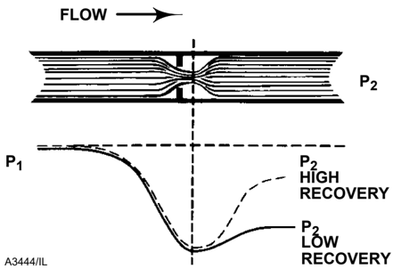
## СПРАВОЧНИК ПО РЕГУЛИРУЮЩИМ КЛАПАНАМ
## Четвертое издание

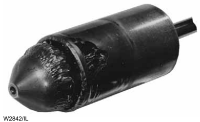

---

## 🏷️ Предисловие
[🔝 Сверху](#top)

## Предисловие к четвертому изданию

Регулирующие клапаны становятся все более важным компонентом современного мирового производства. Правильно подобранные и обслуживаемые регулирующие клапаны повышают эффективность, безопасность, прибыльность и экологичность технологических процессов.

«Справочник по регулирующим клапанам» является основным справочным пособием с момента его первого издания в 1965 году. Это четвертое издание содержит жизненно важную информацию о характеристиках регулирующих клапанов и новейших технологиях.

Данная книга представляет собой одновременно и учебник, и справочник по самому важному звену в контуре управления: регулирующему клапану и его аксессуарам. Книга включает обширные и проверенные знания ведущих экспертов в области управления технологическими процессами, включая материалы от ISA (Международное общество автоматизации) и компании Crane.

---

## 🏷️ Глава 1: Введение
[🔝 Сверху](#top)

## Глава 1
## Введение в регулирующие клапаны

### Что такое регулирующий клапан?

Промышленные предприятия состоят из сотен или даже тысяч контуров управления, объединенных в сеть для производства товарной продукции. Каждый из этих контуров предназначен для поддержания важной технологической переменной (такой как давление, расход, уровень, температура и т. д.) в требуемом рабочем диапазоне, чтобы обеспечить качество конечного продукта. На каждый из этих контуров воздействуют внутренние и внешние возмущения, которые отрицательно влияют на технологический параметр.

Чтобы уменьшить влияние этих возмущений, датчики и преобразователи собирают информацию о технологической переменной и ее связи с желаемой уставкой (set point). Затем контроллер обрабатывает эту информацию и решает, что необходимо сделать, чтобы вернуть технологическую переменную в заданное состояние. После выполнения всех операций измерения, сравнения и расчета, некий тип **исполнительного устройства** (final control element) должен реализовать стратегию, выбранную контроллером.

Наиболее распространенным исполнительным устройством в промышленности является **регулирующий клапан**. Регулирующий клапан манипулирует потоком текучей среды (газ, пар, вода или химические соединения), чтобы компенсировать возмущение нагрузки и поддерживать регулируемый процесс как можно ближе к желаемой уставке.

Многие люди, говоря о «клапане» или «регулирующем клапане», на самом деле имеют в виду **узел регулирующего клапана** (control valve assembly). Этот узел обычно состоит из корпуса клапана, внутренних деталей (**трима**), привода (**актуатора**) для обеспечения движущей силы и различных дополнительных аксессуаров.

---

## 🏷️ Терминология управления
[🔝 Сверху](#top)

### Терминология управления процессами

*   **Аксессуар (Accessory)**: Устройство, устанавливаемое на привод для дополнения его функций. Примеры: позиционеры, регуляторы давления питания, соленоиды и концевые выключатели.
*   **Привод (Actuator)** *: Пневматическое, гидравлическое или электрическое устройство, обеспечивающее силу и движение для открытия или закрытия клапана.
*   **Узел привода (Actuator Assembly)**: Привод вместе со всеми соответствующими аксессуарами, составляющий готовый к работе узел.
*   **Люфт (Backlash)**: Общее название формы «мертвой зоны», возникающей из-за временного разрыва связи между входом и выходом устройства при смене направления входного сигнала. Типичный пример — ослабление механического соединения.
*   **Пропускная способность (Capacity)** *: Интенсивность потока через клапан при заданных условиях.
*   **Замкнутый контур (Closed Loop)**: Взаимосвязь компонентов управления процессом, при которой информация о технологической переменной непрерывно подается обратно к уставке контроллера для автоматической коррекции.
*   **Контроллер (Controller)**: Устройство, работающее автоматически по установленному алгоритму для регулирования контролируемой переменной.
*   **Зона нечувствительности (Dead Band)**: Диапазон, в котором входной сигнал может изменяться при смене направления без инициирования наблюдаемого изменения выходного сигнала.

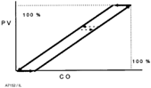
*Рис 1-1. Иллюстрация зоны нечувствительности (Dead Band).*

*   **Время запаздывания (Dead Time)**: Интервал времени (Td), в течение которого не обнаруживается реакция системы после небольшого ступенчатого изменения входа.
*   **Затвор / Диск (Disk)**: Элемент трима клапана, используемый для модуляции расхода. Также может называться плунжером клапана или запорным элементом.
*   **Равнопроцентная характеристика (Equal Percentage Characteristic)** *: Пропускная характеристика, при которой равные приращения хода затвора дают равные процентные изменения коэффициента расхода ($C_v$).

---

## 🏷️ Характеристики и Усиление
[🔝 Сверху](#top)

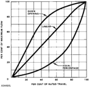
*Рис 1-2. Типовые характеристики регулирующих клапанов.*

*   **Трение (Friction)**: Сила, противодействующая относительному движению контактирующих поверхностей. Трение включает статическую составляющую (усилие страгивания, «stiction») и динамическую составляющую (трение скольжения). Статическое трение — одна из основных причин зоны нечувствительности в узле клапана.
*   **Коэффициент усиления (Gain)**: Отношение величины изменения выхода системы к величине изменения входа. Различают статический и динамический коэффициенты усиления.
*   **Собственная характеристика (Inherent Characteristic)** *: Связь между коэффициентом расхода и ходом затвора (диска) при **постоянном** перепаде давления на клапане. Типовые виды: линейная, равнопроцентная, быстрооткрывающаяся.
*   **Рабочая (установленная) характеристика (Installed Characteristic)** *: Связь между расходом и ходом затвора в реальных условиях эксплуатации, когда перепад давления на клапане меняется в зависимости от условий процесса.

---

## 🏷️ Продолжение терминологии
[🔝 Сверху](#top)

*   **Позиционер (Positioner)** *: Контроллер положения (сервомеханизм), механически связанный с подвижной частью клапана или привода, который автоматически корректирует давление на приводе для поддержания желаемого положения пропорционально входному сигналу.
*   **Процесс (Process)**: Все комбинированные элементы в контуре управления, за исключением контроллера. Обычно включает узел регулирующего клапана, сосуд под давлением или теплообменник, датчики и насосы.
*   **Изменчивость процесса (Process Variability)**: Точная статистическая мера того, насколько плотно процесс контролируется относительно уставки.
*   **Разрешающая способность (Resolution)**: Минимально возможное изменение входа, необходимое для получения заметного изменения выхода без смены направления входа.
*   **Трим / Внутренние детали (Trim)** *: Внутренние компоненты клапана, которые непосредственно модулируют поток регулируемой среды.

---
[[Навигация.md]] | [[Каталог_Книг.md]]

---

## 🏷️ Терминология: Конструкции клапанов
[🔝 Сверху](#top)

*   **Шток привода (Actuator Stem)**: Деталь, соединяющая привод со штоком клапана и передающая движение (усилие) от привода к клапану.
*   **Удлинитель штока привода (Actuator Stem Extension)**: Удлинение штока поршневого привода для передачи движения позиционеру.
*   **Усилие на штоке привода (Actuator Stem Force)**: Чистое усилие от привода, доступное для фактического позиционирования плунжера клапана.
*   **Угловой клапан (Angle Valve)**: Конструкция клапана, в которой один патрубок соосен со штоком или приводом, а другой расположен под прямым углом к нему.
*   **Сильфонное уплотнение крышки (Bellows Seal Bonnet)**: Крышка (боннет), использующая сильфон для герметизации вокруг штока затвора.
*   **Крышка корпуса / Боннет (Bonnet)**: Часть клапана, содержащая сальниковое уплотнение и направляющие для штока. Обеспечивает основной доступ к полости корпуса для сборки внутренних деталей.
*   **Узел крышки (Bonnet Assembly)**: Узел, включающий деталь, через которую проходит шток, и элементы герметизации (сальники).
*   **Нижний фланец (Bottom Flange)**: Деталь, закрывающая отверстие корпуса со стороны, противоположной крышке. Может содержать направляющую втулку.
*   **Втулка (Bushing)**: Устройство, поддерживающее и/или направляющее подвижные детали (например, штоки).
*   **Клетка / Сепаратор (Cage)**: Деталь трима, которая окружает затвор и может обеспечивать пропускную характеристику и/или поверхность седла. Обеспечивает стабильность, направление и центровку.

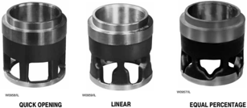
*Рис 1-8. Различные типы клеток (сепараторов) регулирующих клапанов.*

*   **Запирающий элемент / Затвор (Closure Member)**: Подвижная часть клапана (плунжер, диск, шар), изменяющая проходное сечение.
*   **Направляющая затвора (Closure Member Guide)**: Часть затвора, обеспечивающая его центровку в клетке, седле или крышке.
*   **Диафрагма (Diaphragm)**: Гибкий элемент, реагирующий на давление и передающий усилие на шток привода.
*   **Привод прямого действия (Direct Actuator)**: Пневмопривод, у которого шток выдвигается при увеличении давления.
*   **Удлиненная крышка (Extension Bonnet)**: Крышка увеличенной длины (для работы при экстремальных температурах).

---

## 🏷️ Типы клапанов и детали
[🔝 Сверху](#top)

*   **Проходной клапан (Globe Valve)**: Клапан с линейным движением затвора, отличающийся характерной формой корпуса вокруг зоны портов.
*   **Сальниковый узел (Packing Box Assembly)**: Часть узла крышки, используемая для герметизации штока. Включает набивку, нажимную втулку, пружины и т.д.

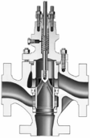
*Рис 1-13. Детали сальникового узла.*

*   **Поршневой привод (Piston Type Actuator)**: Привод, где движущей силой является давление на поршень.
*   **Седло (Seat)**: Зона контакта между затвором и сопряженной поверхностью, обеспечивающая отсечку (герметичность).
*   **Кольцо седла (Seat Ring)**: Часть узла корпуса, обеспечивающая посадочную поверхность для затвора.

---

## 🏷️ Терминология: Поворотные клапаны
[🔝 Сверху](#top)

*   **Рычаг привода (Actuator Lever)**: Плечо, прикрепленное к валу поворотного клапана для преобразования линейного движения штока во вращательное усилие.
*   **Полнопроходной шар (Ball, Full)**: Сферический затвор с проходным отверстием, равным диаметру трубы.
*   **Сегментированный шар (Ball, Segmented)**: Затвор в виде сегмента сферы. Обеспечивает равнопроцентную характеристику.
*   **V-образный шар (Ball, V-notch)**: Тип сегментированного шара с V-образным вырезом для широкого диапазона регулирования.
*   **Дисковый (заслонка) (Disk)**: Симметричный затвор в клапанах типа «баттерфляй».
*   **Эксцентриковый затвор (Eccentric Plug)**: Поворотный затвор со смещенной осью, что снижает износ уплотнения.
*   **Вал (Shaft)**: Часть поворотного клапана, соответствующая штоку проходного клапана.

---

## 🏷️ Характеристики и Расчет
[🔝 Сверху](#top)

*   **Коэффициент расхода (Cv)**: Константа, определяющая пропускную способность клапана.
*   **Диапазон регулирования (Rangeability)**: Отношение максимального Cv к минимальному контролируемому.
*   **Сжатое сечение (Vena Contracta)**: Область потока за сужением с максимальной скоростью и минимальным статическим давлением.

---

## 🏷️ Глава 2: Характеристики производительности
[🔝 Сверху](#top)

## Глава 2
## Производительность регулирующих клапанов

В условиях современной глобализации компаниям крайне важно снижать производственные затраты. Снижение **изменчивости процесса (Process Variability)** через применение современных технологий управления признано эффективным методом улучшения финансовых результатов.

### Изменчивость процесса
Основная цель компании — получение прибыли за счет выпуска качественной продукции. Снижение изменчивости позволяет оптимизировать процесс и выпускать качественный продукт «с первого раза». 

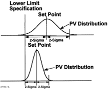
*Рис 2-1. Влияние снижения изменчивости на точность соблюдения спецификаций.*

### Зона нечувствительности (Dead Band)
Зона нечувствительности — основной виновник излишней изменчивости. Она возникает из-за трения, люфтов, закручивания валов в поворотных клапанах. Когда контроллер выдает команду, процесс не реагирует до тех пор, пока сигнал не преодолеет зону нечувствительности.

Хорошо спроектированный клапан должен реагировать на сигналы величиной **1% и менее**. Однако у многих клапанов зона нечувствительности достигает 5% и более.

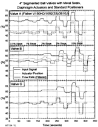
*Рис 2-3. Сравнение реакции трех различных клапанов (A, B, C) на ступенчатые сигналы.*

---

## 🏷️ Проектирование привода и позиционера
[🔝 Сверху](#top)

Комбинация привода и позиционера критически влияет как на статическую точность (зону нечувствительности), так и на динамический отклик всей сборки. 

### Позиционеры (Positioners)
Для минимизации изменчивости процесса наиболее важен высокий коэффициент усиления позиционера. Он состоит из двух частей:
1.  **Статический коэффициент усиления**: Чувствительность к малым изменениям сигнала (0.125% и менее). Реализуется через «предусилитель» (например, сопло-заслонка).
2.  **Динамический коэффициент усиления**: Способность быстро подавать большой объем воздуха в привод для быстрого перемещения затвора.

**Проблема золотниковых позиционеров (Spool Valve Positioners)**: Часто в них отсутствует каскад предварительного усиления, что снижает чувствительность к малым сигналам и увеличивает время запаздывания.

---

## 🏷️ Время отклика клапана ($T_{63}$)
[🔝 Сверху](#top)

Время отклика клапана измеряется параметром **$T_{63}$**. Это время от момента изменения входного сигнала до достижения выходом 63% от заданного значения. Оно включает:
*   **Время запаздывания ($T_d$)**: Статическое время ожидания.
*   **Динамическое время**: Время фактического движения.

Для оптимального управления время запаздывания ($T_d$) не должно превышать **1/3** от общего времени отклика $T_{63}$.

### Поршневые приводы против Мембранных
Существует заблуждение, что поршневые приводы всегда быстрее мембранных (spring-and-diaphragm). На самом деле:
*   Поршневые приводы быстрее при полном ходе (100% stroke).
*   **Мембранные приводы** значительно превосходят поршневые при **малых сигналах (0.25% – 2%)**, которые наиболее типичны для автоматического регулирования. Причина — гораздо более низкое трение в мембранном приводе.

---

## 🏷️ Типы клапанов и пропускные характеристики
[🔝 Сверху](#top)

Выбор типа клапана и его характеристик определяет успех оптимизации процесса.

### Собственная характеристика (Inherent Characteristic)
Это зависимость пропускной способности от хода затвора при **постоянном** перепаде давления. 
*   **Линейная**: Постоянный коэффициент усиления во всем диапазоне.
*   **Равнопроцентная**: Коэффициент усиления растет по мере открытия клапана.
*   **Быстрооткрывающаяся**: Максимальное усиление в начале хода.

### Коэффициент усиления процесса (Installed Process Gain)
Для стабильности контура коэффициент усиления не должен изменяться более чем в **4 раза** во всем рабочем диапазоне. Рекомендуемые пределы усиления процесса — **от 0.5 до 2.0**.

---

## 🏷️ Подбор типоразмера (Sizing)
[🔝 Сверху](#top)

**Завышение типоразмера (Oversizing)** — частая ошибка, ведущая к деградации управления. Основные проблемы завышенного клапана:
1.  Слишком высокий коэффициент усиления клапана, что заставляет снижать усиление контроллера.
2.  Работа в нижней зоне хода (близко к седлу), где влияние трения и зоны нечувствительности максимально.

Для правильного выбора необходимо учитывать реальные перепады давления и требования к динамике контура.

---
[[Навигация.md]] | [[Каталог_Книг.md]]

---

## 🏷️ Глава 3: Типы и конструкции клапанов
[🔝 Сверху](#top)

## Глава 3
## Типы клапанов и модификации

Правильный выбор типа клапана — залог долговечности системы. В этой главе рассматриваются основные конструкции проходных (Globe) и поворотных клапанов, их преимущества и области применения.

### Проходные клапаны (Globe Valves)
Проходные клапаны — самый распространенный тип регулирующей арматуры. Они обеспечивают высокую точность регулирования и герметичность.

#### Односедельные клапаны (Single-Ported)
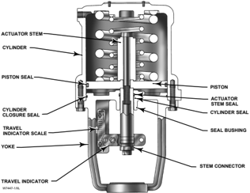
*Рис 3-1. Типовой односедельный регулирующий клапан.*

*   **Преимущества**: Высокий класс герметичности (вплоть до Class VI по ANSI). Простота обслуживания.
*   **Особенности**: Создают значительное осевое усилие на шток из-за неуравновешенности плунжера, что требует мощных приводов.

#### Уравновешенные клапаны (Balanced/Balanced-Cage)
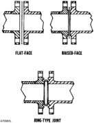
*Рис 3-2. Клапан с уравновешенным затвором (Design ED).*

В этой конструкции используются специальные протоки в плунжере или «клетка» (сепаратор), чтобы уровнять давление сверху и снизу запирающего элемента.
*   **Результат**: Резкое снижение требуемого усилия на привод. Позволяет использовать компактные актуаторы даже на высоких давлениях.

---

## 🏷️ Специальные исполнения: Кавитация и Шум
[🔝 Сверху](#top)

При работе на больших перепадах давления возникают критические явления: кавитация и сверхзвуковой шум. 

### Кавитация (Cavitation)
Возникает, когда давление в сжатом сечении (Vena Contracta) падает ниже давления насыщенных паров, а затем восстанавливается. Это ведет к микровзрывам пузырьков газа, которые «выгрызают» металл.

#### Решение: Cavitrol Trim
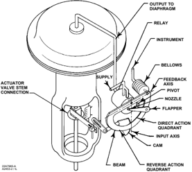
*Рис 3-15. Трим Cavitrol для предотвращения кавитации.*
Многоступенчатое расширение потока в клетке предотвращает локальное падение давления ниже критического уровня.

### Снижение шума: Whisper Trim
Для борьбы с аэродинамическим шумом используются специальные сепараторы с множеством отверстий малого диаметра (Whisper Trim), которые дробят поток и смещают частоту шума в неслышимый или менее разрушительный диапазон.

---

## 🏷️ Поворотные клапаны (Rotary Valves)
[🔝 Сверху](#top)

#### Клапаны с сегментированным шаром (V-notch Ball)
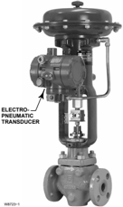
*Рис 3-20. Клапан с V-образным вырезом шара.*

*   **Особенности**: V-образный вырез обеспечивает широчайший диапазон регулирования (**Rangeability** до 300:1) и отличную работу на вязких или загрязненных средах.
*   **Применение**: Целлюлозно-бумажная промышленность, нефтехимия.

#### Дисковые затворы (Butterfly Valves)
Эффективны для больших диаметров и малых перепадов давления. Современные конструкции (High Performance Butterfly) имеют двойной или тройной эксцентриситет для снижения износа уплотнения.

---
[[Навигация.md]] | [[Каталог_Книг.md]]

---

## 🏷️ Глава 4: Приводы и аксессуары
[🔝 Сверху](#top)

## Глава 4
## Приводы регулирующих клапанов

Привод — это «мускулы» регулирующего клапана. Он преобразует управляющий сигнал в механическое движение для позиционирования затвора.

### Пневматические приводы
Самый популярный тип привода благодаря надежности, простоте и возможности обеспечения «безопасного положения» при отказе питания.

#### Мембранно-пружинные приводы (Diaphragm Actuators)
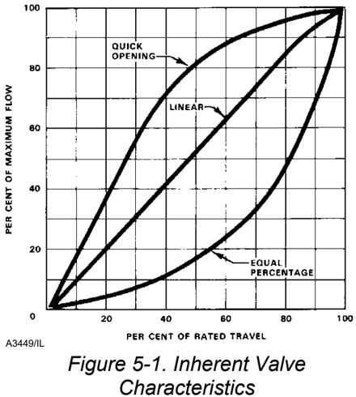
*Рис 4-1. Пневматический мембранно-пружинный привод прямого действия.*

*   **Принцип**: Давление воздуха воздействует на гибкую мембрану, сжимая пружину.
*   **Безопасность (Fail-Safe)**: При потере воздуха пружина автоматически возвращает клапан в открытое (Fail Open) или закрытое (Fail Close) состояние.
*   **Преимущество**: Высокая чувствительность и низкое трение. Лучший выбор для точного регулирования.

#### Поршневые приводы (Piston Actuators)
Используются там, где требуются большие усилия или длинные хода штока. Могут работать с более высоким давлением питания.

---

## 🏷️ Аксессуары: Позиционеры
[🔝 Сверху](#top)

Позиционер — это высокоточное устройство обратной связи, которое гарантирует, что шток клапана находится именно в том положении, которое задал контроллер.

### Зачем нужен позиционер?
1.  **Преодоление трения**: Сальниковые уплотнения создают трение, мешающее точному позиционированию.
2.  **Линеаризация**: Позволяет изменять характеристику клапана на уровне сигнала.
3.  **Скорость**: Ускоряет отклик больших клапанов.

### Типы позиционеров
*   **Пневматические (P/P)**: Принимают сигнал 3-15 psi.
*   **Электропневматические (E/P)**: Принимают сигнал 4-20 мА.
*   **Цифровые (FIELDVUE)**: Интеллектуальные устройства с диагностикой и поддержкой протоколов HART/Foundation Fieldbus.

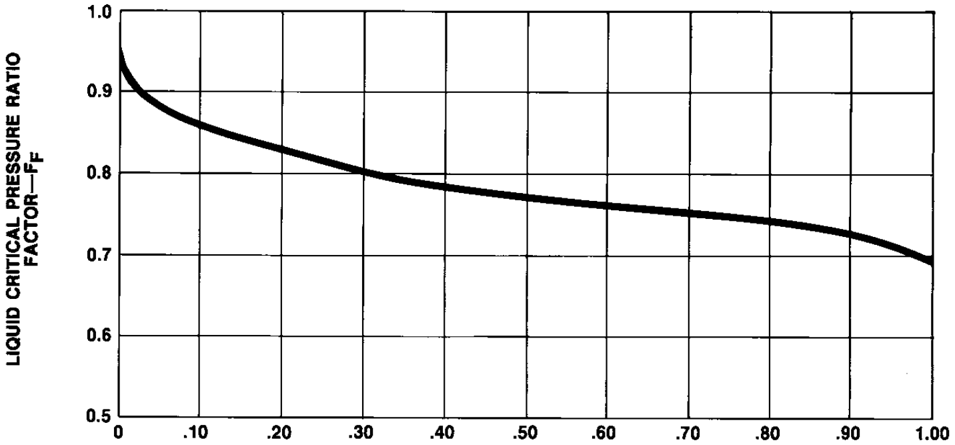
*Рис 4-5. Схема работы цифрового позиционера FIELDVUE.*

---

## 🏷️ Дополнительное оборудование
[🔝 Сверху](#top)

*   **Бустеры (Volume Boosters)**: Увеличивают скорость хода клапана за счет подачи большого объема воздуха.
*   **Соленоидные клапаны (Solenoid Valves)**: Обеспечивают быстрое отсечное срабатывание или блокировку привода.
*   **ЭПП (I/P Transducers)**: Простые устройства для преобразования тока 4-20 мА в давление воздуха 3-15 psi.

---
[[Навигация.md]] | [[Каталог_Книг.md]]

---

## 🏷️ Глава 5: Установка и обслуживание
[🔝 Сверху](#top)

## Глава 3 (Продолжение) / Глава 5
## Монтаж и эксплуатация регулирующей арматуры

Правильная установка — это 50% успеха в работе клапана. Даже самый дорогой клапан может выйти из строя за несколько дней при некорректном монтаже.

### Подготовка к установке
*   **Чистота трубопровода**: Перед установкой клапана трубопровод должен быть очищен от окалины, сварочного грата и мусора. Инородные тела — главная причина повреждения седел.
*   **Подъемные работы**: Никогда не поднимайте клапан за шток или аксессуары (позиционер, трубки). Используйте специальные проушины на корпусе или стропы вокруг фланцев.

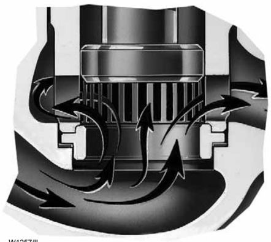
*Рис 5-1. Правильная строповка регулирующего клапана при монтаже.*

### Сальниковые уплотнения (Packing)
Сальник — это критическая зона, где происходит утечка среды в атмосферу. 
*   **Регулировка**: Нажимная втулка сальника должна быть затянута ровно настолько, чтобы обеспечить герметичность, но не препятствовать движению штока (не создавать избыточного трения).
*   **Материалы**: Тефлон (PTFE) — для низких температур и низкого трения. Графит — для высоких температур (свыше 230°C).

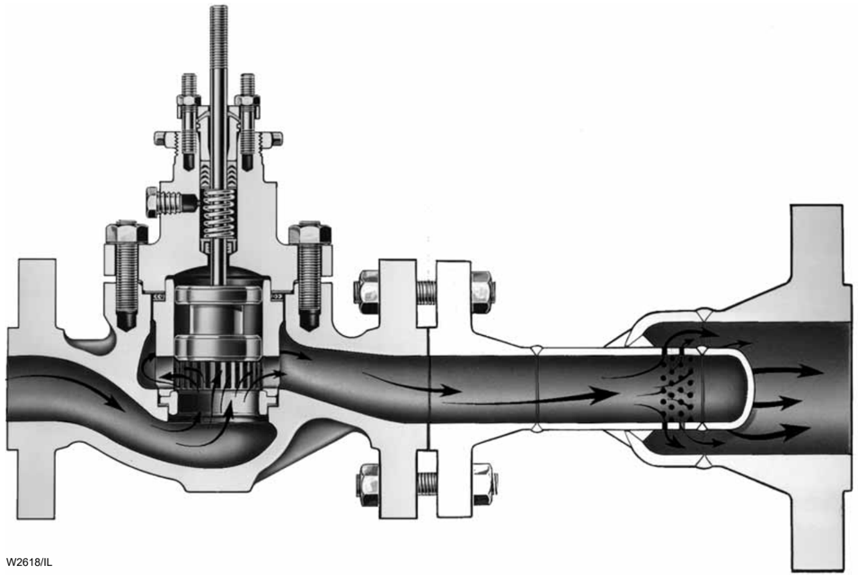
*Рис 5-3. Конструкция современного сальникового узла ENVIRO-SEAL для снижения выбросов.*

---

## 🏷️ Техническое обслуживание (Maintenance)
[🔝 Сверху](#top)

### Проверка герметичности седла
Герметичность затвора классифицируется по стандарту ANSI/FCI 70-2.
*   **Class IV**: Самый распространенный (металлическое седло). Допустимая протечка 0.01% от емкости клапана.
*   **Class VI**: «Пузырьковая герметичность» (эластичное седло). Используется для полной отсечки.

### Притирка седел (Lapping)
Для восстановления герметичности металлических седел применяется притирка плунжера к кольцу седла с использованием абразивных паст. 

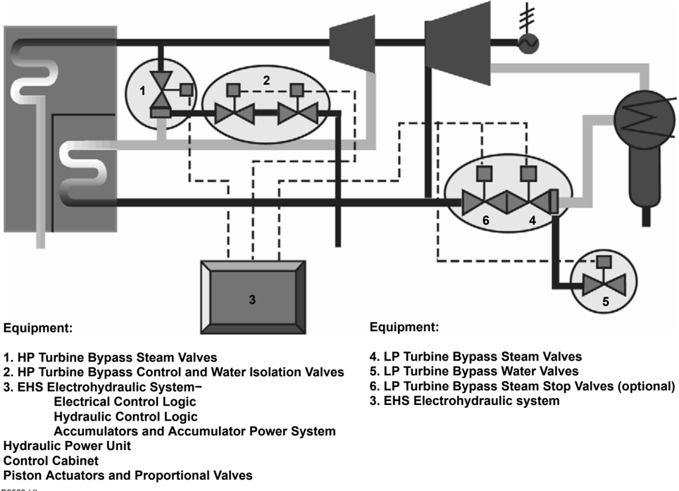
*Рис 5-12. Процесс ручной притирки седла регулирующего клапана.*

---

## 🏷️ Цифровая диагностика
[🔝 Сверху](#top)

Современные позиционеры (например, FIELDVUE) позволяют проводить диагностику без снятия клапана с линии.
*   **Valve Signature**: График зависимости положения штока от давления в приводе. Позволяет выявить износ сальника, поломку пружины или повреждение седла на ранних стадиях.

---
[[Навигация.md]] | [[Каталог_Книг.md]]

---

## 🏷️ Глава 6 (Продолжение) / Глава 10: Инженерные данные
[🔝 Сверху](#top)

### Классификация опасных зон и степени защиты (IP)

Безопасность в промышленных условиях является приоритетом. Оборудование, предназначенное для работы во взрывоопасных средах, должно соответствовать строгим международным стандартам, таким как IEC EN 50014.

#### Температурный код (Temperature Code)
Горючие газовые смеси могут воспламениться при контакте с горячей поверхностью. Температурный код указывает на максимальную температуру поверхности, которую оборудование достигает в нормальном режиме работы (при температуре окружающей среды 40°C, если не указано иное).

### 📊 Таблица: Температурные коды
| Код температуры | Максимальная температура поверхности (°C) | Максимальная температура поверхности (°F) |
|:---|:---|:---|
| T1 | 450 | 842 |
| T2 | 300 | 572 |
| T3 | 200 | 392 |
| T4 | 135 | 275 |
| T5 | 100 | 212 |
| T6 | 85 | 185 |

#### Степени защиты оболочки (IEC IP Rating)
Согласно стандарту IEC 60529, степень защиты оболочки обозначается кодом IP (Ingress Protection). Первая цифра указывает на защиту от проникновения твердых частиц и контакта с опасными частями; вторая — на защиту от проникновения воды.

### 📊 Таблица: Коды защиты IP (Кратко)
| Первая цифра (Твердые частицы) | Вторая цифра (Жидкости) |
|:---|:---|
| 0: Нет защиты | 0: Нет защиты |
| 1: Объекты > 50 мм | 1: Вертикальные капли |
| 2: Объекты > 12.5 мм | 2: Капли под углом 15° |
| 3: Объекты > 2.5 мм | 3: Распыляемая вода (брызги) |
| 4: Объекты > 1.0 мм | 4: Сплески воды со всех сторон |
| 5: Пылезащищенное | 5: Струи воды |
| 6: Пыленепроницаемое | 6: Мощные струи воды |
| - | 7: Временное погружение |
| - | 8: Длительное погружение |

---

### Методы защиты в опасных зонах

1.  **Взрывонепроницаемая оболочка (Flameproof)**: Оборудование помещается в корпус, способный выдержать внутренний взрыв и предотвратить передачу пламени в окружающую атмосферу.
2.  **Повышенная защита (Increased Safety)**: Применяются дополнительные меры для предотвращения искрения, дугообразования и чрезмерного нагрева.
3.  **Искробезопасная электрическая цепь (Intrinsically Safe)**: Ограничение энергии (тока и напряжения), поступающей в опасную зону, чтобы исключить возможность воспламенения даже при неисправности.

---

## 🏷️ Глава 10: Инженерные данные — Материалы клапанов
[🔝 Сверху](#top)

В данном разделе приведены стандартные спецификации материалов, используемых компанией Fisher для изготовления корпусов и внутренних деталей клапанов.

#### 1. Литая углеродистая сталь (Cast Carbon Steel)
**ASTM A216 Grade WCC**
*   **Диапазон температур**: от -29 до 427 °C (от -20 до 800 °F)
*   **Применение**: Стандартный материал для неагрессивных сред.

#### 2. Низкотемпературная углеродистая сталь
**ASTM A352 Grade LCC**
*   **Диапазон температур**: от -46 до 343 °C (от -50 до 650 °F)
*   **Применение**: Для условий, где возможны отрицательные температуры (до -46°C).

#### 3. Хромомолибденовая сталь (Cr-Mo Steel)
**ASTM A217 Grade WC6 / WC9**
*   **Диапазон температур**: до 593 °C (1100 °F)
*   **Применение**: Высокие температуры и давления, требует сопротивления ползучести.

#### 4. Нержавеющая сталь 316L
**ASTM A479 UNS S31603**
*   **Диапазон температур**: от -254 до 454 °C (от -425 до 850 °F)
*   **Применение**: Криогенные среды и коррозионно-активные процессы.

---
[[Навигация.md]] | [[Каталог_Книг.md]]

---

## 🏷️ Глава 10: Спецификации материалов (Продолжение)
[🔝 Сверху](#top)

Ниже перечислены основные сплавы, используемые для корпусов и трима регулирующих клапанов, с указанием их свойств и химического состава по стандартам ASTM/AISI.

#### 5. Хромомолибденовая сталь AISI 4140
*(Аналогична материалу болтов ASTM A193 Grade B7)*
*   **Диапазон температур**: от -48 до 538 °C (от -55 до 1000 °F).
*   **Состав**: Cr (0.8-1.1%), Mo (0.15-0.25%), C (0.38-0.43%).

#### 6. Кованая 3.5% никелевая сталь
**ASTM A352 Grade LC3**
*   **Диапазон температур**: от -101 до 343 °C (от -150 до 650 °F).
*   **Состав**: Ni (3.0-4.0%), C (0.15% макс). Используется для низкотемпературных условий.

#### 7-9. Высокотемпературные хромомолибденовые стали (WC6, WC9, F22)
Эти стали используются в энергетике при высоких температурах до 593°C (1100°F).
*   **WC6 (ASTM A217)**: 1.25% Cr, 0.5% Mo.
*   **WC9 (ASTM A217)**: 2.25% Cr, 1.0% Mo.
*   **F22 (ASTM A182)**: Кованый аналог WC9.

#### 11-18. Аустенитные нержавеющие стали (Серия 300)
Широко применяются из-за отличной коррозионной стойкости и прочности при криогенных температурах.
*   **304L / CF3**: Низкоуглеродистая версия. Температуры от -254 до 427 °C.
*   **316 / CF8M**: Содержит молибден (2-3%) для лучшей стойкости к точечной коррозии.
*   **317 / CG8M**: Повышенное содержание хрома и молибдена для особо агрессивных сред.

---

## 🏷️ Чугуны и цветные сплавы
[🔝 Сверху](#top)

#### 25-26. Серый чугун (Cast Iron)
**ASTM A126 Class B/C**
*   **Диапазон температур**: от -29 до 232 °C (до 450 °F) для деталей под давлением.
*   **Ограничение**: Не рекомендуется использовать при резких температурных перепадах или механических ударах.

#### 27. Высокопрочный чугун (Ductile Iron)
**ASTM A395 Type 60-40-18**
*   **Диапазон температур**: от -29 до 343 °C (от -20 до 650 °F).
*   **Преимущества**: Сочетает коррозионную стойкость чугуна с механическими свойствами, близкими к углеродистой стали.

---
[[Навигация.md]] | [[Каталог_Книг.md]]

---

## 🏷️ Бронзы и спецсплавы
[🔝 Сверху](#top)

#### 29-32. Медные сплавы (Бронзы)
Бронзы часто используются для внутренних деталей клапанов в условиях работы с водой, паром или агрессивными жидкостями при умеренных температурах.
*   **Клапанная бронза (ASTM B61)**: Т-диапазон от -198 до 288 °C. Высокое содержание меди (86-90%).
*   **Алюминиевая бронза (ASTM B148)**: Обладает высокой прочностью и стойкостью к окислению.

#### 40-43. Никель-хром-молибденовые сплавы (Alloy C / B2)
Эти сплавы предназначены для работы в экстремально агрессивных химических средах.
*   **Alloy C (ASTM A494 CW2M)**: Высокая стойкость к сильным окислителям и восстановителям.
*   **Alloy B2 (ASTM B335)**: Специально для работы с соляной кислотой и другими восстановительными средами.

---

## 🏷️ Сводная таблица механических свойств
[🔝 Сверху](#top)

Ниже приведены минимальные механические свойства материалов корпусов и внутренних деталей при температуре 21°C (70°F).

| Код мат. | Предел прочности, MPa (ksi) | Предел текучести, MPa (ksi) | Удлинение (50 мм), % | Твердость по Бринеллю |
|:---|:---|:---|:---|:---|
| 1 (WCC) | 485-655 (70-95) | 275 (40) | 22 | 137-187 |
| 7 (WC6) | 485-655 (70-95) | 275 (40) | 20 | 147-200 |
| 11 (302 SS) | 515 (75) | 205 (30) | 30 | 150 |
| 15 (316 SS) | 551 (80) | 240 (35) | 30 | 150 |
| 27 (Ductile) | 415 (60) | 276 (40) | 18 | 143-187 |

---

## 🏷️ Физические константы углеводородов
[🔝 Сверху](#top)

Данные константы необходимы для расчетов пропускной способности клапанов (Cv) и проверки на возможность кавитации или критического расхода.

| Соединение | Формула | Молек. вес | Точка кипения (1 атм), °C | Уд. вес (Air=1) |
|:---|:---|:---|:---|:---|
| Метан | CH4 | 16.0 | -161.5 | 0.55 |
| Этан | C2H6 | 30.1 | -88.6 | 1.04 |
| Пропан | C3H8 | 44.1 | -42.0 | 1.52 |
| n-Бутан | C4H10 | 58.1 | -0.5 | 2.01 |

---
[[Навигация.md]] | [[Каталог_Книг.md]]

---

## 🏷️ Физические константы различных сред
[🔝 Сверху](#top)

Ниже приведены физические константы для различных жидкостей и газов, часто встречающихся в технологических процессах.

#### Показатель адиабаты (k = Cp/Cv)
*Данный параметр критически важен для расчета коэффициента расширения газов.*

| Газ | k | Газ | k |
|:---|:---|:---|:---|
| Воздух | 1.40 | Углекислый газ | 1.29 |
| Аргон | 1.67 | Гелий | 1.66 |
| Метан | 1.26 | Азот | 1.40 |
| Природный газ | 1.32 | Кислород | 1.40 |
| Водяной пар | 1.33 | Пропан | 1.21 |

#### Свойства технических жидкостей и газов
| Среда | Формула | Молек. вес | Т. кипения (°C) | Плотность (Liq) | Уд. вес (Gas) |
|:---|:---|:---|:---|:---|:---|
| Уксусная кислота | CH3COOH | 60.05 | 118 | 1.05 | - |
| Ацетон | C3H6O | 58.08 | 56 | 0.79 | 2.01 |
| Аммиак | NH3 | 17.03 | -33.3 | 0.62 | 0.59 |
| Хлор | Cl2 | 70.91 | -34.4 | 1.42 | 2.45 |
| Этиловый спирт | C2H5OH | 46.07 | 78.3 | 0.79 | 1.59 |
| Ртуть | Hg | 200.6 | 354 | 13.6 | 6.93 |

---

## 🏷️ Свойства аммиака (Хладагент 717)
[🔝 Сверху](#top)

*Параметры насыщенной жидкости и пара.*

| Темп. (°C) | Давление (бар абс) | Плотность жидк. (кг/м³) | Энтальпия жидк. (кДж/кг) | Энтальпия пара (кДж/кг) |
|:---|:---|:---|:---|:---|
| -40 | 0.71 | 688 | 0 | 1390 |
| -20 | 1.90 | 665 | 45 | 1410 |
| 0 | 4.29 | 638 | 200 | 1461 |
| 20 | 8.57 | 610 | 285 | 1482 |
| 40 | 15.5 | 580 | 371 | 1490 |

---

## 🏷️ Свойства воды и насыщенного пара
[🔝 Сверху](#top)

Эти таблицы являются фундаментальными для большинства инженерных расчетов в теплоэнергетике и при выборе регулирующей арматуры.

#### Свойства воды
| Температура (°C) | Давление насыщ. (кПа) | Удельный вес |
|:---|:---|:---|
| 0 | 0.61 | 1.001 |
| 20 | 2.34 | 1.000 |
| 50 | 12.33 | 0.988 |
| 100 | 101.3 | 0.958 |
| 150 | 476.2 | 0.917 |

#### Насыщенный пар (Краткая выдержка)
| Давление (бар абс) | Темп. насыщ. (°C) | Уд. объем пара (м³/кг) | Энтальпия пара (кДж/кг) |
|:---|:---|:---|:---|
| 1.013 | 100.0 | 1.673 | 2676 |
| 2.0 | 120.2 | 0.885 | 2706 |
| 5.0 | 151.8 | 0.375 | 2748 |
| 10.0 | 179.9 | 0.194 | 2777 |
| 20.0 | 212.4 | 0.099 | 2798 |

---
[[Навигация.md]] | [[Каталог_Книг.md]]

---

## 🏷️ Свойства перегретого пара
[🔝 Сверху](#top)

*Перегретый пар используется в турбинах и высокотемпературных процессах. Приведены значения удельного объема (r, фут³/фунт) и энтальпии (h, БТЕ/фунт).*

| Давление (psig) | 400°F (204°C) | 600°F (315°C) | 800°F (427°C) | 1000°F (538°C) |
|:---|:---|:---|:---|:---|
| 0 (Атм) | r: 34.68, h: 1240 | r: 42.86, h: 1335 | r: 51.00, h: 1432 | r: 59.13, h: 1533 |
| 100 | r: 4.937, h: 1228 | r: 6.218, h: 1329 | r: 7.446, h: 1429 | r: 8.656, h: 1531 |
| 400 | r: 1.365, h: 1271 | r: 1.477, h: 1307 | r: 1.816, h: 1416 | r: 2.134, h: 1522 |
| 1000 | - | r: 0.514, h: 1249 | r: 0.688, h: 1389 | r: 0.829, h: 1505 |

---

## 🏷️ Скорость жидкостей в трубопроводах
[🔝 Сверху](#top)

Средняя скорость любого потока жидкости может быть рассчитана по следующей формуле или определена с помощью номограммы.

> [!NOTE]
> **Формула скорости:**
> $v = rac{0.408 \cdot Q}{d^2}$
> Где:
> - $v$ — средняя скорость (фут/сек)
> - $Q$ — расход (галлонов в минуту)
> - $d$ — внутренний диаметр трубы (дюймы)

#### Рекомендуемые скорости для воды
| Условия эксплуатации | Скорость (фут/сек) | Скорость (м/сек) |
|:---|:---|:---|
| Всас питательного насоса | 8 – 15 | 2.4 – 4.5 |
| Линии дренажа | 4 – 7 | 1.2 – 2.1 |
| Общее назначение | 4 – 10 | 1.2 – 3.0 |
| Городской водопровод | до 7 | до 2.1 |

---

## 🏷️ Расход воды через стальные трубы (Schedule 40)
[🔝 Сверху](#top)

*Данные основаны на воде при температуре 60°F (15.5°C). Приведены потери давления на 100 футов трубы (ΔP) и скорость (v).*

| Расход (GPM) | 1" Труба (v / ΔP) | 2" Труба (v / ΔP) | 4" Труба (v / ΔP) | 6" Труба (v / ΔP) |
|:---|:---|:---|:---|:---|
| 10 | 3.71 / 2.99 | 0.956 / 0.108 | - | - |
| 50 | - | 4.78 / 2.03 | 1.26 / 0.076 | - |
| 100 | - | 9.56 / 7.59 | 2.52 / 0.272 | 1.11 / 0.036 |
| 500 | - | - | 12.61 / 5.56 | 5.57 / 0.743 |
| 1000 | - | - | - | 11.14 / 2.76 |

---
[[Навигация.md]] | [[Каталог_Книг.md]]

---

# Глава 11. Справочные данные по трубопроводам
[🔝 Сверху](#top)

В этой главе приведены технические данные труб, фланцев и крепежных изделий, необходимые для правильного выбора и монтажа регулирующих клапанов.

---

## 🏷️ Спецификации стальных труб (ASME B36.10M / B36.19M)
[🔝 Сверху](#top)

*Приведены данные для труб из углеродистой, легированной и нержавеющей стали. Обозначения: STD — стандартная, XS — усиленная, XXS — двойная усиленная.*

| Номин. размер (дюймы) | Наруж. диам. (дюймы) | Тип / Расписание (Schedule) | Толщина стенки (дюймы) | Внутр. диам. (дюймы) | Площадь сечения (фут²) | Вес трубы (фунт/фут) |
|:---|:---|:---|:---|:---|:---|:---|
| **1/2** | 0.840 | STD (40S) / 80S / 160 | 0.109 / 0.147 / 0.188 | 0.622 / 0.546 / 0.464 | 0.00211 / 0.00163 / 0.00117 | 0.85 / 1.09 / 1.31 |
| **1** | 1.315 | STD (40S) / 80S / 160 | 0.133 / 0.179 / 0.250 | 1.049 / 0.957 / 0.815 | 0.00600 / 0.00500 / 0.00362 | 1.68 / 2.17 / 2.84 |
| **2** | 2.375 | STD (40S) / 80S / 110 | 0.154 / 0.218 / 0.344 | 2.067 / 1.939 / 1.687 | 0.02330 / 0.02051 / 0.01552 | 3.65 / 5.02 / 7.46 |
| **4** | 4.500 | STD (40S) / 80S / 120 | 0.237 / 0.337 / 0.438 | 4.026 / 3.826 / 3.624 | 0.08840 / 0.07984 / 0.07163 | 10.79 / 14.98 / 19.00 |
| **6** | 6.625 | STD (40S) / 80S / 120 | 0.280 / 0.432 / 0.562 | 6.065 / 5.761 / 5.501 | 0.20063 / 0.18102 / 0.16505 | 18.97 / 28.57 / 36.39 |

---

## 🏷️ Размеры американских трубных фланцев
[🔝 Сверху](#top)
### Диаметры окружностей центров болтов (дюймы) 
*(Согласно ASME B16.1, B16.5 и B16.24)*

| Номин. размер | Класс 125/150 | Класс 250/300 | Класс 600 | Класс 900 | Класс 1500 | Класс 2500 |
|:---|:---|:---|:---|:---|:---|:---|
| 1 | 3.12 | 3.50 | 3.50 | 3.50 | 4.00 | 4.25 |
| 2 | 4.75 | 5.00 | 5.00 | 6.50 | 6.50 | 6.75 |
| 4 | 7.50 | 7.88 | 8.50 | 9.25 | 9.50 | 10.75 |
| 6 | 9.50 | 10.62 | 11.50 | 12.50 | 12.50 | 14.50 |
| 10 | 14.25 | 15.25 | 17.00 | 18.50 | 19.00 | 21.75 |

---

## 🏷️ Количество и диаметр шпилек
[🔝 Сверху](#top)

| Номин. размер | Класс 150 (Кол-во x Диам) | Класс 300 (Кол-во x Диам) | Класс 600 (Кол-во x Диам) | Класс 900 (Кол-во x Диам) |
|:---|:---|:---|:---|:---|
| 1 | 4 x 0.50" | 4 x 0.62" | 4 x 0.62" | 4 x 0.88" |
| 2 | 4 x 0.62" | 8 x 0.62" | 8 x 0.62" | 8 x 0.88" |
| 4 | 8 x 0.62" | 8 x 0.75" | 8 x 0.88" | 8 x 1.12" |
| 8 | 8 x 0.75" | 12 x 0.88" | 12 x 1.12" | 12 x 1.38" |
| 12 | 12 x 0.88" | 16 x 1.12" | 20 x 1.25" | 20 x 1.38" |

---
[[Навигация.md]] | [[Каталог_Книг.md]]

---

## 🏷️ Стандарты фланцев PN (Метрические)
[🔝 Сверху](#top)
### Стальные фланцы PN 16 / PN 40 / PN 63

| DN | Наруж. диам. (мм) | Толщина фланца (мм) | Окружн. болтов (мм) | Кол-во болтов | Резьба | Отв. под болт (мм) |
|:---|:---|:---|:---|:---|:---|:---|
| **PN 16** | | | | | | |
| 25 | 115 | 18 | 85 | 4 | M12 | 14 |
| 50 | 165 | 20 | 125 | 4 | M16 | 18 |
| 100 | 220 | 20 | 180 | 8 | M16 | 18 |
| **PN 40** | | | | | | |
| 25 | 115 | 18 | 85 | 4 | M12 | 14 |
| 50 | 165 | 20 | 125 | 4 | M16 | 18 |
| 100 | 235 | 24 | 190 | 8 | M20 | 22 |
| **PN 63** | | | | | | |
| 25 | 140 | 24 | 100 | 4 | M16 | 18 |
| 50 | 180 | 26 | 135 | 4 | M20 | 22 |
| 100 | 250 | 30 | 200 | 8 | M24 | 26 |

---

## 🏷️ Коэффициенты пересчета и эквиваленты
[🔝 Сверху](#top)

### Дробные дюймы в миллиметры
| Дюймы | ММ | Дюймы | ММ | Дюймы | ММ |
|:---|:---|:---|:---|:---|:---|
| 1/16 | 1.59 | 1/4 | 6.35 | 1/2 | 12.70 |
| 1/8 | 3.18 | 3/8 | 9.53 | 3/4 | 19.05 |

### Давление
| Умножить | На | Чтобы получить |
|:---|:---|:---|
| фунт/кв. дюйм (psi) | 0.06895 | бар |
| фунт/кв. дюйм (psi) | 6.89476 | кПа |
| бар | 14.5038 | фунт/кв. дюйм (psi) |
| кг/см² | 14.2233 | фунт/кв. дюйм (psi) |

### Температура
- $T(°C) = rac{T(°F) - 32}{1.8}$
- $T(°F) = T(°C) \cdot 1.8 + 32$

---

# Предметный указатель (Избранное)
[🔝 Сверху](#top)

- **Зона нечувствительности (Dead Band)**: [стр. 25](#p25)
- **Кавитация (Cavitation)**: [стр. 110](#p110)
- **Привод (Actuator)**: [стр. 60](#p60)
- **Трим (Trim)**: [стр. 58](#p58)
- **Уставка (Set point)**: [стр. 6](#p6)
- **Характеристики потока**: [стр. 108](#p108)

---
# Конец документа
[🔝 Сверху](#top)

[[Навигация.md]] | [[Каталог_Книг.md]]
