# 📗 Modal Testing: Модальный анализ

> [!IMPORTANT]
> В данном документе представлены основы модальных испытаний и измерений механической подвижности. Анализ мод колебаний является эффективным средством моделирования динамического поведения конструкций.

## 📌 Оглавление

### 📊 Введение и основы
- [Шум и механические колебания: причины и следствия (стр. 4)](#p4)
- [Анализ сигналов и анализ систем (стр. 6)](#p6)
- [Отыскание причин проблем (стр. 7)](#p7)
- [Приемы решения динамических проблем (стр. 9)](#p9)

### 📐 Теория и модели
- [Анализ мод колебаний (стр. 11)](#p11)
- [Математические динамические модели (стр. 12)](#p12)
- [Применение данных мод колебаний (стр. 13)](#p13)
- [Проверка аналитической математической модели (стр. 14)](#p14)
- [Частотные характеристики (стр. 15)](#p15)

### 📉 Измерения и функции
- [Измерение подвижности — определения (стр. 17)](#p17)
- [Оценки частотных характеристик (H1, H2) (стр. 18)](#p18)
- [Функция когерентности (стр. 21)](#p21)
- [Двухканальный анализатор (БПФ) (стр. 22)](#p22)

### ⚠️ Ошибки и точность
- [Ошибки (случайные и систематические) (стр. 24)](#p24)
- [Ошибка рассеяния (Leakage) (стр. 25)](#p25)
- [Выбор оптимальной оценки (H1 vs H2) (стр. 26)](#p26)

### 🔨 Возбуждение и датчики
- [Возбуждение: Форма волны (стр. 27)](#p27)
- [Управление спектром и Пик-фактор (стр. 28)](#p28)
- [Способы возбуждения (Вибростенды и Молотки) (стр. 29)](#p29)
- [Измерение силы и подсоединение вибростенда (стр. 30)](#p30)
- [Измерение реакции: Датчики (стр. 31)](#p31)
- [Крепление датчиков (стр. 32)](#p32)
- [Нагрузка от датчиков на объект (стр. 33)](#p33)

### ⚡ Типы сигналов (Случайные/Ударные)
- [Случайное возбуждение (стр. 34)](#p34)
- [Псевдослучайное возбуждение (стр. 35)](#p35)
- [Ударное возбуждение: Теория (стр. 36)](#p36)
- [Ударные молотки: Масса и жесткость (стр. 37)](#p37)
- [Недостатки ударного возбуждения (стр. 38)](#p38)
- [Ударные испытания и когерентность (стр. 39)](#p39)

### ⏳ Методы взвешивания (Windowing)
- [Методы взвешивания (Связь частота/время) (стр. 40)](#p40)
- [Импульсная весовая функция и двойные удары (стр. 41)](#p41)
- [Экспоненциальная весовая функция (стр. 42)](#p42)
- [Сравнение различных видов возбуждения (стр. 43)](#p43)

### ⚙️ Калибровка и Практика
- [Калибровка системы (стр. 44)](#p44)
- [Замечания по ударной калибровке (стр. 45)](#p45)
- [Практический пример: Колебания портального крана (стр. 46)](#p46)
- [Решение проблемы и выводы (стр. 47)](#p47)

---

## 🏷️ Измерительная система (стр. 1)

[🔝 Сверху](#top)

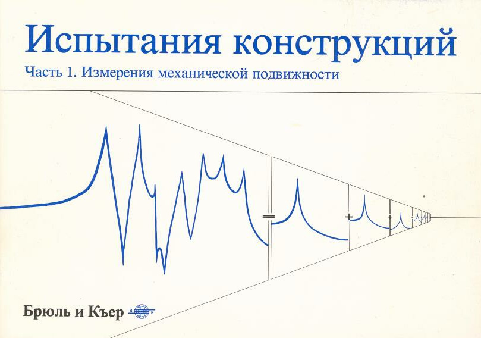

## 🏷️ Содержание (стр. 2)

[🔝 Сверху](#top)

> [!NOTE]
> **Оригинальное содержание книги**:
> Шум и механические колебания: причины и следствия (4), Анализ сигналов и систем (6), Отыскание причин проблем (7), Резонансы (8), Решение динамических проблем (9), Анализ мод (11), Математические модели (12), Применение данных (13), Проверка моделей (14), Частотные характеристики (15), Подвижность (17), Оценки H1/H2 (18), Когерентность (21), БПФ-анализатор (22), Ошибки (24), Возбуждение (27), Измерение реакции (31), Способы возбуждения (34-38), Взвешивание (40), Калибровка (44), Практикум (46).

Оле Дэссинг, БрюльиКъер

## 🏷️ Предисловие (стр. 3)

[🔝 Сверху](#top)

3

Глубокое понимание динамики механических систем имеет большое значение для проектирования, создания и усовершен ствования новых конструкций, а также для решения проблем, связанных с шумом и механическими колебаниями существу ющих конструкций. Анализ мод колебаний является эффективным средством опи сания, понимания и моделирования динамического поведения конструкций. Изучение результатов анализа мод колебаний является основой правильного понимания динамики механиче ских конструкций. Данная брошюра Испытания конструкций содержит описание теоретических основ анализа мод колебаний и динамики меха нических конструкций и систем. Если текст-прочитан и пол ностью усвоен, мы уверены, что специалист, вооруженный про стым набором измерительных данных и правильной их интер претацией, в состоянии решить 90% связанных с шумом и механическими колебаниями проблем, с которыми приходится сталкиваться в промышленности. Мы предполагаем, что читатель знаком с фундаментальными методами измерения механических колебаний и анализа сигна лов. В данной работе проведено четкое различие между анали тическими и экспериментальными методами с уделением гла вного внимания экспериментальным методам. Математические выкладки используются в ограниченном объеме и с соответст вующими пояснениями. Основное внимание уделяется методам широкополосных испытаний, проводимых с помощью двухка нальных анализаторов, выполняющих быстрое преобразование Фурье (**БПФ**), но также приводятся основы теории других мето дов испытаний. Брошюра Испытания конструкций разделена на две части: Часть 1: Измерения механической подвижности Часть 2: Анализ мод колебаний и моделирование Предисловие

## 🏷️ Шум и механические колебания: причины и следствия (стр. 4)

[🔝 Сверху](#top)

4 Шум и механические колебания: причины и следствия

Шум и механические колебания в повседневной жизни и в про мышленности возникают в связи с процессами, происхождение ко торых сопровождается возбуждением конструкций динамическими силами. Следствия шума и механических колебаний самые различные: от раздражения и чувства дискомфорта до возникновения опасности для здоровья. На человеческом теле, на машинном оборудовании, на транспортном средстве следствиями шума и .механических коле баний могут быть износ, снижение производительности, непра вильная работа и/или невосстановимые в той или иной степени повреждения. Механические колебания и шум (определяемый здесь как нежела тельный звук) тесно связаны друг с другом. Шум представляет со бой колебательную энергию конструкции, излучаемую в виде коле баний давления воздуха, которые воспринимаются человеческим слухом. Основные проблемы, возникающие в связи с шумом и механиче скими колебаниями, связаны с ***резонанс***ами. Резонанс возникает, когда динамические силы возбуждают колебания при собственных частотах (или моды механических колебаний) конструкций. Это одна из причин необходимости изучения мод колебаний. Другой причиной необходимости изучения мод колебаний является тот факт, что они образуют основу полного динамического опи сания конструкции. • Существует ли проблема? Определенные шум и механические колебания являкмся побочным эффектом любого динамического процесса. Для некоторых типов машинного оборудования и рабочих условий существуют междуна родные стандарты, которые могут быть использованы для выне сения решения о существовании или отсутствии проблемы, связан ной с шумом и механическими колебаниями. В других ситуациях можно результаты измерений шума и механических колебаний соотнести с техническими данными изготовителя оборудования. Однако, присутствие обусловленной шумом и механическими коле баниями проблемы часто проявляется в виде ненадежной работы, неправильного функционирования или даже поломки оборудова ния

## 🏷️ Ответственность за шум и вибрации (стр. 5)

[🔝 Сверху](#top)

> [!IMPORTANT]
> **Три фактора проблемы**:
> 1. **Источник** — где создаются динамические силы.
> 2. **Путь** — как передается энергия.
> 3. **Приемник** — допустимые уровни для человека или оборудования.

Возьмем для примера водителя автомобиля, который чувствует, что уровень шума внутри слишком высокий...

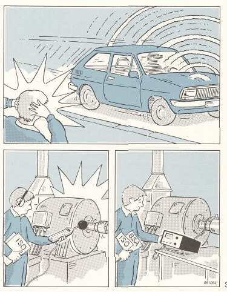

## 🏷️ Анализ сигналов и анализ систем (стр. 6)

[🔝 Сверху](#top)

6 Анализ сигналов и анализ систем Прежде чем приступать к устранению проблем, связанных с шу мом и механическими колебаниями, мы должны сделать четкое различие между двумя путями, которые могут быть при этом избраны, т.е. между анализом сигналов и анализом систем. Анализ сигналов представляет собой процесс определения от кликов системы на неизвестное в обшем случае возбуждение и представления их в такой форме, которую легко интерпретиро вать. Анализ систем является методом определения характерных свойств систем. Он может быть проведен путем возбуждения системы с помощью замеряемых сил и определения отношения отклик/сила (чувствительность). Для линейных систем это отно шение является независимым, присущим этим системам пара метром. Этот параметр остается постоянным независимо от того, если система находится в возбужденном состоянии или в состоянии покоя. Уровень качества проигрывателя с высокой точностью воспро изведения звука определяется его частотными характеристика ми, которые остаются неизменными независимо от того, если пластинка содержит музыку Баха иил Битлз. Эти характеристи ки определяют качество воспроизведения проигрывателем запи санных сигналов. Автомобиль имеет одинаковую форму мод колебаний и иден тичные собственные частоты, когда он стоит в гараже и когда он идет со скоростью 100 км/ч по шоссе. Параметры мод коле баний представляют собой показатели динамических характери стик автомобиля и определяют комфорт и безопасность езды. Какую бы линейную систему мы не взяли, характеристики си стемы всегда определяют сигналы, воспринимаемые при опреде ленных рабочих условиях.

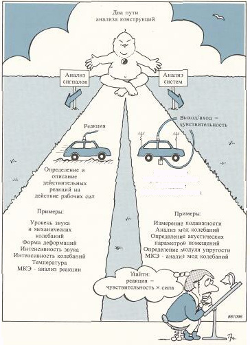

## 🏷️ Отыскание причин проблем (стр. 7)

[🔝 Сверху](#top)

7 Отыскание причин проблем Анализ сигналов Давайте рассмотрим вопрос о том, какая информация мо жет быть получена в результате измерения и анализа ответ ных сигналов, полученных на автомобиле во время его рабо ты. Внутри салона можно закрепить акселерометр, если возможно, в точке, из которой исходит больше всего шума. Изучение развития во времени ускорения механических колеба ний дает немного полезной информации. Путем преобразова ния в частотную область получается спектр ускорения механи ческих колебаний. Такой спектр очень часто имеет особенности, которые могут указать на концентрацию энергии в районе од ной или нескольких дискретных частот (тонов). Сведения о действующих в системе механизмах позволяют соотнести четко выраженные частотные составляющие с от дельными механическими компонентами и таким путем вы явить источник механических колебаний и/или шума. В нашем примере определенная дискретная составляющая спектра ускорения может быть соотнесена с частотой вращения определенного вала в системе трансмиссии. Это дает четкое подтверждение того, что данный компонент являвется источни ком механических колебаний или шума. После выявления источника возникают новые вопросы: «Имеет ли источник достаточное количество свободной энергии для того, чтобы возбудить механические колебания соответству ющей конструкции?» или «Является ли система «динамически слабой» или податливой при данной частоте с чрезмерной реакцией на воздействие обычных сил?»

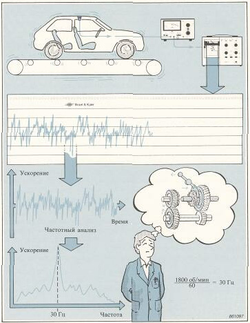

## 🏷️ Анализ систем и диагностика резонансов (стр. 8)

[🔝 Сверху](#top)

> [!TIP]
> **Метод разгона/выбега**: позволяет качественно оценить наличие резонансов в рабочем диапазоне частот, так как частота возбуждения пропорциональна скорости вращения.

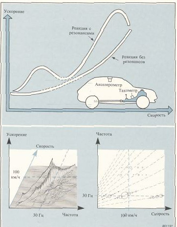

## 🏷️ Приемы решения динамических проблем (стр. 9)

[🔝 Сверху](#top)

9 Приемы решения динамических проблем Для устранения динамических проблем необходимо понять ди намическое поведение конструкции. Это означает, что необходи мо определить деформацию конструкции при критической ча стоте. Снова могут быть выбраны два подхода: • анализ сигналов = измерение формы деформации во время работы • анализ систем = модальные испытания • Измерение формы деформации Целью измерений деформации (формы прогиба, изгиба и т.п.) во время работы является определение вынужденной динамиче ской деформации при рабочей частоте. Самым простым и наиболее точным методом является устано вка акселерометра в какой-либо точке, которая принимается за опорную, и применение перемещаемого акселерометра, который устанавличается в различных точках и, при необходимости, в различных направлениях. Для обеспечения нужной разреша ющей способности точки замера должны быть выбраны с доста точно малым промежутком. Измерения разницы амплитуды и фазы отдаваемых опорным и перемещаемым акселерометрами сигналов во всех точках проводятся при установившемся режи ме работы. Применяемыми приборами могут быть две отдель ные одноканальные системы или двухканальный анализатор, выполняющий быстрое преобразование Фурье. После этого по результатам измерений строятся графики, с по мощью которых определяются деформации и перемещения от дельных частей конструкции, как абсолютные, так относи тельные.

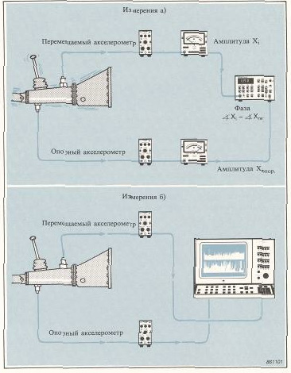

## 🏷️ Форма деформации и решение проблем (стр. 10)

[🔝 Сверху](#top)

> [!CAUTION]
> **Важно**: Форма деформации (ODS) показывает *текущее* состояние под нагрузкой, но не объясняет внутренние свойства системы. Решение через увеличение жесткости требует понимания фазовых отношений.

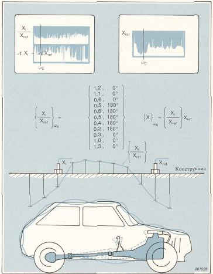

## 🏷️ Анализ мод колебаний (стр. 11)

[🔝 Сверху](#top)

11 Анализ мод колебаний • Свойства мод колебаний Большинство встречающихся на практике проблем с шумом и механическими колебаниями связано с ***резонанс***ами, при кото рых действующие силы возбуждают одну или несколько мод колебаний. Моды колебаний, лежащие в пределах частотного диапазона действующих динамических сил, всегда представля ют собой потенциальную проблему. Важным свойством мод колебаний является то, что любая вынужденная или свободная динамическая реакция конструкции может быть представлена в виде дискретного набора мод. Имеются следующие параметры мод колебаний: • модалная частота • модальное затухание • модальная форма Модальные параметры всех мод в пределах заданного частотно го диапазона составляют полное динамическое описание кон струкции. Следовательно, моды колебаний представляют собой динамические свойства, присущие свободной конструкции (кон струкции, на которую не действуют никакие силы). Анализ мод колебаний является процессом определения всех модальных параметров, результаты которого достаточны для создания математической динамической модели. При анализе мод колебаний можно применять аналитические или экспери ментальные методы.

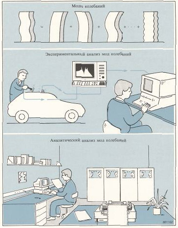

## 🏷️ Математические динамические модели (стр. 12)

[🔝 Сверху](#top)

12 Математические динамические модели Математические модели разрабатываются по определенному ря ду причин: • для понимания поведения конструкции под воздействием динамических сил и нагрузок • для моделирования или  оценки  реакции  системы   на воздействие внешних сил • для моделирования изменений динамических характеристик в связи с изменениями физических условий. Математическая модель обычно не является моделью самой кон струкции. Скорее эти модели являются моделями динамическо го поведения конструкции, созданными с учетом ряда предполо жений и граничных условий. Аналитичекие математические модели базируются на результа тах расчетов распределения масс и жесткости при определенных граничных условиях. Эти расчеты обычно выполняются по ме тоду конечных элементов (МКЭ) и в результате выводится си стема большого числа зависимых дифференциальных уравне ний, которые могут быть решены только с помощью больших ЭВМ. Экспериментальные математические модели могут быть постро ены по замеренным данным мод колебаний, которые предста вляют соответствующие системы при тех условиях, при кото рых были проведены экспериментальные исследования. Модель обычно состоит из системы независимых дифференциальных уравнений, по одному для каждой моды с определенными экс периментальным путем параметрами. Соответствующие модели обычно называют «модальными моделями».

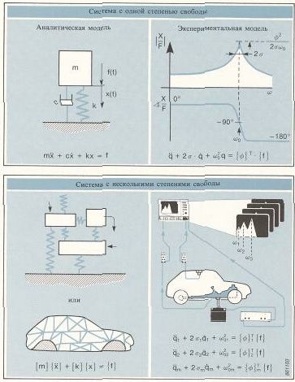

## 🏷️ Применение данных мод колебаний (стр. 13)

[🔝 Сверху](#top)

13 Применение данных мод колебаний

Сейчась мы рассмотрим применение данных, полученных в ре зультате экспериментального анализа мод колебаний. Результаты испытаний и анализа мод колебаний могут иметь различную степень сложности: • простые функции частотных характеристик (ФЧХ), показывающие слабое динамическое состояние конструкции в виде модальных частот, или набор частотных характеристик, спо собствующий определению частот и форм мод колебаний • данные по формам отдельных мод колебаний или данные, допускающие создание математической динамической мо дальной модели.

Диапазон   применений   модальных   данных   очень   обширен   и включает в себя: • проверку модальных частот • построение качественных дескрипторов форм мод - вспомогательного средства понимания динамического поведения конструкции для отыскания причин динамических проблем • проверку и улучшение аналитических моделей • моделирование с помощью ЭВМ (на основе модальных моделей) для разработки прототипа или для эффективного отыскания неисправностей, при котором необходимо - предсказать реакции на предполагаемые возбуждения и проверить динамические характеристики - предсказать изменения динамических свойств вследствие физических изменений, таких как увеличение полезной на грузки или увеличение жесткости - предсказать необходимые физические изменения для получения требуемых динамических свойств - предсказать комбинированное динамическое поведение сопряженных механических конструкций.

## 🏷️ Проверка аналитической математической модели (стр. 14)

[🔝 Сверху](#top)

14 Проверка аналитической математической модели В качестве примера мы проследим за этапами проектирования небоскреба, который должен выдерживать землетрясения и со ставную ветровую нагрузку. Сначала разрабатывается математическая модель с учетом действия расчетных сил. Результаты показывают удовлетворительное динамическое поведение. После окончания строительства должна быть проведена проверка конструкции. Математическая модель содержит некоторые идеальные распределения сил инерции и элементов жесткости, которые не могут быть проверены экспериментальным путем. Полномасштабные испытания не могут быть проведены. Что жеможно сделать? Анализ мод колебаний конструкции и модели дают решение. Вершина здания возбуждается с помощью электродинамического вибростенда или эксцентричного вибратора. После этого в заданном частотном диапазоне прикладывается определенная сила и проводятся замеры реакций в нескольких выбранных точках. По соответствующим результатам определяются параметры мод колебаний. Проводится непосредственное сравнение модальных параметров, определенных аналитическим и экспериментальным путем. Если результаты не сходятся, то аналитическая модель модифицируется до достижения достаточно хорошего совпадения. Наконец повторяются расчеты по модифицированной моде ли, после чего могут быть предсказаны реакции исследуемой конструкции на действие расчетных сил. Если аналитическое динамическое поведение соответствует критериям проектирования, результирующие динамические свойства в отношении безопасности небоскреба считаются проверенными. Аналитическая модель также дает возможность оценки комфорта находящихся в здании людей. После этого может быть повторено моделирование и внесены предложенные улучшения динамических свойств.

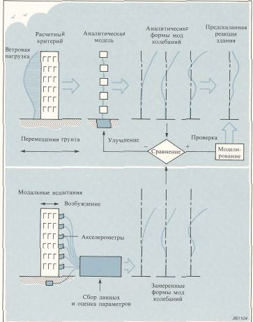

## 🏷️ Частотные характеристики (стр. 15)

[🔝 Сверху](#top)

15 Частотные характеристики Одной из эффективных моделей линейной системы является мо дель в частотной области, в которой выходной спектр выражен через входной спектр, умноженный на дескриптор системы

Этот дескриптор системы Н(ш) является частотной характери стикой (ЧХ), которая определяется следующим образом:

Она представляет собой комплексное отношение между выхо дом и входом в зависимости от частоты ш. Под понятием комплексный мы имеем в виду, что частотная характеристика является комплексной функцией, имеющей амплитуду | Н(ω) ( и фазу H(ω) = ф(ω). Физическая интерпретация ****частотной характеристики**** заключа ется в том, что синусоидальная сила (воздействие на входе) при частоте о) приводит к возникновению синусоидального переме щения (реакция на выходе) с той же самой частотой. Амплиту да на выходе умножается на |Н(ω)|, а фаза между выходом и входом сдвинута на 2£Н(ω). Так как мы ограничились рассмотрением только линейных си стем, любой входной или выходной спектр может быть пред ставлен в виде суммы синусоид. Частотные характеристики описывают динамические свойства систем независимо от типа сигналов, используемых при испытаниях. Поэтому концепция частотных характеристик одинаково применима к гармониче скому, кратковременному (импульсному или ударному) и слу чайному возбуждению.

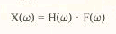

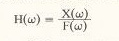

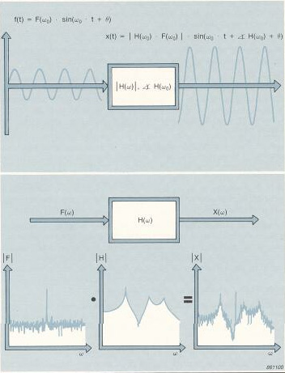

## 🏷️ Преимущество широкополосного возбуждения (стр. 16)

[🔝 Сверху](#top)

> [!TIP]
> **Эффективность**: Использование широкополосного возбуждения позволяет значительно сократить время эксперимента по сравнению с пошаговым синусоидальным методом.

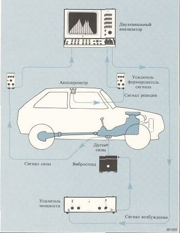

## 🏷️ Измерение подвижности — определения (стр. 17)

[🔝 Сверху](#top)

17 Измерение подвижности  определения Основой одного особого класса экспериментального модального анализа являются измерения набора частотных характеристик. Движение может быть описано в терминах перемещения, скоро сти и ускорения. Соответствующие частотные характеристики можно назвать характеристиками «податливости», «подвижно сти» и «ускоряем ости». В общем случае термин «измерение подвижности» используется для обозначения механической ча стотной характеристики любого вида. При моделировании наиболее часто учитываются частотные ха рактеристики податливости. При измерениях обычно определя ются частотные характеристики ускоряем ости, так как наиболее удобным датчиком для измерения движения является акселеро метр. Податливость, подвижность и ускоряемостъ алгебраически свя заны друг с другом. Результаты измерений одной из соответст вующих частотных характеристик могут быть использованы для расчета другой.

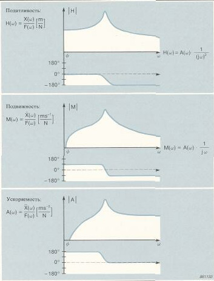

## 🏷️ Оценки частотных характеристик (H1, H2) (стр. 18)

[🔝 Сверху](#top)

18 Оценки частотных характеристик В идеальном случае определение ****частотной характеристики**** подвижности включает в себя возбуждение конструкции с помо щью замеряемой силы, измерение реакции с последующим рас четом отношения спектров действующей силы и реакции. Одна ко, на практике возникает целый ряд проблем: • наличие механического шума в конструкции, включая нелинейные процессы • шум электрического характера в используемой аппаратуре • ограниченная разрешающая способность при анализе. Для сведения этих проблем до минимума необходимо приме нить некоторые статистические методы для оценки ****частотной характеристики**** по результатам проведенных измерений. Оцен ка по данным, содержащим случайные шумы, обычно требует применения какого-либо вида усреднения. Какие методы могут быть использованы для усреднения значе ний отношения выход/вход? • Можно ли взять сумму п спектров реакции и разделить ее на сумму п спектров силы?

Нет, нельзя. Спектры являются комплексными величинами, и их суммы будут стремитьсы к нулю, так как разница фаз между отдельными спектрами имеет случайный характер. • Можно ли взять сумму п отношений реакций и сил и разделить се на п?

Нет, нельзя. Если сила имеет случайный характер, она может быть равна нулю при любой частоте в отдельном спектре. Соот ветствующая составляющая ****частотной характеристики**** будет при этом неопределенной.

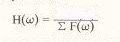

## 🏷️ Оценка H1: Минимизация шума на выходе (стр. 19)

[🔝 Сверху](#top)

> [!IMPORTANT]
> **Оценка H1**: Используется, когда шум присутствует в основном в сигнале *реакции* (на выходе). Она минимизирует влияние этого шума через расчет взаимного спектра.

Эту оценочную функцию мы назовем Н1. Можно показать, что она равна взаимному спектру реакции и силы, разделенному на собственный спектр силы

Понятия собственного и взаимного спектров описываются в разделе, посвященном двухканальному анализатору сигналов.

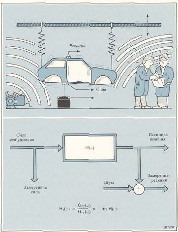

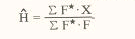
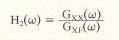

## 🏷️ Оценка H2: Минимизация шума на входе (стр. 20)

[🔝 Сверху](#top)

> [!IMPORTANT]
> **Оценка H2**: Оптимальна при наличии шума в сигнале *возбуждения* (на входе). Особенно важна в точках резонанса, где амплитуда силы может падать до уровня шума.

Важной особенностью функции Н1 является то, что случайный шум на выходе удаляется в процессе усреднения взаимного спектра. При увеличении числа усреднений Н1 стремится к истинной частотной характеристике Н.

• **Шум на входе исследуемой системы**
При практических исследованиях конструкции с применением вибростенда или вибратора может появиться другой источник шума. При своих собственных частотах конструкция становится очень податливой, что приводит к сильному увеличению амплитуд механических колебаний. При этом вибростенд или вибратор может использовать всю имеющуюся энергию для ускорения своих собственных механических компонентов, не оставляя никакой энергии для возбуждения объекта. Амплитуда сигнала силы может при этом упасть до уровня собственного шума аппаратуры, в отличие от сигнала реакции, амплитуда которого имеет большие значения и не зависит от шума. Эта ситуация характеризуется присутствием шума на входе.

При определении Н шум на входе удаляется из взаимного спектра в процессе усреднения. При увеличении числа циклов усреднения Н2 стремится к истинной частотной характеристике Н. Когда шум имеется на выходе и на входе, функции Н1 и Н2 можно считать пределами доверительного интервала для истин ной ****частотной характеристики**** Н.

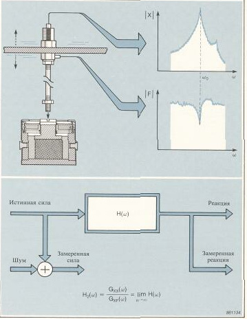

## 🏷️ Функция когерентности (стр. 21)

[🔝 Сверху](#top)

21 • Функция когерентности Функция когерентности дает нам средство для оценки степени линейности связи входных и выходных сигналов. Неравенство для взаимного спектра устанавливает, что если соответствующие собственные спектры содержат некогерентные шумы, то квадрат амплитуды взаим ного спектра меньше произведения собственных спектров. Это объясняется тем, что некогерентные шумы удалены из взаим ного спектра в процессе усреднения. Приведенное выше нера венство дает возможность определить функцию когерентности

Граничными значениями **функции когерентности** являются 1 в отсутствии шума и 0 при наличии чистых шумов. В качестве интерпретации **функции когерентности** можно сказать, что для каждой частоты ω она указывает степень линейной зависимости между сигналами на входе и выходе системы. Функция коге рентности аналогична квадрату коэффициента корреляции, ис пользуемому в статистике. При проведении измерений подвижности это важное свойство **функции когерентности** используется для выявления целого ряда возможных ошибок.

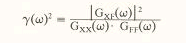

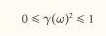

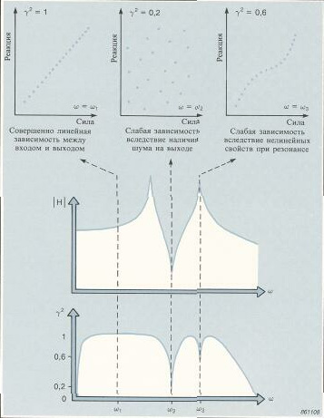

## 🏷️ Двухканальный анализатор (**БПФ**) (стр. 22)

[🔝 Сверху](#top)

22 Двухканальный анализатор, выполняющий быстрое преобразование Фурье Двухканальный анализатор, основанный на быстром преобразо вании Фурье, может быть использован для определения Н, и Н2. Анализатор можно применять в качестве «черного ящика», из меряющего сигналы возбуждения и реакций и определяющего частотные характеристики на основе результатов этих измере ний. Давайте кратко рассмотрим принципы спектрального ана лиза и обсудим несколько определений. A) Поступающие на входы анализатора аналоговые сигналы фильтруются, отбираются и преобразуются в цифровую фор му для получения серий цифровых данных, называемых реализациями. Эти реализации представляют временную историю сигналов на протяжении соответствующих времен ных интервалов. Скорость выборки и продолжительность реализаций определяют частотный диапазон и разреша ющую способность при анализе. Б) Зарегистрированные реализации могут быть умножены на весовую функцию. Тем самым проводится сужение данных в начале и конце реализаций, что делает их более удобными для блочного анализа. B) Взвешенные реализации преобразуются в частотную область в виде комплексных спектров с помощью дискретного преоб разования Фурье. Этот процесс обратимый - в результате об ратного преобразования получаются исходные временные последовательности. Для определения спектральной плотно сти должен быть использован какой-либо метод усреднения, в результате чего происходит устранение шума и улучшение степени статистической достоверности.

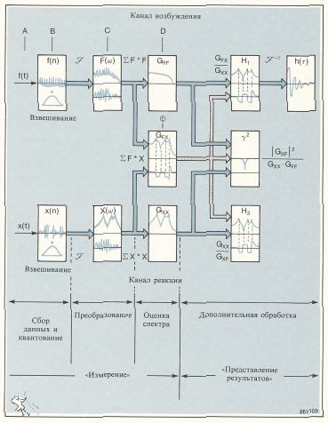

## 🏷️ Взаимный спектр (стр. 23)

[🔝 Сверху](#top)

23 Г) Собственные спектры определяются путем умножения ком плексных спектров на соответствующие комплексно сопря женные спектры (с противоположным знаком фазы) и затем усреднения ряда независимых произведений. Д) При умножении комплексно сопряженного спектра на дру гой комплексный спектр получается взаимный спектр. Вза имный спектр - это комплексная функция, фаза которой по казывает сдвиг фаз между выходом и входом и модуль кото рой представляет когерентное произведение мощности на входе и выходе. Собственные спектры силы и реакции совместно с взаимным спектром силы и реакции представляют собой именно те функции, которые необходимы для оценки частотной характери стики и функции когерентности.

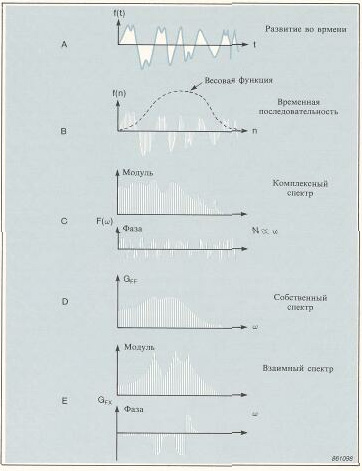

## 🏷️ Ошибки: случайные и систематические (стр. 24)

[🔝 Сверху](#top)

24

При проведении измерений подвижности необходимо позна комиться с возможными ошибками для того, чтобы их можно было выявлять и сводить до минимума их влияние. Эти ошибки могут быть подразделены на два класса. Первый класс - случайные ошибки. Они наблюдаются в виде случайного разброса данных, вызванного шумом. Второй класс - систематические ошибки, которые имеют одина ковую амплитуду и фазу при каждом наблюдении. Результаты оценок с наложенными случайными ошибками мо гут быть улучшены путем усреднения. Систематические ошибки могут быть сведены до минимума только путем использования различных оценок. В таблице приведена классификация типичных ошибок, приведе ны оценки, оптимальные с точки зрения сведения до минимума отдельных ошибок, а также указано, когда функция когерент ности может ( + ) или не может (0) указывать на ошибку.

Ошибки

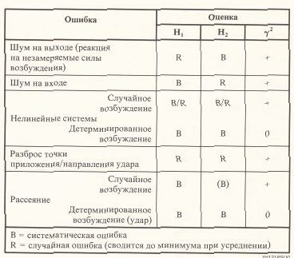

## 🏷️ Ошибка рассеяния (Leakage) (стр. 25)

[🔝 Сверху](#top)

25 • Ошибка рассеяния Вследствие природы дискретного преобразования Фурье систе матическая ошибка может возникнуть, когда частотная характе ристика имеет очень узкий ***резонанс*** по сравнению с учитыва емой при анализе разрешающей способностью по частоте. Соответствующие узким ***резонанс***ам сигналы затухают медлен но, что в данном случае означает, что узкие частотные полосы соответствуют продолжительным интервалам времени. Так как сбор данных происходит в течение ограниченного времени, мо жет оказаться, что сигнал реакции будет срезан. Усечение во временной области приводит к рассеянию в частот ной области. Рассеяние (утечка) проявляется в виде расширения и снижения пиков определяемых в частотной области характе ристик. Оно может рассматриваться как результат работы с бо лее низкой разрешающей способностью по частоте, чем та, ко торая необходима для проведения анализа. Хотя ошибка рассеяния является систематической, практика по казывает, что оценка Н2 может значительно уменьшить ее влияние. При экспериментальных исследованиях спектр возбу ждения обычно является плоской функцией, измеряемой почти без ошибок рассеяния. Взаимный спектр, отражающий острые пики **частотной характеристики**, может быть нарушен вследст вие рассеяния. Так как Н] отображает отношение спектра с рас сеянием и спектра без него, эта оценка находится под влиянием ошибки рассеяния. В отличии от этого, Н2 представляет собой отношение двух спектров с острыми ***резонанс***ами, которые оба подвержены ошибкам рассеяния. При делении эти ошибки име ют тенденцию к взаимному аннулированию.

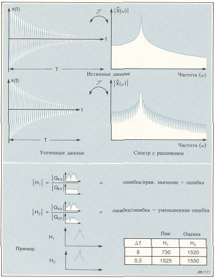

## 🏷️ Выбор оптимальной оценки (H1 vs H2) (стр. 26)

[🔝 Сверху](#top)

> [!TIP]
> **Золотое правило**:
> - **H1** — для антирезонансов (минимум шума на выходе).
> - **H2** — для резонансов (минимум шума на входе и меньше влияния Leakage).

26 Выбор оптимальной оценки ****частотной характеристики**** В заключении нашего обсуждения оценок частотных характери стик и соответствующих ошибок мы можем сформулировать несколько эмпирических правил для специалистов, проводящих испытания. При проведении любых испытаний очень вероятно, что при некоторых частотах будут иметься шумы на входе, при других  шумы на выходе, а при некоторых частотах шумы будут присутствовать и на входе и на выходе. Для систем с острыми ***резонанс***ами и глубокими *анти**резонанс***ами ни одна из оценок не будет перекрывать весь частотный диапазон без появления систематических ошибок. Оптимальная оценка должна быть выбрана на основе самой **частотной характеристики**. • Случайное возбуждение и ***резонанс***ы. Самой лучшей оценкой ****частотной характеристики**** является Н2, так как она ком пенсирует шум на входе и менее чувствительна к рассеянию. • Анти**резонанс**ы. Самой лучшей оценкой **частотной характеристики** является И,, так как главной в данном случае явля ется ее малая чувствительность к шуму на выходе. • Ударное возбуждение и псевдослучайное возбуждение. В областях ***резонанс***ов оценки Н[ и Н2 одинаково эффективны. Функция Н, является более предпочтительной, так как она является самой лучшей оценкой ****частотной характеристики**** в областях *анти**резонанс***ов.

В общем случае, при наличии случайных шумов на входе и на выходе оценки Н; и Н2 обычно ограничивают доверительный интервал истинных значений ****частотной характеристики**** Н. Примечание: Это неравенство несправедливо для ошибок рассеяния нелинейных систем и для когерентных шумов на входе и на выходе

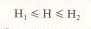

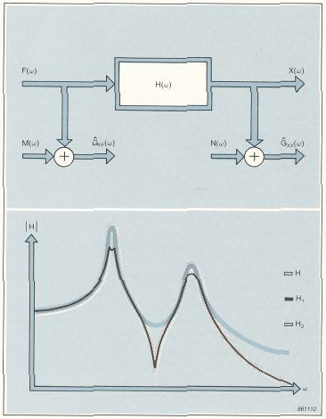

## 🏷️ Возбуждение: Форма волны (стр. 27)

[🔝 Сверху](#top)

27 Возбуждение

В ходе измерений необходимо возбуждать исследуемую кон струкцию с помощью замеряемой динамической силы, но ника ких теоретических ограничений на форму волны или на то, как проводится возбуждение, не накладывается. • Форма волны при возбуждении В данном обсуждении мы ограничимся рассмотрением форм волн таких сил, энергия которых распределена по широкому ча стотному диапазону. Они могут одновременно возбуждать кон струкции во всем рассматриваемом частотном диапазоне. Перед выбором формы волны силы возбуждения необходимо рассмотреть следующие аспекты: • применение • управление спектром • пик-фактор • линейные/нелинейные свойства исследуемой конструкции • скорость проведения испытаний • имеющаяся аппаратура. Если целью испытаний является только измерение собственных частот, то необходимая точность значительно меньше, чем при проведении измерений с целью определения базы для математи ческой модели. Затраты на достижение дополнительной точ ности определяются временем, необходимым для проведения из мерений, и затратами на приборное обеспечение.

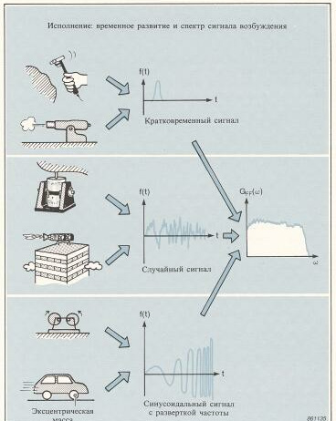

## 🏷️ Управление спектром и Пик-фактор (стр. 28)

[🔝 Сверху](#top)

> [!NOTE]
> **Пик-фактор**: Отношение пикового к среднеквадратичному значению. Высокий пик-фактор ухудшает отношение сигнал/шум и может провоцировать нелинейное поведение системы.

28

Управление спектром дается способностью ограничить возбу ждение в заданном частотном диапазоне. Динамический диапазон частотных характеристик зачастую очень широк и определен самыми высокими ***резонанс***ными пиками и самыми глубокими впадинами *анти**резонанс***ов. Так как форма волны возбуждающей силы обычно выбирается по принципу достижения идеально плоского спектра, это приводит к тому, что спектр реакции имеет такой же широкий динамический диапазон, что и частотная характеристика. Если возбуждение конструкции происходит только в заданном частотном диапазоне, то учитываемый динамический диапазон является ми нимальным. Пик-фактор характеризует присутствие или отсутствие пиков в сигнале. Он определяется как отношение пикового и среднего квадратического (СКЗ) значений сигнала. Силы возбуждения с большим пик-фактором имеют два недостатка: отношение сигнал/шум уменьшается, так как аппаратура должна быть в состоянии обрабатывать острые пики, и неко торые сигналы теряются а имеющемся шуме - большие значения пик-факторов могут быть причиной проявления нелинейных свойств исследуемых объектов. Ожидаемое нелинейное поведение конструкции приводит к во просу: «будет проводиться описание нелинейного поведения или будет учитываться линейная аппроксимация1!» Анализ мод колебаний предполагает наличие линейных систем и использование линейных моделей. Если мы имеем дело с кон струкцией, проявляющей в какой-то степени нелинейные свой ства, обычно предполагается, что лучше всего сделать линейную аппроксимацию. При выборе формы волны возбуждающей кон струкцию силы с широким диапазоном амплитуд происходит хаотизация нелинейности, причем случайный характер сигналов затем устраняется в результате усреднения. Для изучения нели нейности обычно используется синусоидальное возбуждение с максимальной степенью управления амплитудой.

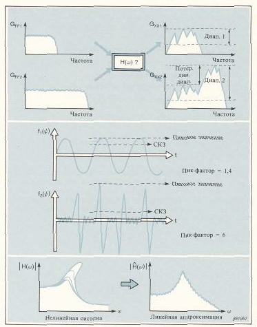

## 🏷️ Способы возбуждения (Вибростенды и Молотки) (стр. 29)

[🔝 Сверху](#top)

29

Проведение возбуждения Возбуждающая сила может быть создана с помощью устройств различного типа. Для проведения широкополосного возбужде ния рассмотрим два класса устройств - прикрепляемые и непри креплямые вибровозбудители. Примеры прикрепляемых вибровозбудителей: • электромагнитные вибростенды • электрогидравлические вибростенды • вибраторы с эксцентрическими вращающимися массами • специальные устройства (ракеты и др.). Примеры неприкрепляемых вибровозбудителей: • молотки • большие маятниковые ударные молота • подвесные кабели для создания сотрясений и др. Примечание: Акустическое возбуждение не может быть исполь зовано при анализе мод колебаний, так как не представляется возможным осуществлять управление направлением и точкой приложения возбуждающей силы. Однако, оно может быть ис пользовано для проверки модальных частот и для определения немасштабированных форм мод.

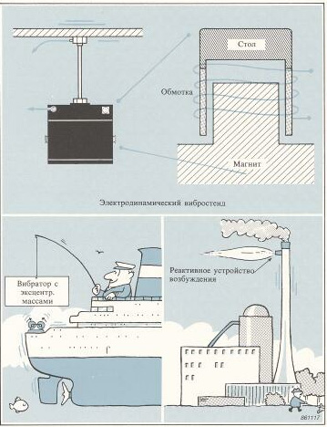

## 🏷️ Измерение силы и подсоединение вибростенда (стр. 30)

[🔝 Сверху](#top)

30 • Измерение силы Возбуждающая сила обычно измеряется с помощью пьезоэлектрического датчика силы, отдающего пропорциональный динамической силе электрический сигнал. К достоинствам пьезоэлектрического датчика силы относятся: • небольшие размеры и масса • исключительная линейность • широкий рабочий динамический диапазон (120дБ) • широкий рабочий частотный диапазон. Полная сила, создаваемая вибровозбудителем, должна приводить в действие все движущиеся части: обмотки/поршень вибростенда, соединительный механизм и испытуемую конструкцию. Точный замер возбуждающей конструкцию силы может быть проведен только в том случае, если датчик силы установлен непосредственно на конструкции или как можно ближе к ней. • Подсоединение вибростенда Вибростенд должен быть соединен с испытуемой конструкцией таким образом, чтобы возбуждающая сила воздействовала только в нужной точке и в нужном направлении. Конструкция должна иметь возможность свободно совершать механические колебания в этой точке с другими пятью степенями свободы без ограничения вращательного или поперечного перемещения. Хорошим способом является соединение вибростенда и датчика силы с помощью тонкого штока (толкателя). В таком случае обеспечивается высокая жесткость в осевом направлении, но низкая поперечная и вращательная жесткость, что способствует точному определению направления возбуждения. Еще одним достоинством данного метода является то, что толкатель дей ствует как механический предохранитель между конструкцией и вибростендом, защищая их и датчик от перегрузок.

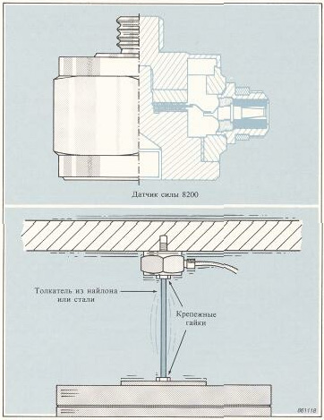

## 🏷️ Измерение реакции: Датчики (стр. 31)

[🔝 Сверху](#top)

31 Измерение реакции • Датчики для измерения реакции При измерениях реакции может учитываться любой параметр движения - перемещение, скорость или ускорение. В качестве датчика лучше всего использовать пьезоэлектрический акселеро метр, так как он обладает следующими преимуществами: • хорошие линейные характеристики • малая собственная масса (масса датчика может быть менее 1г) • широкий рабочий динамический диапазон (160дБ) • широкий рабочий частотный диапазон (от 0,2 Гц до более 10 кГц с отклонением от линейности менее 5%) • прочная и простая конструкция (акселерометры некоторых типов могут выдержать ударные нагрузки свыше 200000м/с2) • высокая стойкость в отношении неблагоприятных окружающих условий (особенно акселерометры марки Delta Shear1"; фирмы Брюль и Къер) • малая поперечная чувствительность • возможность применения простых методов крепления. Скорость и перемещение могут быть получены путем электриче ского интегрирования пропорционального ускорению сигнала с помощью снабженного интеграторами усилителя-формировате ля сигнала или с помощью устройств для последующей обра ботки данных, имеющихся в анализаторе.

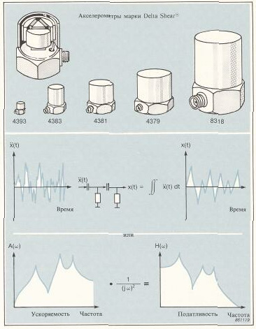

## 🏷️ Крепление датчиков (стр. 32)

[🔝 Сверху](#top)

32 • Крепление датчика Для обеспечения оптимальных эксплуатациолнных характери стик акселерометра наилучшим методом его крепления является применение стальной шпильки с резьбой. Допуски для монтаж ных поверхностей и рекомендуемые установочные моменты обычно указываются изготовителями акселерометров. Этот метод не всегда является удобным, возможным или раци ональным. Хорошие результаты могут быть получены при кре плении с помощью магнита или тонкого слоя пчелиного воска, накладываемого на основание акселерометра перед тем, как он прочно прижимается к конструкции. Такие методы крепления могут привести к сужению полезного частотного диапазона ак селерометра, но это редко когда приводит к возникновению проблем при анализе мод колебаний. При испытаниях, в результате которых необходимо получить формы мод в масштабе, измерения должны быть проведены в точке приложения силы. При этом возникает проблема, как про вести возбуждение конструкции и измерение реакции в одной и той же точке и в том же направлении. В случае крупных конструкций измерения обычно могут быть проведены без возникновения каких-либо значительных ошибок путем приложения силы возбуждения вблизи датчика. На не больших конструкциях часто бывает возможным приложить силу и датчики для замера в точке приложения силы, но на противоположной стороне конструкции. Возможным вариантом является применение импедансной головки, которая содержит в общем корпусе датчик силы и акселерометр.

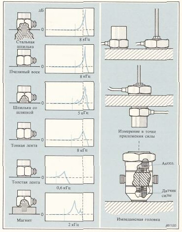

## 🏷️ Нагрузка от датчиков на объект (стр. 33)

[🔝 Сверху](#top)

33 • Обусловливаемая датчиками нагрузка испытуемых объектов После выбора датчиков следует принять во внимание механиче ские нагрузки, обусловливаемые закрепленными датчиками. Влияние нагрузки может проявляться в виде изменения массы, жесткости и/или затухания. Наиболее заметное влияние оказы вается вследствие нагрузочной массы, обусловливающей умень шение частот ***резонанс***ов исследуемых конструкций. Динамическая нагрузка, вызванная установкой акселерометра, зависит от локальных динамических свойств конструкции. Ди намическая масса и вызванный ею сдвиг частоты пропорци ональны квадрату локального модального перемещения соответ ствующей моды колебаний. Эмпирическое правило говорит о необходимости применения легких датчиков на легких конструкциях для снижения до мини мума нагрузки. Осторожность следует соблюдать также при испытаниях тяжелых конструкций, так как даже акселерометр с малой массой (20 г) может значительно изменить локальный ре зонанс. Следует рассмотреть также влияние добавочной жесткости и за тухания на монтажной поверхности вследствие изгиба или тре ния. Опять действует правило, что при работе в области высо ких частот следует использовать небольшие датчики и методы крепления, требующие минимальной площади механического контакта.

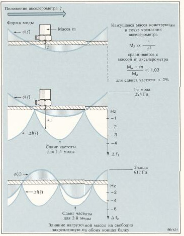

## 🏷️ Случайное возбуждение (стр. 34)

[🔝 Сверху](#top)

34 Случайное возбуждение Понятие случайный здесь применяется к амплитуде возбужда ющей силы, которая, говоря в статистических терминах, имеет нормальное или гауссово распределение вероятности. При данном типе возбуждения отдельные реализации, хранящи еся в запоминающем устройстве анализатора, содержат данные по случайным амплитудам и фазам при каждой частоте. Одна ко, после преобразования и усреднения спектр силы становится плоским и непрерывным, его энергия находится приблизительно на одном уровне при всех частотах. Вследствие случайного ха рактера силы возбуждение конструкции при каждой частоте происходит в широком диапазоне амплитуд. Это приводит к хаотизации возможных нелинейных эффектов, а последующее усреднение дает наилучшую линейную аппроксимацию. Легко осуществляется управление частотным спектром случай ной силы, благодаря чему распределение в частотной области может быть ограничено диапазоном, учитываемым при анализе. Анализ может быть проведен, начиная с частоты 0 Гц, до пре дельной частоты ωu или от частоты ω1 до частоты ω2 при увеличении масштаба частоты. Генерируемые с помощью электронных устройств или синтези руемые цифровыми устройствами случайные сигналы возбужде ния подводятся к усилителю можности, который приводит в действие электродинамический вибростенд. В современных си стемах применяется встроенный в анализаторе генератор, рабо тающий синхронно с осуществляющими анализ устройствами. Возбуждение носит случайный, непрерывный во времени хара ктер, но так как время регистрации ограничено, могут возни кнуть ошибки рассеяния. Эти ошибки могут быть сведены до минимума с помощью весовой функции, которая способствует достижению плавного начала и конца отдельных реализаций. Для случайных данных лучше всего использовать весовую фун кцию Ханнинга.

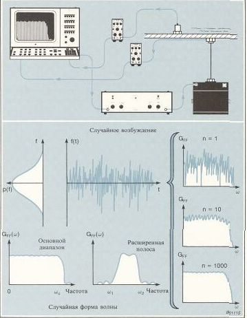

## 🏷️ Псевдослучайное возбуждение (стр. 35)

[🔝 Сверху](#top)

35 Псевдослучайное возбуждение Псевдослучайное возбуждение основано на применении приоди ческиого сигнала, повторяющегося с периодом, соответству ющим анализируемым реализациям. Отдельные реализации имеют схожую со случайными сигналами форму волны с рас пределением амплитуды, подобным гауссову. Однако, спек тральные свойства очень отличаются. Так как псевдослучайный сигнал повторяется при каждой регистрации или является пе риодическим с периодом, равным длине реализации, в спектре имеются значительные изменения. • Спектр становится дискретным, содержащим энергию только при частотах, учитываемых при выборке в процессе анализа. Можно считать, что сигнал представляет собой набор сину соид с одинаковыми амплитудами, но случайными фазами. • Каждый отдельный замеренный спектр имеет одинаковые амплитуды и фазу для каждой частоты. Это указывает на то, что усреднение будет иметь небольшой эффект, за исклю чением удаления случайных шумов. Так как конструкция все время возбуждается силой с одной и той же амплитудой, путем усреднения не может быть получена линейная ап проксимация. • Периодический характер сигнала устраняет ошибки рассеяния, но при взвешивании нужно использовать прямоуголь ную весовую функцию. Работа и управление аналогичны испытаниям со случайным возбуждением. В данном случае очевидно, что генератор должен быть синхронизирован с анализатором.

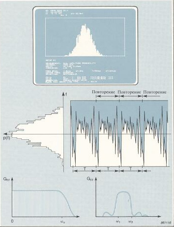

## 🏷️ Ударное возбуждение: Теория (стр. 36)

[🔝 Сверху](#top)

36 Ударное возбуждение Наиболее распространенным методом, используемым при ана лизе мод колебаний, является ударное возбуждение. Колебания, создаваемые при ударе, представляют собой пере ходный, кратковременный процесс передачи энергии. Спектр ударной силы является непрерывным, с максимальной амплиту дой при 0 Гц и с последующим ее уменьшением с ростом часто ты. Спектр имеет периодическую структуру с нулевым значением амплитуды при частотах с интервалами n/Т, где n - целое число, а Т - эффективная продолжительность кратковременной ударной силы. Наиболее рационально учитывать диапазон ча стот от 0 Гц до частоты F, при которой уровень спектра силы уменьшается на 10 или 20 дБ. Продолжительность удара, а следовательно и форма спектра при ударном возбуждении, определяется массой и жесткостью как ударного молотка, так и конструкции. При применении от носительно небольшого молотка на твердой конструкции жест кость головки молотка определяет спектр. Головка молотка действует как механический фильтр*. Путем выбора жесткости головки молотка можно выбирать частоты среза. * Эта аналогия не совсем правильна, так как головка не производит фильтрации энергии - она определяет частотный диапазон, в котором сосредоточена энергия.

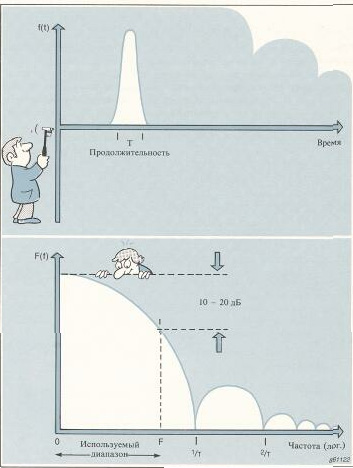

## 🏷️ Ударные молотки: Масса и жесткость (стр. 37)

[🔝 Сверху](#top)

37 Ударные молотки обычно имеют встроенный датчик силы и сменные головки, предусмотренные для управления жесткостью. Внимание: Измеряемая сила представляет собой произведение массы ударного молотка за пьезоэлектрическим элементом дат чика силы и ускорения. Действительная сила, осуществляющая возбуждение конструкции, равна полной массе ударного мо лотка (включая датчик силы и головку молотка), умноженной на ускорение во время удара. Действительная сила представляет собой произведение измеряемой силы на отношение полной массы и массы за пьезоэлектрическим элементом датчика силы. Ударные молотки могут иметь массу от нескольких грамм до нескольких тонн с частотным диапазоном от 0 - 5000 Гп у са мого легкого до 0 - 10 Гц у самого тяжелого молотка. Преимущества применения ударных молотков следующие: • скорость - необходимо проводить только несколько усреднений • крепежные приспособления вообще не нужны • отсутствие влияния на конструкцию переменной нагрузки, обусловливаемой массой. Это является особым преимущест вом при испытаниях легких конструкций, так как изменение нагрузки от точки к точке может вызвать сдвиг модальных частот при различных измерениях • компактность и удобство проведения испытаний на месте эксплуатации • относительная дешевизна аппаратуры.

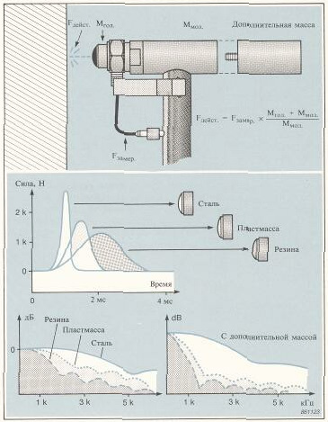

## 🏷️ Недостатки ударного возбуждения (стр. 38)

[🔝 Сверху](#top)

38 Однако,  имеется  несколько   недостатков,   которые  необходимо рассмотреть. • Большие значения пик-фактора делают ударное возбуждение неудобным для испытаний систем с нелинейными характе ристиками, так как при этом проявляются нелинейные свой ства. • Для сообщения нужной энергии большим конструкциям могут потребоваться очень высокие пиковые силы, которые мо гут привести к местному повреждению конструкции. • Ударные сигналы являются детерминированными, а амплитуда силы лишь мало изменяется между уровнями перегру зки и недовозбуждения. Это означает, что для нелинейных систем не может быть выполнена линейная аппроксимация. • Вследствие детерминированного характера сигнала **функция когерентности** не может показать возможное рассеяние или нелинейность поведения испытуемой конструкции. • Управление спектром может быть осуществлено только в области верхнего предела частоты, так что ударное возбу ждение не подходит для анализа с увеличением масштаба частоты.

## 🏷️ Ударные испытания и когерентность (стр. 39)

[🔝 Сверху](#top)

39 Ударные испытания и **функция когерентности** Детерминированный характер ударного возбуждения ограничи вает применение функции когерентности. Функция когерентности при ударном возбуждении показывает «идеальное» значение 1 до возникновения одной из описанных ниже ситуаций. • Появление *анти**резонанс***а, при котором отношение сигнал/ шум имеет малое значение. На это не нужно обращать боль шого внимания. С помощью определенного числа циклов усреднения кривая ****частотной характеристики**** должна стать плавной (в случае шума на выходе используется оценка H1). • Ударные испытания конструкции проводятся с разбросом в отношении точки приложения силы и ее направления. Это должно быть сведено до минимума таким образом, чтобы при ***резонанс***е степень когерентности была выше 95%. Если точка приложения удара расположена вблизи узловой точки, **функция когерентности** может иметь очень малое значение (~0,1). Однако, это приемлемо, так как модальная напря женность в этой точке мала и не имеет большого значения для проведения анализа.

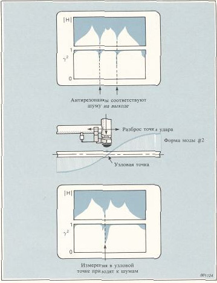

## 🏷️ Методы взвешивания (Связь частота/время) (стр. 40)

[🔝 Сверху](#top)

40 Методы взвешивания при ударных испытаниях Перед обсуждением методов взвешивания, применяемых при ударных испытаниях, мы рассмотрим две важные зависимости частотного анализа. • Связь между частотной и временной областями Данные могут быть представлены в двух различных областях, т.е. во временной и частотной областях. При этом получается одна и та же информация, представленная различными способами. Следует помнить, что функции, широкой в одной области, соответствует узкая функция в другой. • Короткие импульсы имеют широкий спектр, простирающийся от 0 Гц до очень высоких частот. • Непрерывной синусоиде во временной области соответствует только одна дискретная составляющая спектра. • Острому ***резонанс***у соответствует продолжительный сигнал во временной области (медленно затухающие колебания при возбуждении). • Связь между усечением и рассеянием Если учитываемая реализация ограничена в одной области, т.е. усечена, то в другой области неизбежно рассеяние (утечка). • Если мы попытаемся замерить импульс с помощью аппаратуры с недостаточной шириной рабочего частотного диапазона, то импульс покажется шире, чем он есть на самом деле. • Если при измерении затухающего колебательного процесса, сопровождающего ***резонанс***, время наблюдения меньше времени затухания, то соответствующий ***резонанс***ный пик покажется шире действительного пика. Рассеяние проявляется в виде нелинейной ошибки, связанной с длиной учитываемой в процессе дискретного преобразования Фурье реализации. Это является внутренним свойством и не связано с методами испытаний.

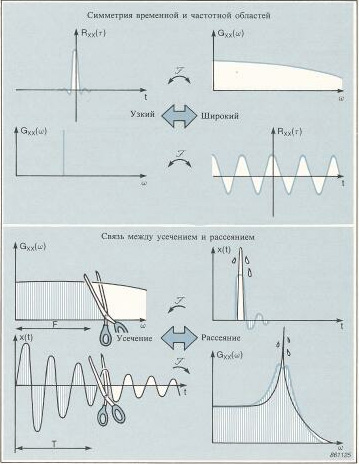

## 🏷️ Импульсная весовая функция и двойные удары (стр. 41)

[🔝 Сверху](#top)

41 Импульсная весовая функция Продолжительность механических ударов обычно намного меньше продолжительности регистрируемых во временной области реализаций. Поэтому при применении взвешивания следует иметь в виду описанные ниже указания. Интерес представляет сигнал силы, действующей во время удара, а остальные сигналы являются шумами. Они могут иметь электрический характер или это могут быть механические колебания самого ударного молотка. Используемая весовая функция является импульсной функцией. Она допускает применение невзвешенных данных только во время контакта, а в оставшееся время придает данным равные нулю значения. Используемая импульсная весовая функция может иметь мягкий переход на переднем и заднем фронтах для повышения плавности в случае, когда сигнал силы содержит постоянную составляющую. При рассмотрении временной зависимости ударной силы может быть отмечено наличие отрицательных значений. В физическом смысле это является невозможным, но так как измерения силы проводятся в пределах ограниченного частотного диапазона (усечение), Эти короткие выбросы являются правильным представлением в учитываемом диапазоне (рассеяние). Протяженность весовой функции может быть выбрана таким образом, что в нее попадет весь сигнал. • Двойные удары Если применяется слишком тяжелый молоток, конструкция может спружинить, в результате чего произойдет двойной удар. Поя вление двойных ударов также зависит от мастерства проводящего испытания специалиста. Данные, полученные при двойном ударе, не могут быть использованы, так как соответствующий спектр со держит нулевые точки с интервалами n/ir, где п - целое число, a tr  задержка времени между двумя ударами. Двойные удары не могут быть компенсированы с помощью импульсных весовых функций. Следовательно, частотные характеристики,  замеренные при   двойных   ударах,   будут   ошибочными  и должны быть исключены из учитываемого набора данных.

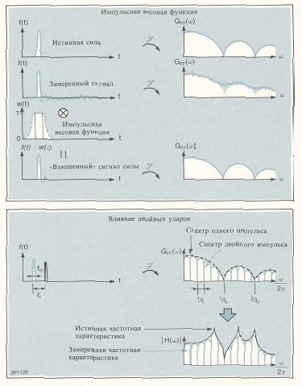

## 🏷️ Экспоненциальная весовая функция (стр. 42)

[🔝 Сверху](#top)

42 Экспоненциальная весовая функция При ударном возбуждении происходит свободное затухание всех мод механических колебаний, представляющих собой реакцию конструкции. Ниже рассматриваются две типичные ситуации. • Конструкция с малым затуханием имеет острые ***резонанс***ы, соответствующие которым колебания затухают медленно (узкие в частотной области функции и соответствующие широкие во временной области функции). Если продолжительность регистрируемых реализаций короче времени затухания, то в результатах измерений будет иметься ошибка рассеяния (усечение во временной области и соответствующее рассеяние в частотной области), что приводит к наблюдению слишком низких и слишком широких ***резонанс***ных пиков. • Конструкция с большим затуханием, сигналы реакций которой затухают очень быстро и достигают нуля за очень короткое время. Если продолжительность регистрируемых реализаций намного больше времени затухания, отношение сигнал/шум уменьшается и на результаты наложены шумы. Экспоненциальная весовая функция хорошо подходит для обоих описанных ситуаций. Это функция w(t) = e+t/τ, которая увеличивает затухание реакции и эффективна по описанным ниже причинам. • Отклики конструкций с малым затуханием приводятся весовой функцией к полному затуханию в течение времени регистрации, так что совершенно исключается рассеяние вследствие усечения реализаций. Наблюдаемое влияние на результаты измерений таково, что ***резонанс***ы становятся слишком широкими или затухание кажется слишком большим. Коррекция затухания может быть легко осуществлена на стадии последующей обработки. • В конструкциях с большим затуханием весовая функция способствует подавлению паразитных шумов. Коррекции затухания проводить не следует, так как естественное затухание обычно происходит гораздо быстрее, чем затухание весовой функции.

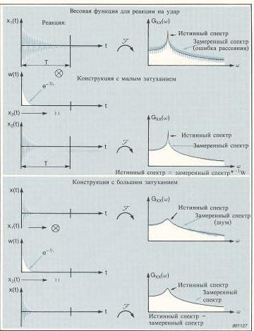

## 🏷️ Сравнение различных видов возбуждения (стр. 43)

[🔝 Сверху](#top)

43 Сравнение различных видов возбуждения Кроме трех, уже рассмотренных видов возбуждения, имеется целый рад других возможностей, примеры которых кратко опи саны ниже. • Синусоидальные сигналы с быстрой разверткой частоты, которые совмещают в себе преимущества управления амплиту дой, характерного для синусоидального возбуждения, и быстродействия, характерного для широкополосных сигна лов. • Периодический случайный сигнал и импульсный случайный сигнал. Оба эти вида возбуждения имеют преимущество, обеспечиваемое случайной амплитудой и случайной фазой, для уменьшения влияния нелинейных свойств объектов, а их периодическая форма волны предотвращает ошибки, связан ные с рассеянием. Случайно повторяющиеся удары при испытаниях в области низких частот (длительность реализации менее 2 с) повы шают отношение сигнал/шум. При этом применяются такие же методы, что и при случайном возбуждении, но сохраня ется простота метода возбуждения с помощью ударного молотка

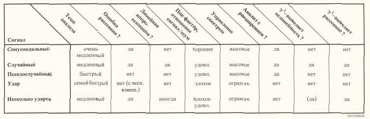

## 🏷️ Калибровка системы (стр. 44)

[🔝 Сверху](#top)

44

Большинство имеющихся на рынке датчиков поставляются с калибровочными паспортами. Однако, перед каждым измерением подвижности настоятельно рекомендуется проведение калибровки и проверки по следующим причинам: • для подтверждения правильности работы датчика и для предотвращения погрешностей, возникающих в кабелах, соединителях, предусилителях и анализаторах • для подтверждения правильности всех настроек усиления, полярности и аттенюаторов в системе (в больших измерительных системах может быть легко пропущена одна на- стройка) • для подтверждения наличия датчиков  с  характеристиками, согласованными в учитываемом диапазоне частот. Один из простых методов калибровки и проверки всей системы заключается в измерении подвижности  простой  конструкции. Простейшей конструкцией является одиночный груз известной массы. По второму закону Ньютона; сила = масса х ускорение Отсюда следует выражение для ускоряемости:

Для любой частоты ускоряемость имеет амплитуду '/масса и фазу 0 градусов. Груз известной массы подвешивается таким образом, чтобы он перемещался только в одном направлении. Для определения ускорения его колебаний к нему прикрепляется акселерометр. При возбуждении может использоваться как молоток, так и вибростенд. В описанном процессе осуществляется относительная калибровка, что обеспечивает получение более точных результатов измерений подвижности, чем при индивидуальной абсолютной калибровке отдельных датчиков. Груз можно также держать в руке. Калибровка

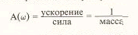

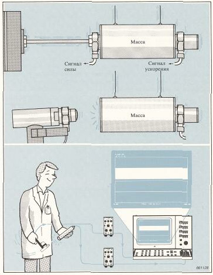

## 🏷️ Замечания по ударной калибровке (стр. 45)

[🔝 Сверху](#top)

45 • Замечания по ударной калибровке Если калибровочный груз представляет собой абсолютно твер дое тело в учитываемом частотном диапазоне, то форма волны сигнала силы и ускорения одинакова. Если используется как импульсная весовая функция для силы, так и экспоненциальная весовая функция для реакции, то опре деляемая реакция будет меньше, чем теоретическая реакция. Это объясняется ослаблением, вызванным экспоненциальной весо вой функцией. Однако, несмотря на сказанное, общая чувстви тельность измерительной системы будет в описанном процессе калибровки определена правильно.

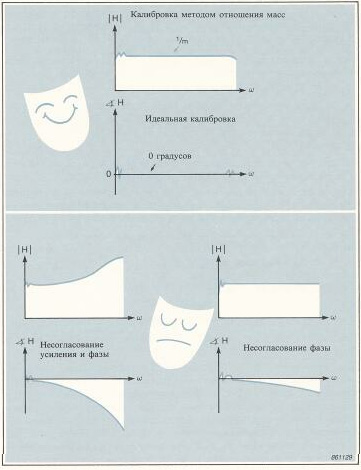

> [!TIP]
> **Кейс**: Выявление источника вибраций (11 Гц) в редукторе узла лебедки. С помощью модального анализа подтверждено, что проблема вызвана разбалансом, а не резонансом конструкции.

• **Проблема**
Очень часто во время работы крана возникали сильные механические колебания его портала. Перед руководителями предприятия встала большая дилемма: остановка производства для проведения инспекции и устранения неполадки означала большие расходы, а выход из строя был бы катастрофой.

• **Выявление источника**
Механические колебания возникали только тогда, когда задействовался определенный узел лебедки. В результате нескольких измерений механических колебаний удалось легко выявить их источник, которым оказался редуктор этого узла. Анализ замеренного на редукторе ускорения механических колебаний показал, что доминирующая частота механических колебаний составляла 11 Гц. Эта частота в свою очередь привела к промежуточной шестерне, имеющей соответствующую частоту вращения.

• **Выявление причины проблемы**
После этого проблема свелась к следующим вопросам:
1. Слишком ли высоки амплитуды сил, создаваемых редуктором? 
2. Или усилены ли амплитуды нормальных сил вследствие **резонанса** конструкции?

Для получения ответа на эти вопросы были проведены измерения подвижности в точке приложения силы на подшипнике вала соответствующей шестерни. Возбуждение, проводимое в верхней части редуктора с помощью большого вибростенда, позволило легко и быстро выполнить эти измерения. Частотная характеристика не имела **резонанса** при наблюдаемой частоте механических колебаний (11 Гц), в результате чего было решено, что вынужденные механические колебания возникают вследствие разбаланса.

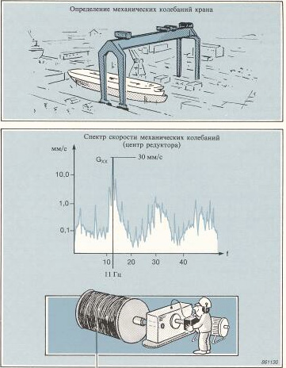

• **Определение сил разбаланса**
Для определения сил, создаваемых из-за наличия неуравновешенных масс, был использован непосредственный метод. Рассматривая подшипник вала как систему с одним входом и одним выходом, можно было создать линейную модель.

Было получено решение при частоте 11 Гц, указывающее на то, что амплитуда сил, создаваемых из-за наличия неуравновешенных масс, составляет 8,29 кН. Дальнейшие расчеты показали, что они соответствуют моменту 1,74 кг • м.

• **Решение**
Была проведена подготовка балансировочного стенда. Редуктор был демонтирован, шестерня доставлена на стенд, сбалансирована и установлена назад. Кран был подготовлен к бесперебойной работе. Интересно отметить, что хотя модель была очень грубой, рассчитанный момент разбаланса оказался почти равным истинному (разбаланс был вызван отломанным куском литья массой 3,3 кг).

> [!TIP]
> **Итог**: Модальный анализ позволил избежать дорогостоящего и ненужного усиления конструкции, точно указав на механическую неисправность (разбаланс) узла.

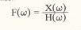

