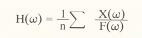
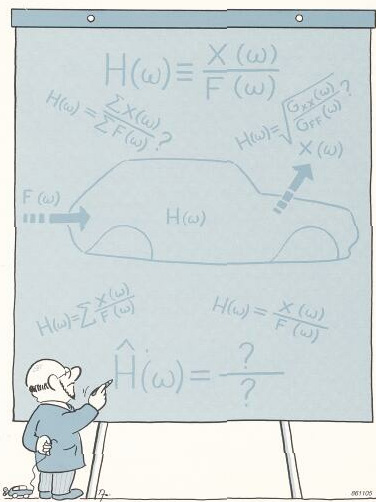

# test_page_18

## 🏷️ Страница 1

[🔝 Сверху](#top)

 
18
Оценки частотных характеристик 
В идеальном случае определение частотной характеристики 
подвижности включает в себя возбуждение конструкции с помо- 
щью замеряемой силы, измерение реакции с последующим рас- 
четом отношения спектров действующей силы и реакции. Одна- 
ко, на практике возникает целый ряд проблем: 
• наличие механического шума в конструкции, включая нели- 
нейные процессы 
• шум электрического характера в используемой аппаратуре 
• ограниченная разрешающая способность при анализе. 
Для сведения этих проблем до минимума необходимо приме- 
нить некоторые статистические методы для оценки частотной 
характеристики по результатам проведенных измерений. Оцен- 
ка по данным, содержащим случайные шумы, обычно требует 
применения какого-либо вида усреднения. 
Какие методы могут быть использованы для усреднения значе- 
ний отношения выход/вход? 
• Можно ли взять сумму п спектров реакции и разделить ее на 
сумму п спектров силы? 
 
Нет, нельзя. Спектры являются комплексными величинами, и их 
суммы будут стремитьсы к нулю, так как разница фаз между 
отдельными спектрами имеет случайный характер. 
• Можно ли взять сумму п отношений реакций и сил и раз- 
делить се на п? 
 
Нет, нельзя. Если сила имеет случайный характер, она может 
быть равна нулю при любой частоте в отдельном спектре. Соот- 
ветствующая 
составляющая 
частотной 
характеристики 
будет 
при этом неопределенной. 

