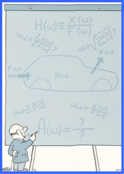

# Оценки частотных характеристик

В идеальном случае определение частотной характеристики подвижности включает в себя возбуждение конструкции с помо -щью замеряемой силы , измерение реакции с последующим рас -четом отношения спектров действующей силы и реакции . Одна -ко , на практике возникает целый ряд проблем :

Для сведения этих проблем до минимума необходимо приме -нить некоторые статистические методы для оценки частотной характеристики по результатам проведенных измерений . Оцен -ка по данным , содержащим случайные шумы , обычно требует применения какого -либо вида усреднения .

Какие методы могут быть использованы для усреднения значе -ний отношения выход / вход ?

Нет , нельзя . Спектры являются комплексными величинами , и их суммы будут стремитьсы к нулю , так как разница фаз между отдельными спектрами имеет случайный характер .

Нет , нельзя . Если сила имеет случайный характер , она может

быть равна нулю при любой частоте в отдельном спектре . Соот -ветствующая составляющая частотной характеристики будет при этом неопределенной .

