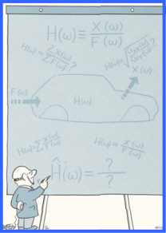
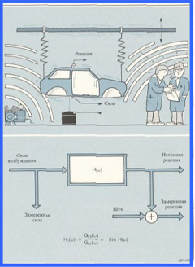

---

## 🏷️ Страница 1
[🔝 Сверху](#top)

## Оценки частотных характеристик

В идеальном случае определение частотной характеристики подвижности включает в себя возбуждение конструкции с помо -щью замеряемой силы , измерение реакции с последующим рас -четом отношения спектров действующей силы и реакции . Одна -ко , на практике возникает целый ряд проблем :

Для сведения этих проблем до минимума необходимо приме -нить некоторые статистические методы для оценки частотной характеристики по результатам проведенных измерений . Оцен -ка по данным , содержащим случайные шумы , обычно требует применения какого -либо вида усреднения .

Какие методы могут быть использованы для усреднения значе -ний отношения выход / вход ?

Нет , нельзя . Спектры являются комплексными величинами , и их суммы будут стремитьсы к нулю , так как разница фаз между отдельными спектрами имеет случайный характер .

Нет , нельзя . Если сила имеет случайный характер , она может

быть равна нулю при любой частоте в отдельном спектре . Соот -ветствующая составляющая частотной характеристики будет при этом неопределенной .

---

## 🏷️ Страница 2
[🔝 Сверху](#top)

Анализ результатов проведенных измерении может при -вести к получению полезной оценки .

## · Шум на выходе исследуемой системы

При проведении измерений исследуемая конструкция каким -либо образом подвешивается . Измерение сигнала силы осуществляется с помощью датчика силы , подсоединенного непосредственно в точке приложения силы . Кроме очень низких уровней электрического шума , может быть замеренодействительное возбуждение . Другие динамические процессы ( машины , ветер , шаги людейи т . п .) могут совместно с акустическими и внутренними динамическими процессами привести к возникновению паразитных механических колебаний исследуемого объекта . Сигнал реакции содержит не только реакцию на замеряемое возбуждение , но также реакцию на случайное возбуждение от воздействия окружающей среды . Поэтому такие измерения можно охарактеризовать как измерения , имеющие шумв выходном сигнале .

Используя метод наименьших квадратов для сведения до минимума влияния шума на выходе , находим , что наилучшей оценкой частотной характеристики будет

Эту оценочную функцию мы назовем Н 1 . Можно показать , что она равна взаимному спектру реакции и силы , разделенному на собственный спектр силы

Понятия собственного и взаимного спектров описываются в разделе , посвященном двухканальному анализатору сигналов .

