
# Modal_testing_2

---

## 🏷️ Страница 1
[🔝 Сверху](#top)

HacTh 2. AHaJT3 MOI KoJIe6aH H MOIeJIpOB aHHe

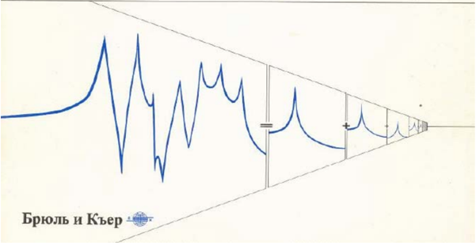

---

## 🏷️ Страница 2
[🔝 Сверху](#top)

## Испытания конструкций

## Часть 2. Анализ мод колебаний и моделирование

## Оле Дэссинг , Брюль и Къер

---

## 🏷️ Страница 3
[🔝 Сверху](#top)

## Предисловие к части 2

Изучение динамики конструкций имеет большое значение для понимания и оценки эксплуатационных характеристик любого изделия технического характера . Имеем ли мы дело с печатными платами или подвесными мостами , высокоско -ростными печатающими устройствами или стартовыми установками ракет -хорошие динамические характеристики представляют собой основу непрерывной и удовлетворитель -ной эксплуатации .

Анализ мод колебаний на основе данных , полученных в ре -зультате испытаний , обеспечивает получение определенного описания реакции конструкции , которая может быть оценена в сравнении с проектной спецификацией . Он также позволя -ет получить мощный инструмент , модальную модель , кото -рая позволяет определить влияние конструктивных модифи -каций или предсказать поведение конструкции при изменя -ющихся рабочих условиях .

Упрощенное определение анализа мод колебаний может быть сделано путем сравнения его с частотным анализом . При частотном анализе сложный сигнал разлагается в набор простых синусоидальных волн с индивидуальными частот -ными и амплитудными параметрами . При анализе мод ко -лебаний сложная динамическая деформация совершающей механические колебания конструкции разлагается в набор простых мод с индивидуальными частотными параметрами и параметрами затухания .

Строгие математические выкладки по данному предмету вы -ходят за рамки данной брошюры . При необходимости лишь приводятся математические определения для подтверджения интуитивных предположений . Для читателей , желающих найти подтверждение справедливости приводимых матема -тических соотношений , в конце брошюры приведен перечень соответствующей литературы .

К вопросу о подготовленности читателя ( см . предисловие к части 1) мы добавим также предположение знакомства с частью 1, названной « Измерения механический подвижно -сти ».

---

## 🏷️ Страница 4
[🔝 Сверху](#top)

## Экспериментальный анализ мод колебаний

## Введение

Большинство конструкций совершают механические колеба -ния . При эксплуатации все машины , танспортные средства и здания подвергаются воздействию динамических сил , ко -торые приводят к возникновению механических колебаний . Очень часто необходимо провести исследование механиче -ских колебаний вследствие возникших проблем или вслед -ствие необходимости подгонки характеристик конструкции под « стандартные » или контрольные значения . Независимо от причин , необходимо получить каким -либо образом коли -чественные данные о реакции конструкции для того , чтобы можно было оценить ее влияние на эксплуатационные хара -ктеристики и усталость материалов .

Измерения и частотный анализ механических колебаний ра -ботающей конструкции могут быть выполнены с использо -ванием методов анализа сигналов . После этого может быть проведена проверка соответствия частотного спектра меха -нических колебаний заданным параметрам . Результат будет представлять произведение реакции конструкции и спектра неизвестной силы возбуждения . Он будет дават мало или не давать вообще информации о характеристиках самой кон -струкции .

Другим подходом является метод анализа систем , при кото -ром для измерения отношения реакции к замеряемой силе возбуждения может быть использован двухканальный ана -лизатор , выполняющий быстрое преобразование Фурье . Оп -ределяемые частотные характеристики способствуют выде -лению спектров силы из результатов и описанию соб -ственно свойств конструкции между точками замера . По набору замеренных в различных точках конструкции частот -ных характеристик можно начать строить картину ее дина -мического поведения . Используемый при этом метод назы -вается анализом мод колебаний .

---

## 🏷️ Страница 5
[🔝 Сверху](#top)

## Все конструкции проявляют модальные свойства

Определяемые экспериментальным путем частотные характе -ристики механических конструкций указывают на присутст -вие серий пиков . Отдельные пики часто очень острые и четко определенные при дискретных частотах , что указывает на резонансы , каждый из которых представляет собой хара -ктеристику системы с одной степенью свободы . Если в ре -зультате определения частотных характеристик с повышен -ным разрешением по частоте выявляются новые пики , то можно предполагать присутствие нескольких резонансов . Вследствие этого конструкция представляет собой как бы на -бор отдельных механических систем с одной степенью сво -боды . Это является основой анализа мод колебаний , с помо -щью которого может быть проведен анализ поведения кон -струкции путем определения и оценки всех резонансных частот или мод , имеющихся в характеристиках конструкции .

Рассмотрим сначала вопрос о том , как реакция конструкции может быть представлена в различных областях . Таким об -разом мы сможем увидеть , как модальное описание связано с описанием в пространственной , временной и частотной областях .

В качестве примера рассмотрим реакцию колокола , который предстваляет собой механическую систему с малым затуха -нием . При ударе по колоколу он выдает акустическую реакцию , содрежащую ограниченное число числтых тонов . Реакция , соответствующая механическим колебаниям , имеет точно такую же структуру , а колокол как бы накапливает энергию удара и рассеивает ее в виде механических колеба -ний с несколькими дискретными частотами .

На рисунке в отдельных колонках показаны реакции коло -кола , представленные в различных областях :

В физической области сложная геометрическая деформация колокола может быть представлена с помощью набора простых независимых графиков деформации или форм мод .

Во временной области реакция в виде механических ( или акустических ) колебаний является временной функцией , ко -торая может быть представлена как набор затухающих си -нусиод .

---

## 🏷️ Страница 6
[🔝 Сверху](#top)

В частотной области анализ временного сигнала дает спектр , содержащий серию пиков , соответствующих спек -трам реакций систем с одной степенью свободы .

В модальной области реакция колокола представлена в виде модальной модели , построенной на основе набора моделей систем с одной степенью свободы . Так как форма моды представляет собой перемещение всех точек конструкции при соответствующей модальной частоте , то одиночная мо -дальная координата q может быть использована для пред -ставления всего вклада этой моды в общую деформацию конструкции в целом .

Возвращаясь назад по строкам рисунка , мы видим , что каж -дая модель системы с одной степенью свободы связана с частотой , затуханием и формой моды колебаний . Таким об -разом , имеются следующие МОДАЛЬНЫЕ ПАРАМЕТРЫ :

Эти параметры совместно образуют полное описание собст -венных динамических характеристик колокола и являются неизменными , независимо от того , звонит ли колокол или нет .

Анализ мод колебаний представляет собой процесс определе -ния модальных параметров конструкции для всех мод в оп -ределенном частотном диапазоне . Основной целью его про -ведения является использование этих параметров для построения модальной модели реакции конструкции .

Заслуживают внимания два обстоятельства :

---

## 🏷️ Страница 7
[🔝 Сверху](#top)

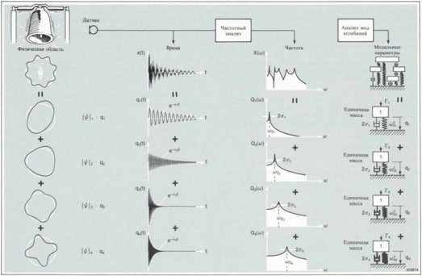

---

## 🏷️ Страница 8
[🔝 Сверху](#top)

## Модели систем с одной степенью свободы

Так как каждый пик ( или мода ) характеристики конструк -ции может быть представлен при помощи модели системы с одной степенью свободы , мы рассмотрим некоторые ас -пекты динамики систем с одной степенью свободы . В част -ности , мы исследуем методы построения моделей системы с одной степенью свободы в физической , временной и частот -ной областях . Эти модели не предназначены для представле -ния физических конструкций , но они служат в качестве инструмента для интерпретации их динамического пове -дения ( представленного с помощью набора предположений и граничных условий ). Модели оказываются полезными для :

---

## 🏷️ Страница 9
[🔝 Сверху](#top)

Эта модель представлена в виде дифференциального уравне -ния второго порядка . Более простая в математическом отно -шении модель может быть получена в частотной области .

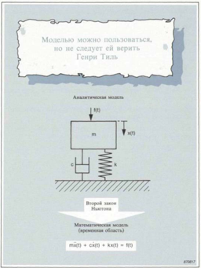

---

## 🏷️ Страница 10
[🔝 Сверху](#top)

## Модели систем с одной степенью свободы в частотной области

· Модель с пространственными параметрами может быть построена в частотной области для описания частотной ха -рактеристики Н ( ω ) в терминах массы , жесткости и коэффи -циента затухания .

Давайте рассмотрим поведение этой модели под воздейст -вием синусоидального возбуждения и проследим за измене -ниями модуля | Н ( ω )| и фазы ^ Н ( ω ) при часто -ты .

Статическое смещение определяется только жесткостью пру -жины . При низких частотах реакция , определяемая в основ -ном пружиной , находится в фазе с силой возбуждения .

При увеличении частоты присущая массе сила инерции оказывает возрастающее влияние . При определенной частоте ( ω 0 = √ k/m  собственная частота незатухающих колебании ) соответствующие массе и пружине составляющие взаимно аннулируются и реакция определяется только присущей демпферу составляющей . Следовательно , податливость си -стемы увеличивается . Если присущая демпферу составля -ющая была бы равна нулю , то податливость стала бы беско -нечной . При частоте ω 0 реакция отстает от силы возбуждения на 90°.

---

## 🏷️ Страница 11
[🔝 Сверху](#top)

При частотах , превышающих ω 0 основное влияние оказы -вает присущая массе составляющая и система начинает вести себя как чистая масса , податливость уменьшается , а реакция отстает от силы возбуждения на 180°.

Функция H( Ω ) является частотной характеристикой податли -вости ( перемещение / сила ). Она представляет собой отноше -ние выходного и входного спектров и изменяется в зависи -мости от частоты ( ω ).

Эта модель связывает аналитическую модель системы с од -ной степенью свободы с практическими измерениями и их результатами .

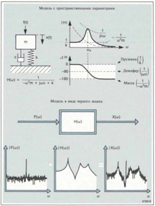

---

## 🏷️ Страница 12
[🔝 Сверху](#top)

Модель с пространственными параметрами является идеаль -ной для работы с аналитическими системами . Обычно нам неизвестны распределения массы , жесткости и затухания реальных конструкций . Следующая модель представляет со -бой практическую связь между теорией и практикой .

На данном рисунке функция Н ( ω ) определяется координатой полюса ( р ) и вычетом (R) и их комплексно сопряженными величинами ( р * и R*). Координата полюса и вычет в свою очередь определяются через пространственные параметры .

Координата полюса представляет собой комлексную величи -ну . Численное значение ее действительной части ( σ ) пред -ставляет собой скорость затухания колебаний . Это показано на графике зависимости импульсной характеристики от вре -мени . В частотной области σ представляет собой половину ширины полосы (-3 дБ ) пика частотной характеристики . Мнимая часть координаты полюса представляет собой мо -дальную частоту -собственную частоту свободно затуха -ющих колебаний ( ω d ).

Вычет в случае системы с одной степенью свободы пред -ставляет собой мнимую величину , которая отображает ин -тенсивность моды колебаний .

Как показано на рисунке , координата полюса и вычет могут быть экспериментальным путем на основе измеренной и из -ображаемой на экране анализатора частотной характеристи -ки . Таким образом , модель с модальными параметрами дает связь аналитических моделей с результатами эксперимен -тальных исследований .

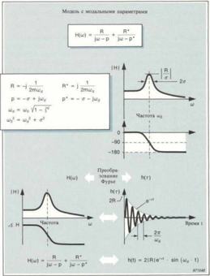

---

## 🏷️ Страница 13
[🔝 Сверху](#top)

## Координата полюса и вычет

Так как координата полюса и вычет представляют основу анализа мод колебаний , мы рассмотрим эти два параметра более подробно .

Координата полюса включает в себя два модальных параме -тра , описанных на стр .  4. Действительная часть координаты полюса представляет собой скорость затухания свободных колебаний ( по отношению к модальному затуханию ), а мни -мая часть представляет собой частоту , при которой система совершает свободные затухающие колебания ( модальная ча -стота ). Эта информация представлена в частотной области в виде средней частоты и половины ширины полосы ( при -3 дБ ) соответствующего резонансу пика . Координата полю -са описывает форму кривых модуля и фазы частотной хара -ктеристики . Она дает нам качественную информацию о ди -намических свойствах соответствующей механической си -стемы .

Вычет иногда называют напряженностью полюса , но ампли -туда моды определяется не только вычетом . Она представля -ет собой отношение вычета и скорости затухания , т . е .

---

## 🏷️ Страница 14
[🔝 Сверху](#top)

На рисунке показан пример , иллюстрирующий свойства координаты полюса и вычета . При упрощенном подходе с учетом системы с одной степенью свободы высококачествен -ный проигрыватель мог бы иметь такое же распределение жесткости , затухания и массы , что и автомобиль , а следова -тельно , такую же координату полюса . Частотные характери -стики таких объектов имели бы одинаковую форму , но их реакции на воздействие единичной силы были бы совершен -но различными . Это различие может быть обнаружено в вычетах .

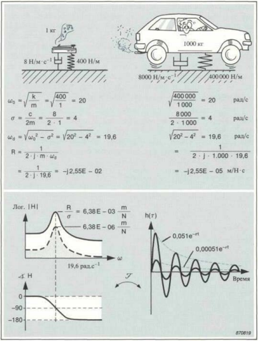

---

## 🏷️ Страница 15
[🔝 Сверху](#top)

## Степени свободы и модели систем с несколькими степенями свободы

Предыдущие модели относились к случаю одной степени свободы , т . е . к перемещению в одном направлении . Реаль -ные конструкции имеют много точек , которые могут переме -щаться независимо друг от друга , т . е . они являются систе -мами с несколькими степенями свободы . Для определения частотной характеристики реальной конструкции необходи -мо замерить силу возбуждения и реакцию в двух точках . Однако , каждая точка может перемещаться максимально в шести возможных направлениях и поэтому необходимо так -же определить направление перемещения .

Написав функцию Н ij( ω ) двумя способами , можно получить две модели систем с несколькими степенями свободы . Эти модели описаны уравнениями на рисунке .

---

## 🏷️ Страница 16
[🔝 Сверху](#top)

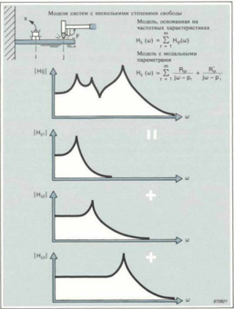

---

## 🏷️ Страница 17
[🔝 Сверху](#top)

## Что такое форма мод ?

Форма мод представляет собой , как уже было показано в примере с колоколом на стр .  4, деформацию , связанную с конкретной модальной частотой или с координатой полюса . Ее трудно представить себе и наблюдать . Она представляет собой абстрактный математический параметр , который определяет деформацию , как если бы эта мода существовала отдельно от всех остальных мод колебаний конструкции .

Истинное физическое перемещение в любой точке всегда является комбинацией всех мод колебаний конструкции . При гармоническом возбуждении , близком к модальной ча -стоте ,  95% перемещений может быть связано с соответству -ющей конкретной формой мод , а при случайном возбужде -нии имеется тенденция к произвольной комбинации всех форм мод .

В любом случае , форма мод представляет собой внутреннее динамическое свойство совершающей « свободные » механиче -ские колебания ( без воздействия внешних сил ) конструкции . Она отображает относительное перемещение всех частей конструкции для конкретной моды .

## · Выделенные формы мод → вектор формы мод

Формы мод являются непрерывными функциями , которые при анализе выделяются с « пространственным разрешени -ем », зависящим от числа учитываемых степеней свободы . В общем случае они не замеряются непосредственно , а опреде -ляются по набору присущих заданным степеням свободы ча -стотных характеристик . Выделенная форма мод предстваля -ется с помощью вектора формы мод { ψ }r , где -номер моды .

## · Модальное перемещение

Составляющие ψ ir вектора формы мод представляют собой относительные перемещения , присущие отдельным степеням свободы (i). Обычно они являются комплексными числами , отображающими как амплитуду , так и фазу перемещения .

---

## 🏷️ Страница 18
[🔝 Сверху](#top)

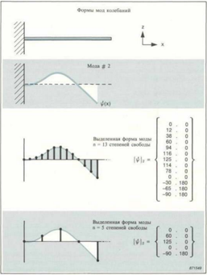

---

## 🏷️ Страница 19
[🔝 Сверху](#top)

## Нормальные моды и комплексные моды

Моды колебаний могут быть подразделены на два класса .

## · Нормальные моды

Нормальные моды характерны тем , что все части конструк -ции перемещаются в фазе или в противофазе ( со сдвигом 180)° по отношении друг к другу . Поэтому модальные пере -мещения ψ ir представляют собой действительные величины , принимающие положительные или отрицательные значения . Нормальные моды можно рассматривать как стоячие волны с неподвижными узловыми линиями .

## · Комплексные моды

Комплексные моды могут иметь какое угодно соотношение между фазами в различных частях конструкции . Модальные перемещения ψ ir представляют собой комплексные величины и они могут иметь любое значение фазы . Формы комплекс -ных мод могут рассматриваться как распространяющиеся волны без стационарных узловых линий .

## · Когда можно ожидать наличие нормальных / комплексных мод

Распределение затухания в конструкции определяет наличие нормальных или комплексных мод . Когда конструкция име -ет очень малое затухание или затухание вообще отсутству -ет , моды будут нормальными . Если затухание распределено так же , что и инерция и жесткость ( пропорциональное зату -хание ), можно ожидать наличие нормальных мод .

Конструкции с локализованным затуханием , такие как ку -зова автомобилей с точечной сваркой и амортизаторами , имеют комплексные моды .

Предупреждение . Формы мод , определенные по небольшому количеству замеров , могут указывать на комплексные моды 18 в конструкциях , в которых имеются лишь нормальные моды .

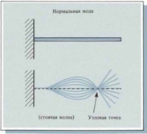

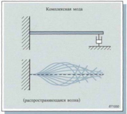

---

## 🏷️ Страница 20
[🔝 Сверху](#top)

## Связь вычетов и форм мод

На стр .  9 было показано , что вычет пропорционален модулю частотной характеристики . При модальной частоте ( ω dr ) мо -дуль частотной характеристики дается выражением

Можно показать , что присущий конкретной моде ( г ) вычет пропорционален произведению модальных перемещений ψ ( соответствует степени свободы реакции ) и ψ jr ( соответству -ет степени свободы силы возбуждения ).

На рисунке показаны вторая мода колебаний консольной балки , когда сила возбуждения приложена в точке , соответ -ствующей при степени свободы 8, и реакции , замеренные в соответствующих трем степеням свободы точках . Следует отметить , что форма резонансных кривых одинакова во всех случаях , а амплитуда пропорциональна модальным переме -щениям .

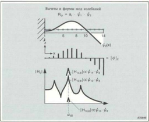

---

## 🏷️ Страница 21
[🔝 Сверху](#top)

Вектор формы мод { ψ } г определяет относительное переме -щение точек , соответствующих отдельным степеням своб -оды . Следовательно , значения составляющих ψ ir неодно -значны .

По результатам измерений частотных характеристик опреде -ляются вычеты , которые однозначны . Связь между вычетом и связанными с ним перемещениями позволяет определить масштабный коэффициент аг для каждой моды , т . е .

где ф ir и ф jr представляют собой модальные перемещения . Для измерений , проводимых в точке возбуждения , получает -ся выражение

Строгие математические выкладки по анализу мод колеба -ний дают зависимость ( приведенную на рисунке ) между ве -ктором мод [ ф } г и модальной массой Мг . При применении этого соотношения к случаю с одной степенью свободы ( когда имеется только одно перемещение и одна масса ) мо -жно провести оценку величины аг .

Что такое модальная масса ? Модальная масса не связана с массой конструкции и не может быть замерена . Это лишь математический прием . Модальная масса может иметь любое значение за исключением нуля . Мы можем выбрать ее значение , а затем рассчитать аг . Для простоты в дальней -шем будет учитываться масштабирование с единичной мо -дальной массой ( Мг = 1).

Масштабирование форм мод . По результатам измерений в точке возбуждения можно получить вычеты Rjir для отдель -ных мод . Расчетные величины аг дают возможность опреде -ления масштабированных перемещений ф jr . По результатам измерений реакции можно затем провести масштабирование величин ф ir и получить масштабированные формы мод .

---

## 🏷️ Страница 22
[🔝 Сверху](#top)

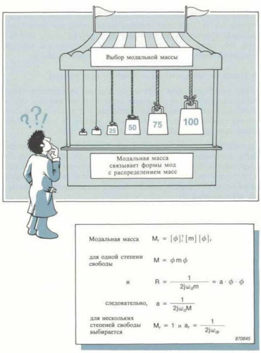

---

## 🏷️ Страница 23
[🔝 Сверху](#top)

## Модальная связь

Модальная связь представляет собой общее понятие , указы -вающее на то , насколько сильно на реакцию при одной мо -дальной частоте оказывают влияния другие моды колеба -ний . Эту связь можно наблюдать на построенной кривой частотной характеристики вблизи модальной частоты .

## · Слабо связанные моды -простые конструкции

Моды колебаний конструкции со слабым затуханием четко разделены друг от друга и при этом говорят , что они слабо связаны . Такие системы ведут себя как системы с одной сте -пенью свободы вблизи модальных частот , а соответству -ющие конструкции получили названия простых .

При иссследованиях подобных конструкций простые методы дают достоверные результаты . Простые конструкции часто встречаются при проведении поиска неисправностей , так как в большинстве случаев проблемы с шумом , механическими колебаниями и связаны с мало демпфированны -ми резонансами .

## · Сильно связанные моды -сложные конструкции

Частотные характеристики конструкций с сильным затуха -нием или высокой модальной плотностью не указывают на четко разделенные моды . При этом говорят , что моды сильно связаны , а реакция при любой частоте представляет собой комбинацию многих мод . Сложные конструкции мо -гут быть все -таки описаны с помощью дискретного набора мод , но методы , необходимые для определения модальных параметров , более сложные .

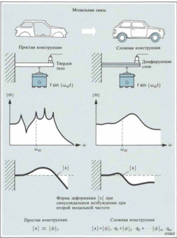

---

## 🏷️ Страница 24
[🔝 Сверху](#top)

## Предположения модального описания

На предыдущей странице были рассмотрены понятия высо -кой модальной плотности и сильного затухания . Но ни один из этих двух факторов не мешает применению к кон -струкции модального описания . Они только усложняют ис -пользуемые методы .

Лишь одно предположение необходимо сделать -предполо -жение о линейности .

## · Линейность

Необходимо предположить , что исследуемые системы имеют линейные свойства , т . е . что реакция всегда пропорциональна силе возбуждения . Это предположение имеет три следствия для измерений частотных характеристик .

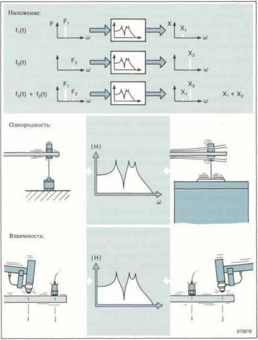

---

## 🏷️ Страница 25
[🔝 Сверху](#top)

## Практические конструкции

В общем случае конструкции будут обладать линейными свойствами с небольшими отклонениями . Но линейность ча -сто нарушается , когда деформации становятся большими . Именно поэтому модальное описание не может быть ис -пользовано для предсказания серьезных неисправностей .

Необходимо предположить , что наши конструкции :

Примечание . Характеристики некоторых конструкций изме -няются во врумя исследований или испытаний .

Характеристики конструкции с малой массой могут из -меняться вследствие нагрузки , обусловливаемой исполь -зуемыми датчиками .

При продолжительных испытаниях характеристики кон -струкции могут изменяться вследствие изменений темпе -ратуры или других окружающих условий .

Некоторые конструкции могут непрерывно изменяться . Масса летательного аппарата , например , будет умень -шаться по мере сгорания топлива .

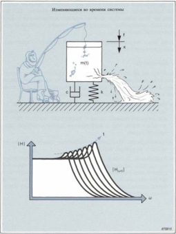

---

## 🏷️ Страница 26
[🔝 Сверху](#top)

## Модель с сосредоточенными параметрами и модальная теория

Большая часть теории модального анализа базируется на векторном и матричном матеметическом анализе . В данной работе мы не предполагаем приводить строгие математи -ческие выкладки , но для понимания того , почему методы анализа справедливы , мы рассмотрим некоторые теорети -ческие аспекты .

## · Модель с сосредоточенными параметрами

Эта модель представляет конструкцию с несколькими сте -пенями свободы в виде серии масс , соединенных друг с дру -гом с помощью пружин и демпферов . Применив второй за -кон Ньютона , можно получить систему уравнений для пере -мещения , по одному уравнению для каждой массы ( каждой степени свободы ) в данной модели .

Математическим примером , используемым для системати -зации этих уравнений , является матричная запись . Матрица масс будет содержать значения одиночных масс , а матрицы жесткостей и затуханий будут содержать комбинации значе -ний , которые связывают все уравнения друг с другом . Эта связь говорит о том , что прилагаемая к одной массе сила вызывает реакцию всех остальных , что усложняет провдение анализа данной модели .

Распределения массы , затухания и жесткости реальных кон -струкций обычно неизвестны , но можно определить коорди -наты полюсов ( затухание и модальные частоты ) и вычеты и получить масштабированные формы мод . С помощью этих параметров можно преобразовать модель с сосредоточенны -ми параметрами .

---

## 🏷️ Страница 27
[🔝 Сверху](#top)

## · Модальное преобразование

Если заменить физические координаты в уравнении переме -щений ( в матричной форме ) на произведение модальной матрицы ( все векторы масштабированных форм мод как ко -лонки ) и модальных координат , то тем самым выполнится переход в другую область , называемую модальным про -странством .

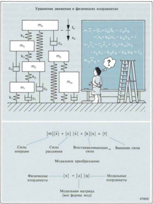

---

## 🏷️ Страница 28
[🔝 Сверху](#top)

## Модальное пространство

Переход в модальное пространство оказывает сильное вли -яние на модель с сосредоточенными параметрами . Уравне -ния для перемещений становятся независимыми и могут рассматриваться как набор уравнений независимых моделей с одной степенью свободы , по одной для каждой моды в модели с несколькими степенями свободы ( для каждой мо -дальной координаты ).

Каждая модель имеет массу , равную единице ( единичную модальную массу ), коэффициент затухания , равный ширине частотной полосы моды , и жесткость , равную квадрату собственной частоты незатухающих колебаний . Возбужде -ние отдельных моделей происходит модальной силой , ра -вной скалярному произведению формы мод и вектора физи -ческой силы ( т . е . проекции силы на форму мод ). Эта мо -дальная сила может быть интепретирована как способность заданного распределения сил возбуждать данную моду .

В данном положении можно написать уравнения в терминах модальных параметров с получением решения в модальных координатах . Уравнение для каждой координаты может быть решено отдельно как уравнение , описывающее систему с одной степенью свободы . После масштабирования форм мод с помощью единичной модальной массы уравнения имеют вид зависимостей от простых , замеряемых параме -тров : собственной частоты , модального затухания и масшта -бированной формы мод .

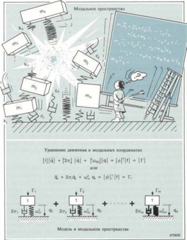

---

## 🏷️ Страница 29
[🔝 Сверху](#top)

## Характеристика степеней свободы

Свободная точка обычно имеет шесть степеней свободы , со -ответствующих трем поступательным и трем вращательным движениям . Удобных датчиков для вращательного движения не имеется , но для описания общего движения обычно до -статочно учитывать поступательные движения . Для боль -шинства реальных конструкций достаточно провести изме -рения в нескольких равномерно расположенных точках в одном или двух направлениях .

## · Сколько степеней свободы необходимо для испытаний ?

Количество необходимых степеней свободы зависит от це -лей проводимых испытаний , от геометрической формы кон -струкции и от количества мод в учитываемом частотном диапазоне .

При испытаниях , проводимых только для простой проверки определенных аналитическим методом частот , достаточно учитывать лишь небольшое число степеней свободы .

Если целью испытаний является построение математической модели , то для того , чтобы замеренные формы мод были ортогональными или линейно независимыми , необходимо учитывать достаточное число степеней свободы .

На рисунке показаны два примера измерений , выполненных на прямоугольной пластинке . В одном примере учитывались четыре степени свободы , в другом -тридцать . В примере с четырьмя степенями свободы видны максимально четыре линейно независимые моды . Моды с более высокими поряд -ковыми номерами являются простым повторением первых четырех мод . Модель , созданная на основе этих измерений , может быть использована только в диапазоне частот , кото -рый включает в себя первые три или четыре моды . В приме -ре с тридцатью степенями свободы формы двух высших мод представлены приблизительно .

Примечание . Число степеней свободы должно быть выбрано с учетом надежного представления общей динамики систе -мы . Геометрическая сложность форм мод в большей степе -ни , чем количество ожидаемых мод , определяет необходимое число степеней свободы .

---

## 🏷️ Страница 30
[🔝 Сверху](#top)

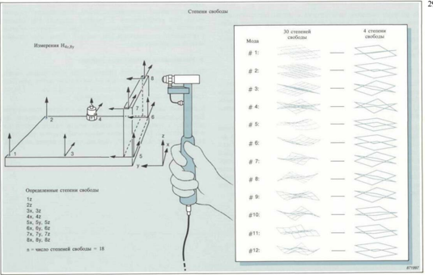

---

## 🏷️ Страница 31
[🔝 Сверху](#top)

## Степени свободы и матрица подвижностей

## · Входные / выходные комбинации

На рисунке показана конструкция с двумя определенными степенями свободы , каждая из которых представляет собой входную / выходную точку при измерениях частотных хара -ктеристик . Если мы имеем п определенных степеней свобо -ды , то число возможных входных / выходных комбинаций со -ставляет п х п .

## · Матрица подвижностей

Отдельные частотные характеристики могут быть предста -влены в виде элементов матрицы , известной под названием матрицы подвижностей [ Н ]. Каждый элемент матрицы Ну ( ω ) представляет собой результат измерений отдельной частотной характеристики .

Каждая строка матрицы подвижностей содержит частотные характеристики с общей степенью свободы реакции , а в ка -ждой колонке матрицы имеются частотные характеристики с общей степенью свободы силы возбуждения . По диагонали матрицы [ Н ] расположен класс частотных характеристик , для которых степени свободы реакции и силы возбуждения идентичны друг другу . Они представляют собой точечные частотные характеристики . Элементы вне диагонали пред -ставляют собой передаточные частотные характеристики .

Примечание . Понятие подвижности используется в общем смысле и может представлять собой податливость , подвиж -ность или ускоряемость . В моделях матрица [ Н ] обычно является матрицей податливостей , а при измерениях обычно учитывается ускораемость ( см . часть 1 « Измерения механи -ческой подвижности »).

## · Минимально необходимые данные

Число степеней свободы , заданных при испытаниях , может лежать в диапазоне от десяти до нескольких сотен . Матрица [ Н ] может поэтому быть слишком большой ( при п = 100 ма -трица [ Н ] содержит 10000 элементов ).

К счастью , здесь приходит на помощь свойство взаимности . Вся информация по линейной механической системе со -держится в одной полной строке или в одной полной ко -лонке матрицы [ Н ]. Поэтому число необходимых частотных характеристик равно числу определенных степеней свободы .

---

## 🏷️ Страница 32
[🔝 Сверху](#top)

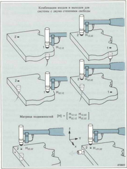

---

## 🏷️ Страница 33
[🔝 Сверху](#top)

## Модальные испытания простой конструкции

Чтобы ознакомиться с методами , используемыми для выде -ления модальных параметров , рассмотрим проведение испы -таний простой конструкции , т . е . пример , типичный для отыскания неисправностей .

Показанную на рисунке конструкцию можно рассматривать как консольную балку . Самым простым приборным обеспе -чением является двухканальный анализатор сигналов , удар -ный молоток с датчиком силы и акселерометр , с помощью которого замеряется сигнал реакции . Мы ограничимся рас -смотрением нескольких первых мод изгибных колебаний . Поэтому достаточно учитывать четыре степени свободы в вертикальном направлении .

Предположим , что проведена настройка приборов , выпол -нена предварительная подготовка и что проведены несколько обзорных измерений для оптимизации частотного диапазо -на , весовых функций и входных условий .

## · Определение координат полюсов

Любая частотная характеристика будет указывать на то , что балка имеет слабо связанные моды колебаний . Поэтому кон -струкция будет вести себя как система с одной степенью свободы вблизи модальных частот , где можно предполо -жить , что все реакции вызваны только соответствующими модами .

По любой замеренной частотной характеристике можно определить модальные частоты и значения коэффициента затухания и получить таким образом координаты полюсов .

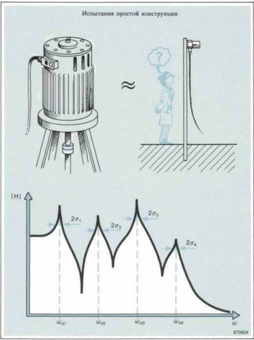

---

## 🏷️ Страница 34
[🔝 Сверху](#top)

Одним из методов , которым можно воспользоваться при экспериментальном определении параметров затухания , является определение ширины частотной полосы при -3 дБ . Конструкции с малым демпфированием имеют острые резо -нансы , а пики слишком узкие для обеспечения достаточной точности результатов измерений ширины полосы . Эта про -блема часто может быть устранена путем анализа с увеличе -нием масштаба частоты для получения достаточного разре -шения по частоте при измерениях .

Как вариант можно воспользоваться методом частотного взвешивания , при котором поочередно изолируются отдель -ные моды колебаний . Последующее применение преобразо -ваний Фурье и Гильберта обеспечит получение присущих от -дельным модам импульсных характеристик . На кривой ам -плитуды импульсной характеристики в логарифмическом масштабе затухание имеет вид прямой линии . По ней мож -но определить время затухания τ , соответствующее умень -шению амплитуды ( уровня ) на 8,7 дБ . Скорость затухания а представляет собой величину , обратную времени затухания , т . е . σ = 1 / τ

На основе результатов соответствующих измерений можно определить координаты полюсов , но нам также необходимо определить соответствующие формы мод .

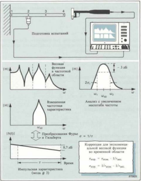

---

## 🏷️ Страница 35
[🔝 Сверху](#top)

## Определение форм мод методом квадратур

Напомним , что уравнение для модели с одной степенью свободы , записанное для одной из модальных частот 4? dr , имеет вид :

Но так как проводятся измерения ускоряемости , для получе -ния модели в терминах ускоряемости необходимо провести двойное дифференцирование :

В случае нескольких степеней свободы можно вычет пред -ставить выражением :

В результате получается :

Частотная характеристика становится чисто мнимой при модальной частоте . Ее модуль пропорционален модальному перемещению , а ее знак положительный , если перемещение совпадает по фазе с силой возбуждения .

Формы мод могут быть определены , если принять степень свободы реакции или возбуждения в качестве опрной , а за -тем провести серию измерений . Мнимые части замеренных частотных характеристик могут быть подобраны при мо -дальных частотах , при которых они представляют присущие соответствующим модам модальные перемещения .

В нашем примере в качестве опорной используется степень свободы #  2. После этого проводится измерение серии ча -стотных характеристик путем поочередного возбуждения каждой из четырех заданных точек .

Четыре значения мнимых частей частотных характеристик для каждой модальной частоты определяют соответству -ющую форму моды . Если измерения были проведены с по -мощью калиброванной аппаратуры , то может быть прове -дено масштабирование форм отдельных мод .

Следует отметить , что A(w) является мнимой величиной при модальной частоте . Это является основой примерения мето -да квадратур , с помощью которого можно определить фор -мы мод колебаний .

---

## 🏷️ Страница 36
[🔝 Сверху](#top)

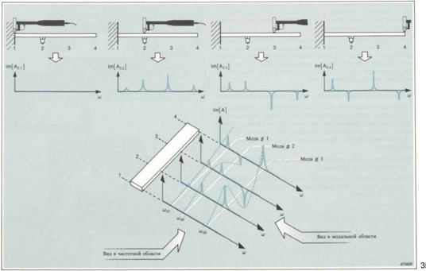

---

## 🏷️ Страница 37
[🔝 Сверху](#top)

## Оценка параметров с помощью подбора кривых

В предыдущем примере были моды слабо связаны и модаль -ные параметры находились путем простого определения не -которого числа дискретных значений по результатам изме -рений частотных характеристик .

Если замеренные данные указывают на сильно связанные молы или на присутствие паразитного шума или если необходима высокая точность оценки , то целесообразно про -вести анализ мод колебаний с помощью ЭВМ . После этого для улучшения оценки модальных параметров может быть применен метод подбора кривых .

## · Хорошие исходные данные -залог хороших результатов

Для осуществляемого с помощью ЭВМ анализа мод колеба -ний имеется много эффективных алгоритмов . Но какой бы метод оценки параметров мы не использовали , оценка должна всегда основываться на надежных данных , которые в достаточной степени представляют динамику исследуемой конструкции :

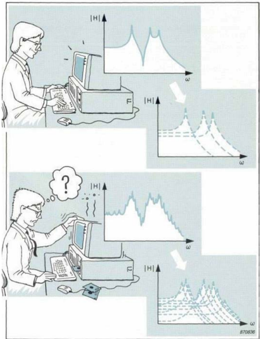

---

## 🏷️ Страница 38
[🔝 Сверху](#top)

## Что такое подбор кривой ?

Подбор кривой является этапом , на котором происходит сравнение математической теории и результатов практиче -ских измерений . Теория обеспевает построение математиче -ской параметрической модели на основе теоретических ча -стотных характеристик конструкции , а результаты измере -ний дают реальные частотные характеристики . Подбор кри -вой является аналитическим процессом определения матема -тических параметров , которые как можно точно совпадают с замеренными данными .

Давайте рассмотрим этот процесс , изучив эксперимент по определению податливости ( обратной величины жесткости ) спиральной пружины . При приложении грузов ( нагрузочной массы ) мы можем наблюдать и построить в виде графика результирующие перемещения . При предположении линей -ной зависимости между силой и отклонением можно напи -сать выражение :

В этом случае имеется только одна неизвестная (1/k) и по -этому достаточно использовать лишь одну пару замеров . Однако , при применении всех экспериментальных данных получается наилучшая оценка для 1/k.

Если грузы откалиброваны , то прилагаемая сила точно известна . Любое отклонение от прямой линии может про -исходить только вследствие ошибки измерения перемещения ( погрешность показаний ).

---

## 🏷️ Страница 39
[🔝 Сверху](#top)

## · Метод наименьших квадратов

Метод наименьших квадратов ( МНК ), показанный на рисун -ке , является одним из методов , используемых для сведения до минимума разницы между экспериментальными данны -ми и предсказываемыми значениями . Он может использо -ваться с любой математической моделью , включая модели систем с одной степенью свободы или с несколькими сте -пенями свободы .

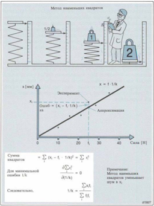

---

## 🏷️ Страница 40
[🔝 Сверху](#top)

## Средства подбора кривых при анализе мод колебаний

Процесс оценки модальных параметров по результатам из -мерений частотных характеристик очень похож на преды -дущий пример .

Для повышения степени достоверности оценки модальных параметров может использоваться метод наименьших ква -дратов . Для каждой моды необходимо провести оценку двух неизвестных комплексных параметров , координаты полюса и вычета . Однако , определяемые двухканальным анализато -ром частотные характеристики содержат около 800 ком -плексных значений каждая . В связи с необходимостью рабо -ты с таким огромным количеством данных важное значение имеет использование ЭВМ в процессе оценки модальных па -раметров . Появление средств подбора кривых методом наи -меньших квадратов и соответствующих алгоритмов позво -лило перейти от ручных методов к использованию ЭВМ .

Метод наименьших квадратов сам по себе уменьшает вли -яние случайных шумов , присутствующих при измерениях . Его применение сопровождается сглаживанием данных . Этот метод в общем случае не уменьшает влияние система -тических ошибок , таких как ошибки рассеяния или фазовые ошибки измерений , которые будут продолжать приводить к ошибочным оценкам параметров .

В настоящее время имеется большое количество средств под -бора кривых различного типа , рассмотрение которых выхо -дит за рамки данной работы . Однако , целесообразно рас -смотреть некоторые моменты .

---

## 🏷️ Страница 41
[🔝 Сверху](#top)

Понятие « подбор кривой » происходит от общей процедуры , при которой после оценки параметров подбирается и стро -ится аналитическая кривая , накладываемая на полученные экспериментальным путем данные . Оператор затем оцени -вает совпадение .

Хорошее средство подбора кривых должно быть простым и допускать применение в режиме диалога с оператором . Если имеется возможность выбора среди нескольких средств под -бора кривых , то следует остановиться на самом простом при условии , что оно подходит для обрабатываемых экспе -риментальных данных . Такое средство обычно оказывается наилучшим для использования и самым быстрым в работе .

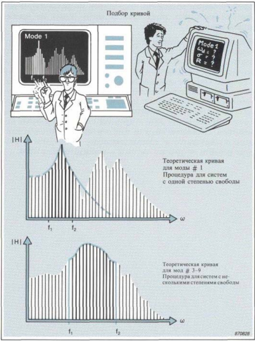

---

## 🏷️ Страница 42
[🔝 Сверху](#top)

Подбор кривых служит для выделения надежных модальных данных из результатов измерений . Хотя хорошая кривая мо -жет быть необходимой , но сама по себе она не является до -статочной . Оператор должен сам судить о правильности ме -тодики и надежности полученных результатов .

## · Средства подбора кривых для систем с одной степенью свободы

Средства подбора кривых для систем с одной степенью свободы используются для систем со слабо связанными мо -дами , у которых можно предположить наличие характери -стик систем с одной степенью свободы вблизи модальных частот . Оператор должен выбрать частотную полосу вблизи каждой модальной частоты , в которой это предположение может быть справедливо . Это всегда представляет компро -мис между включением как можно большего числа данных для достижения наилучшей статистической оценки и стре -млением отойти как можно дальше от области резонанса других частот , где предположение об одной степени свободы становится несправедливым .

## · Средства подбора кривых для систем с несколькими сте -пенями свободы

Средства подбора кривых для систем с несколькими сте -пенями свободы использутся в случае сильно связанных мод . Оператор должен задать частотный диапазон , в кото -ром используемое средство подбора кривых будет подбирать параметры . Некоторые алгоритмы всегда определяют доста -точное количество мод для построения кривой , но некоторые из них работают механически и должны быть откорректированы оператором . Для больших объемов дан -ных результаты часто зависят от мастерства оператора и от его опыта задания правильного числа мод для учитываемой модели .

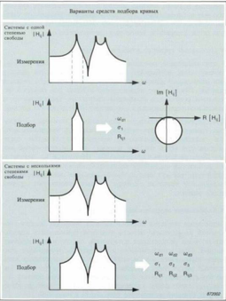

---

## 🏷️ Страница 43
[🔝 Сверху](#top)

## Локальные и глобальные средства подбора кривых

Средства подбора кривых можно классифицировать как ло -кальные и глобальные . Эта классификация зависит от того , как проводится оценка модальных параметров по наборы ре -зультатов измерений частотных характеристик .

## · Локальные средства подбора кривых

В эту категорию попадают большинство средств подбора кривых . Они подбирают координаты полюсов по одному или нескольким измерениям и задают их для всего массива данных . После этого подбираются вычеты для каждого от -дельного результата измерения частотных характеристик с использованием локально определенной координаты полюса .

Достоверность результатов , полученных с помощью локаль -ных средства подбора кривых , зависит от предположения , что локально определенные координаты полюсов спра -ведливы для всего массива данных . Это предположение мо -жет быть не всегда справедливым . Некоторые из результа -тов измерений частотных характеристик может быть трудно подогнать , так как они содержат сильные локальные моды . Глобальные средства подбора кривых используют другой метод оценки .

## · Глобальные средства подбора кривых

Глобальные средства подбора кривых проводят оценку гло -бальной координаты полюса методом наименьших квадра -тов по всем результатам измерений , т . е . по всему массиву данных . При использовании этого метода происходит уси -ление глобальных мод и ослабление чисто локальных мод , которые могут быть связаны с некоторыми частотными ха -рактеристиками . После этого средство подбора кривых ис -пользует глобальную координату полюса для подбора выче -\ п тов для каждого отдельного результата измерений .

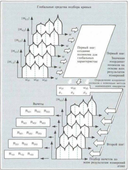

---

## 🏷️ Страница 44
[🔝 Сверху](#top)

## Модальные испытания , проводимые с помощью ЭВМ

Во многих случаях применения анализа мод колебаний возникает необходимость в определении большого числа степеней свободы и проведении такого же числа измерений частотных характеристик . Поэтому для проведения оценки и регистрации большое значение имеет использование ЭВМ . В настоящее время для этой цели имеются небольшие , доста -точно мощные настольные ЭВМ и универсальные , простые в использовании программы , которые в диалоговом режиме выдают оператору указания при проведении измерений и анализа .

## · Модальные испытания кузова микроавтобуса

Давайте рассмотрим пример модальных испытаний , прово -димых с помощью ЭВМ , и подробно изучим каждый этап таких испытаний .

Этап 1 -подготовка модальных испытаний .

Этап 2 проведение измерений .

Этап 3 -оценка параметров путем подбора кривых .

Этап 4 -выпуск документации по испытаниям и их результатам .

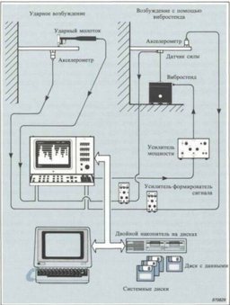

---

## 🏷️ Страница 45
[🔝 Сверху](#top)

## Этап 1 подготовка модальных испытаний

Датчик силы шпилькой закрепляется в раме кузова ( через отверстие с резьбой ) и соединяется с вибростендом с помо -щью найлоновой штанги ( толкателя ) диаметром 4 мм . Ви -бростенд устанавливается непосредственно на полу , способ -ном поглощать противодействующую силу .

Режим измерения и анализа : режим анализа в двух каналах с усреднением спектров .

Запуск : режим несинхронизированного запуска с заблокиро -ванным пусковым устройством ( анализатор ввводит и обра -батывает данные с максимальной скоростью ).

Усреднение : усреднение по линейному закону с максималь -ным числом циклов усреднения ( процесс усреднения можно остановить , когда кривые становятся достаточно плавными ).

---

## 🏷️ Страница 46
[🔝 Сверху](#top)

Частотный диапазон : верхний предел 100 Гц .

Средняя частота : основная полоса ( нижний предел учитыва -емого частотного диапазона равен 0 Гц ).

Взвешивание : весовая функция Ханнинга ( оптимальная весо -вая функция для случайного возбуждения ).

Канал А и канал Б : входные аттенюаторы , фильтры и опор ные значения настраиваются с учетом технических единиц .

Генератор : режим отдачи случайного сигнала

-.

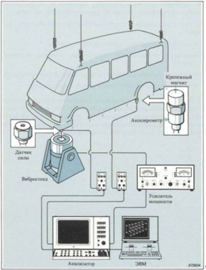

---

## 🏷️ Страница 47
[🔝 Сверху](#top)

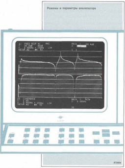

---

## 🏷️ Страница 48
[🔝 Сверху](#top)

## Этап 2 проведение измерений

На данном этапе проводятся измерения и хранятся частот -ные характеристики между точками , соответствующими сте -пени свободы возбуждения и другим определенным сте -пеням свободы .

ЭВМ оказывает помощь при обработке данных . Она упра -вляет выводом данных из анализатора и сообщает , когда каждая передача заканчивается и можно устанавливать датчик на другое место . ЭВМ также создает файлы данных и помещает данные на хранение в запоминающее устройст -во на гибком диске . В заголовках файлов предусмотрена ин -формация о степенях свободы , для которых проведены за -меры , режимах и параметрах анализатора , калибровке , дате и времени и любые примечания к помещенным на хранение результатам .

Оператор играет важную роль , непрерывно контролируя по -лучаемые результаты . Путем наблюдения по экрану анали -затора за функцией когерентности и за сходимостью частот -ных характеристик оператор может принять решение по вопросу , когда принимать получаемые результаты , а когда осуществить нужную корректировку .

Программа может управлять автоматическим происхожде -нием описанного процесса . Однако , автоматическое управле -ние использовать не рекомендуется .

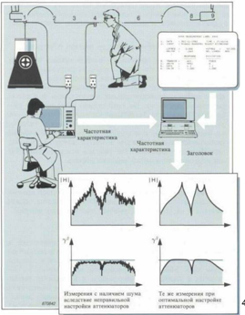

---

## 🏷️ Страница 49
[🔝 Сверху](#top)

## Этап 3 оценка параметров путем подбора кривых

После завершения этапа измерений частотных характери -стик можно приступить к предварительной обработке дан -ных для выделения модальных параметров . Этот процесс имеет три стадии :

## 1) Интерактивный подбор кривых => частота и затухание

На данной стадии проводится подбор кривых вручную . Оператор должен сам решать , какие из результатов изме -рений частотных характеристик лучше всего подходят для использования , какие моды представляют интерес , какое средство подбора кривых использовать и в каком частотном диапазоне . На этой стадии определяются гло -бальные параметры ( модальные частоты и коэффициенты затухания ). Одновременно ЭВМ « выписывает рецепт », т . е . выдает таблицу для подбора кривых . В этой таблице указывается , каким образом оператор должен проводить первый подбор кривых . Эта таблица используется ЭВМ для подгонки остального массива данных .

## 2) Автоматический подбор кривых => вычеты

ЭВМ проводит в автоматическом режиме подбор кривых по всем результатам измерений . Осуществляется оценка вычетов и их хранение в таблице подобранных данных .

## 3) Классификация => формы мод

В процессе классификации информация , собранная в таблице подобранных данных , преобразуется в данные по формам мод ( масштабированным ) и хранится в таблице форм мод . ЭВМ также преобразовывает данные из ло -кальных в глобальные координаты и определяет движе -ния точек , соответствующих неучтенным при измерениях степеням свободы , в виде линейных комбинаций движе -ний точек , соответствующих учтенным при измерениях степеням свободы .

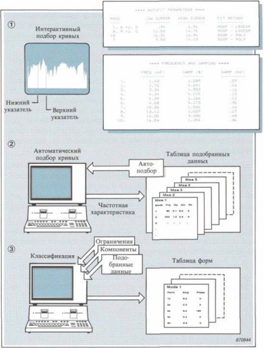

---

## 🏷️ Страница 50
[🔝 Сверху](#top)

## Этап 4 -выпуск документации по испытаниям и их результатам

Документация может быть выполнена в виде выпечатанных таблиц с результатами . Но для больших массивов наиболее рациональным является графическое представление .

## · Построение геометрической модели

При построении модальной модели никакая геометрическая информация ( за исключением соответствующих заданным степеням свободы точек и направлений ) не включается в динамическое описание . Для выпуска документации необхо -димо получить некоторые геометрические параметры , чтобы на изображениях был представлен объект испытаний .

В данных испытаниях измерялись только частотные характе -ристики в вертикальном направлении в точках в одной пло -скости , т . е . в точках рамы кузова . Эта относительно простая геометрическая конструкция может быть описана в системе прямоугольных координат с помощью таблицы координат . Для получения изображения проводится задание вычерчи -ваемых линий между координатами . В этом процессе ис -пользуется обновляемая таблица послодовательности изоб -ражения .

## · Оживление изображения

Формы мод могут быть определены как выбранный набор относительных перемещений по всей конструкции , предста -вленный с помощью вектора форм мод . Принцип оживления может быть проиллюстрирован в виде мультипликацион -ного фильма , содержащего рисунки форм мод в масштабе , изменяющемся по гармоническому закону . Эти формы мод непрерывно изображаются на экране ЭВМ . Могут использо -ваться дополнительные режимы изображения : вращение во -круг трех осей , расширение диапазона и панорамное изобра -жение , изменение амплитуды и скорости движущихся

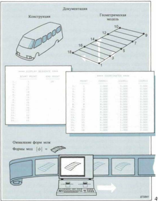

---

## 🏷️ Страница 51
[🔝 Сверху](#top)

изображений , расположение различных мод друг над дру -гом , недеформированная геометрия . Оживление изображе -ний является очень информативной формой представления форм мод .

## · Графическая регистрация форм мод

Цифровой графопостроитель может быть использован для графической регистрации форм мод колебаний на бумаге .

## · Модифицировние геометрической модели

Простая геометрическая модель нижней части рамы кузова может быть расширена с влючением координат крыши ми -кроавтобуса . Результирующее изображение будет предста -влять коробчатую конструкцию , которая более правильно представляет кузов микроавтобуса .

Программное обеспечение имеет подрограмму для включе -ния точек , соответствующих незамеряемым степеням своб -оды , в таблицу ограничений . Ограничения выражаются в том , что перемещения соответствующих незамеряемым сте -пеням свободы точек должны быть произведениями констан -ты и перемещений точек , соответствующих замеряемым сте -пеням свободы .

В нашем примере можно предположить , что для двух учиты -ваемых мод колебаний перемещения крыши и нижней рамы одинаковы . Поэтому можно ввести точки , соответствующие незамеряемым степеням свободы ( от точки 1 А до точки 18 А ), с равной единице константой в таблицу ограничений и модифицировать таблицу последовательности изображе -ний .

ЭВМ будет добавлять перемещения точек , соответствующих незамеряемым степеням свободы , во время классификации . На основе модифицированной информации будет строиться изображение новой геометрической модели .

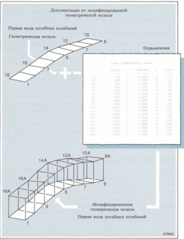

---

## 🏷️ Страница 52
[🔝 Сверху](#top)

## Динамическая модальная модель

## · Окончательные результаты модальных испытаний

Непосредственным результатом модальных испытаний явля -ются представленные в виде изображений формы мод и свя -занные с ними резонансы . Но кроме того , мы располагаем инструментом , с помощью которого можно получить пол -ную динамическую математическую объекта испыта -ний .

## · Что такое динамическая модель ?

Динамическая модель представляет собой математическую формулировку динамических свойств конструкции в виде дискретного набора точек и направлений . Она не является моделью физической конструкции . Например , если конст -рукция имела только один вход и один выход , динамическая модель может иметь вид :

где параметром модел является частотная характеристика

## · Что такое модальная модель ?

Модальная модель является обобщением динамической мо -дели :

где вектор {X} представляет собой таблицу спектров меха -нических колебаний в точках , соответствующих заданным степеням свободы ,  {F} является таблицей спектров сил воз -буждения для тех же самых точек и [ Н ] -матрица частот -ных характеристик , соответствующих всем возможным комбинациям выходов и входов . Эта модель называется мо -дальной , так как матрица [ Н ] может быть создана по опре -деленным путем оценки модальным параметрам .

---

## 🏷️ Страница 53
[🔝 Сверху](#top)

Преимущество данной формулировки заключается в том , что параметры могут быть определены экспериментальным путем . Хотя на основе измерений частотных характеристик определен только один ряд или одна колонка матрицы [ Н ], можно рассчитать все остальные элементы благодаря тому , что известны соответствующие формы мод , модальные ча -стоты и значения затухания .

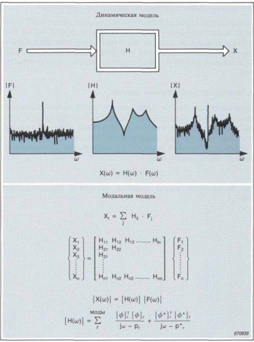

---

## 🏷️ Страница 54
[🔝 Сверху](#top)

## Проверка и применение модели

Благодаря простоте процесса сравнения форм и частот мод колебаний может быть легко проведена качественная провер -ка аналитического решения по оцененным модальным пара -метрам . Однако , количественный потенциал модели оценить труднее .

## · Адекватность модели

Модальная модель , которая может быть полезна в количе -ственном смысле , должна быть достаточно точной и пол -ностью представлять соответствующую конструкцию .

## · Проверка точности путем синтеза частотных характери -стик

Если модальные испытания и проверки калибровки выпол -нены правильно , то модальные данные будут представлять собой точное описание динамических свойств исследуемой конструкции . Для проверки точности может быть использо -вана простая процедура .

Во время испытаний мы провели измерения или одной пол -ной строки ( ударные испытания ) или одной полной колонки ( присоединяемый вибростенд ) матрицы частотных характе -ристик . По этим результатам измерений ЭВМ с соответст -вующей программой может провести синтез незамеренных частотных характеристик . Если после этого провести изме -рения соответствующих частотных характеристик исследу -емого объекта и сравнить результаты этих измерений с ре -зультатами синтеза , можно определить , насколько точна и адекватна модальная модель .

Точность может оцениваться вблизи модальных частот , где пики должны точно совпадать . Вопрос об адекватности дол -жен решать оператор на основе того , насколько хорошо со -ответствующие функции совпадают между модами и в отно -шении последующего применения модели .

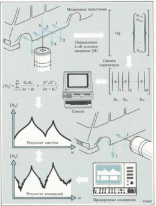

---

## 🏷️ Страница 55
[🔝 Сверху](#top)

## Замечания о законченности модели

С теоретической точки зрения формулировка модальной мо -дели точна , так как не было введено никаких аппроксима -ций . Но остается открытым вопрос о том , насколько точна модель , созданная на результатов измерений и оце -нок . Предполагая , что исходные предположения о линей -ности и т . п . справедливы , проблема , связанная с усечением .

## · Усечение мод

Так как всегда необходимо ограничить частотный диапазон при испытаниях , в поле зрения попадают не все моды кон -струкции . На практике часто игнорируют моды твердого тела при очень низких частотах , а также моды , имеющиеся только в некоторых частях конструкции . Для получения ма -ксимального разрешения по частоте всегда целесообразно сохранять как можно узкий диапазон частот . Это означает , что в частотной области происходит усечение , которое мо -жет привести к снижению точности модели , особенно между резонансами .

---

## 🏷️ Страница 56
[🔝 Сверху](#top)

## · Пространственное усечение

При описании непрерывной конструкции мы имеем дело с конечным дискретным набором степеней свободы . Но каж -дая точка конструкции может теоретически перемещаться в шести направлениях . Непроведение измерений в некоторых из этих направлениях и конечное число используемых точек замера равносильны пространственному усечению .

Давайте снова рассмотрим наши модальные испытания . Кузов микроавтобуса был описан на основе результатов ко -нечного числа измерений в вертикальном направлении . На основе полученных результатов можно видеть , что вторая мода твердого тела ( кручение ) более похожа на срез , так как не была получена информация о горизонтальных переме -щениях .

Модель не может быть использована для предсказания вли -яния сил или модификаций в точках / направлениях , где не было проведено измерений .

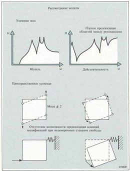

---

## 🏷️ Страница 57
[🔝 Сверху](#top)

## Что такое имитационное моделирование с помощью ЭВМ ?

Имитационное моделирование с помощью ЭВМ представля -ет собой применение точной и полной модальной модели . Моделирование может оказать помощь при поиске ответа на вопрос « А что если ?» в отношении оптимизации прототип -ной конструкции , при решении проблем и изучении пове -дения конструкции при оцененных рабочих условиях .

Имитационное моделирование реакций может предсказать реакции ( механические колебания ) конструкции при возбу -ждении различными силами , действующими в различных точках .

Моделирование модификаций может использоваться для предсказания в терминах модальных параметров того , что произойдет с моделью , если будут введены физические мо -дификации ( изменения массы , жесткости и затухания , изме -нения узлов и т . п .).

Проверка . Предсказанная реакция может быть преобразова -на в шум , деформацию , усталость и т . п . для проведения сравнения с опорными данными , критериями проектирова -ния или стандартами . Если результаты неудовлетворитель -ны , то технический специалист должен определить необхо -димые меры .

---

## 🏷️ Страница 58
[🔝 Сверху](#top)

## Имитационное моделирование в цикле проектирования

Циклический процесс

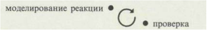

моделирование модификации ·

может быть повторен при необходимости много раз .

Благодаря высокой скорости ЭВМ и эффективности исполь -зуемого программного обеспечения время , необходимое для выполнения полного цикла имитационного моделирования , составляет всего несколько минут . Следовательно , оптим -изация может быть проведена в течение очень короткого времени .

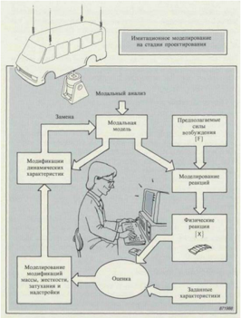

---

## 🏷️ Страница 59
[🔝 Сверху](#top)

## Имитационное моделирование реакций

Для предсказания реакций ( механических колебаний ) иссле -дуемой конструкции необходимо нагрузить модальную мо -дель заданным комплектом моделируемых физических сил .

## · Возбуждение при моделировании

При моделировании можно использовать два типа возбу -ждения , т . е . синусоидальное или широкополосное возбужде -ние . Таким образом , имеются два различных вида имитаци -онного моделирования .

## · Синусоидальное возбуждение

Синусоидальное возбуждение является реальным для многих случаев применения . В рабочих условиях конструкции часто подвергаются воздействию синусоидального возбуждения от действия свободных сил или моментов , создаваемых враща -ющимися компонентами . Процедура моделирования проста . Нам необходим набор физических перемещений { х } ( форма рабочих перемещений ), вызванных возбуждением в соответствующей одной степени свободы точке . При наличии только одной частоты спектр реакции содержит только одну составляющую -одно значение для одной сте -пени свободы .

Если необходимо использовать более одной возбуждающей силы , реакция будет представлять собой сумму индивиду -альных реакций . Дисбаланс при вращении , например , может быть моделирован как две ортогональные силы , сдвинутые по фазе на 90°.

## Синусоидальное оживление

Оживление достигается путем расчета вектора деформаций с использованием такой же методики , что и для оживления форм мод . Если учитывается несколько частот , правильное оживление невозможно , но может быть показано движение , представляющее огибающую механических колебаний .

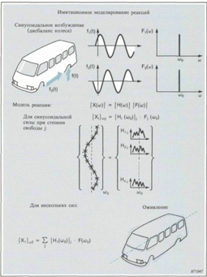

---

## 🏷️ Страница 60
[🔝 Сверху](#top)

## · Широкополосное возбуждение

Широкополосное имитационное моделирование использует -ся в случае действия сучайных сил . ОТакое моделирование может быть необходимо , например , для предсказания уровня комфорта в кабине водителя автомобиля на определенной ( стандартной ) поверхности или для предсказания составля -ющих усталости в нестабильных окружающих условиях .

Собственный спектр силы возбуждения G FF может быть по -лучен из расчета , стандартов или по результатам измере -ний . Затем с помощью программного обеспечения может быть проведен синтез частотных характеристик между точ -кой приложения силы и точками , соответствующими другим степеням свободы модальной модели .

При данном типе возбуждения мы имеем дело со статисти -ческими параметрами ( а не с дискретными величинами ). Следовательно , результаты должны быть оценены с исполь -зованием статистических методов .

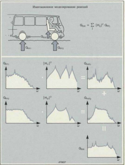

---

## 🏷️ Страница 61
[🔝 Сверху](#top)

## Моделирование модификаций

## · Решение проблемы « Что произойдет , если ... ?»

Многие проблемы с шумом и механическими колебаниями , с которыми приходится сталкиваться , связаны с резонан -сами конструкции . Резонансы могут приводить к механиче -скому нормальных рабочих сил , в результате чего получаются недопустимые реакции конструкции .

В подобных случаях в задачу технического специалиста вхо -дит предложение решения . Ткое решение часто может заклю -чаться в модификации конструкции ( изменении массы , жесткости и / или затухания ) с целью сдвига резонанса . Од -ним из путей решения является метод проб и ошибок , но он является дорогостоящим в отношении времени , расхода ма -териалов и качества .

Если имеется модальная модель , то модификации можгут быть оценены с помощью ЭВМ . Такой подход « Что про -изойдет , если ...  ?» может быть применен задолго до прове -дения модификаций физической конструкции и окончатель -ных испытаний .

---

## 🏷️ Страница 62
[🔝 Сверху](#top)

## · Рабочие модификации : « Что происходит , когда ... ?»

Подобная же проблема возникает , когда работа или эксплу -атация конструкции оказывает влияние на ее динамические свойства .

« Что » происходит , « когда » конструкция

Используя модальную модель , можно предсказать влияние этих ситуаций с помощью ЭВМ . В процессе предсказания модифицированных динамических свойств создается новая модальная модель -единственный инструмент , необходи -мый для предсказания новых реакций ( механических колеба -ний ) исследуемой конструкции .

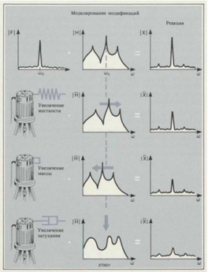

---

## 🏷️ Страница 63
[🔝 Сверху](#top)

## Внесение модификаций

## · Расчет модификаций

Обычно нам известны не пространственные параметры ис -следуемой конструкции , а лишь параметры в модальных координатах . Физическая модификация , описываемая место в пространственных параметрах , будет расширять влияние на все модальные координаты во всем объеме модального преобразования .

Уравнение для модифицированной конструкции представля -ет собой стандартную задачу на отыскание собственных значений , решение которой дает новые значения модальных частот и коэффициентов затухания , а также новые формы мод колебаний .

Так как все расчеты базируются на модальной модели , модификации могут быть моделированы в точках и с учетом определенных направлений . Метод является точным , так как не используются аппроксимации . Его точность зави -сит целиком от качества модели , созданной на основе экспе -риментальных результатов .

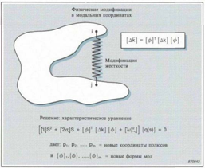

---

## 🏷️ Страница 64
[🔝 Сверху](#top)

## Проведение модификаций

## · Составляющими блоками программы модификаций явля -ются :

Кроме того , могут иметься некоторые составные элементы :

## · Программное обеспечение

Комплект программ для модификаций конструкций пред -оставляет в распоряжение пользователя универсальный ин -струмент , который может быть использован многими спосо -бами . Непосредственное применение было уже обсуждено , но имеется также возможность работать с другого направле -ния . Можно ввести набор требуемых модальных частот и с помощью ЭВМ провести расчет необходимых модификаций .

---

## 🏷️ Страница 65
[🔝 Сверху](#top)

## · Моделирование физических модификаций

Практические модификации не могут быть моделированы в виде точечных масс или пружин , не обладающих массой , а они должны быть представлены в виде комбинаций этих ос -новных элементов .

Стержень , приваренный между двумя точками конструкции , может быть при моделировании представлен с помощью од -ного элемента жесткости в направлении продольной оси . Если имеются поперечные перемещения , то два других эле -мента жесткости , перпендикулярных друг другу в горизон -тальной плоскости , приведут к улучшению модели . Так как реальные стержни обладают массой , модель может быть еще улучшена путем введения двух модификаций массы , прида -ющих обеим точкам массу , равную 1/3 физической массы стержня .

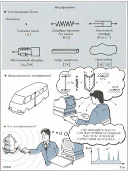

---

## 🏷️ Страница 66
[🔝 Сверху](#top)

## Пример применения синтезированных частотных характеристик

## · Механические колебания судна

При нормальных рабочих условиях на мостике судна возни -кала серьезная проблема снятия показаний с приборов . Не -посредственной причиной этого были слишком сильные ме -ханические колебания мостика .

Анализ сигнала механических колебаний показал , что ам -плитуда увеличивалась по экспоненциальному закону с ро -стом скорости . Спектр механических колебаний указывал на концентрацию энергии при определенной частоте вращения гребного винта . Таким образом было обнаружено , что греб -ной винт был первичным источником механических колеба -ний .

Задача заключалась в определении точки , в которой эта энергия передавалась конструкции судна . Возможными ме -стами передачи энергии были : кормовой ( задний ) подшип -ник ( две степени свободы ), редуктор ( две степени свободы ) или колебания давления , передаваемые корпусу в непосред -ственной близости от гребного винта .

## · Исследования

Было решено провести исследования на базе модальных ис -пытаний с ограниченным числом степеней свободы . Возбу -ждение осуществлялось с помощью вибростенда с эксцен -тричными массами , приваренного к кормовой палубе . Ви -бростенд работал в режиме быстрой развертки частоты , обеспечивая относительно плоское распределение спектраль -ной плотности энергии во время проведения измерений ча -стотных характеристик .

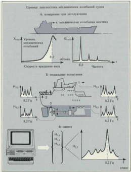

---

## 🏷️ Страница 67
[🔝 Сверху](#top)

Ни одна из замеренных частотных характеристик не по -казала сильных резонансов при критической частоте (8,2 Гц ), даже когда измерения проводились на мостике . Од -нако , возникающие в процессе работы силы не могли воз -действовать на конструкцию на уровне верхней палубы . Поэтому на основе оцененных модальных параметров был проведен синтез частотных характеристик между мостиком и всеми возможными точками передачи энергии . Источник был выявлен после того , как было найдено , что синтезированная частотная характеристика между опорным подшипником и мостиком указала на очень высокую под -вижность при частоте 8,2 Гц .

Изменение жесткости корпуса опорного подшипника приве -ло к уменьшению подвижности в пять раз . Последующие измерения показали , что амплитуда механических колеба -ний уменьшилась почти во столько же раз .

---

## 🏷️ Страница 68
[🔝 Сверху](#top)

## Дополнительная литература

## D. J. EWINS

"Modal Testing: Theory and Practice" Research Studies Press Ltd., Letchworth, Herts, England.

## K. ZAVERI

"Modal  Analysis  of  Large  Structures  -  Multiple  Exciter  Systems" Bruel&Kjxr ВТ 0001-12

Материалы конференции IMAC

"Proceedings of the International Modal Analysis Conference" Union College, Schenectady, N.V. 12308

Журнал Общества экспериментальной механики SEM

"The  International  Journal  of  Analytical  and  Experimental Modal  Analysis" The  Society  for  Experimental  Mechanics, Inc., School Street, Bethel, CT 06801

---

## 🏷️ Страница 69
[🔝 Сверху](#top)

## Обозначения и пояснения

### 📊 Таблица

| AHAJIM3CMTHAJIOB   | AHAJIM3CMTHAJIOB                                                    | @H3MYECKNEIAPAMETPbI   | @H3MYECKNEIAPAMETPbI                                                                                  |
|--------------------|---------------------------------------------------------------------|------------------------|-------------------------------------------------------------------------------------------------------|
| BpeMeHHas O6JIaCTb | BpeMeHHas O6JIaCTb                                                  | m                      | Macca                                                                                                 |
| t                  | BpeMs                                                               | k C                    | KeCTKOCTb KopouneHT3aTyxaHa                                                                           |
| T                  | BpeMeHHaA 3aJep*KKa                                                 |                        | KpuTHuecKHiKOoouuHeHT 3aTyxaHna                                                                       |
|                    | CHrHaJI CHJIbI                                                      | Cc 3                   | yrJOBaa CKOpOCTb                                                                                      |
| x(t) ()            | CHrHaJI nepeMeWeHH CurHaJI CKOpOCTH                                 | MOIAJIbHDIEJIAPAMETPbI | MOIAJIbHDIEJIAPAMETPbI                                                                                |
| x()                | CurHaJIyCKOpeHNA                                                    |                        |                                                                                                       |
| YaCTOTHaA O6JIaCTb | YaCTOTHaA O6JIaCTb                                                  | i                      | CTeneHbCBO6OJbI peaKIINH                                                                              |
| f 3                | =w/2π4acToTa（Tu) =2πf yrJOBa cKOpOCTb HJIH yrJIOBaS uaCTOTa (paz/c) | j m                    | CTeIeHbCBO6OIbI BO36yXeHHA HCJO MON KOJeOaHHH MHJKCMOIICOPKOBbIM HOMePOM                              |
| F(f) X(f)          | CneKTp cHJIbI CneTKp IepeMemeHN                                     | 0m                     | He3aTyxaIo1uIaaco6cTBeHHa yaCTOTa MOCOPKOBIMHOMPOM                                                    |
| AHAJIM3CMCTEM      | AHAJIM3CMCTEM                                                       |                        | 3aTyxaIOHaa cO6cTBeHHa yaCTOTa                                                                        |
| BpeMeHHa8 O6JacTb  | BpeMeHHa8 O6JacTb                                                   | 中                      | MoaJbHoe nepeMeeHHe MacuTa6HpOBaHHbIi BeKTOp 中opMbI                                                   |
| h(t)               | HMnyJIbcHaa xapaKTepuCTHKa                                          |                        | MOJICOPAKOBDIM HOMePOM                                                                                |
| YaCTOTHaA O6JIaCTb | YaCTOTHaA O6JIaCTb                                                  |                        | HeMaCuITa6upOBaHHbIiBeKTOp中OpMbI MOJbICOPIKOBbIM HOMePOM                                              |
| ²(0) H(@)          | OueHKa 中yHKHIHH KOrepeHTHOCTH HacTOTHaa xapaKTepuCTHKa              | qr(t)                  | MOJaIbHa KOOPIHaTA MOJICOPKOBIM HOMe- pOMrKaK yHKIHA BpeMeHH                                          |
| H,(@) H(@)         | OHeHKa yaCTOTHOi xapaKTepHCTHKH OueHKa yacTOTHOi xapaKTepHCTHKH     | Q.()                   | MOnaJIbHa KOOPIHaTA MOICOPIKOBBIM HOMe- POMrKaK ΦyHKHHyaCTOTbl O6O6eHHaA MOJaJIbHaA CHJIaBO BpeMeHHOn |
|                    |                                                                     | r,()                   | 06JIaCTH                                                                                              |

Hpeo6pa3OBaHHeIuJb6epTa

---

## 🏷️ Страница 70
[🔝 Сверху](#top)

## МАТЕМАТИЧЕСКИЕ ОБОЗНАЧЕНИЯ

### 📊 Таблица

| 3A # Im[]   | FeOMeTpHyecKH HIH 中a3OBbIH yron    |
|-------------|------------------------------------|
|             | CyMMa                              |
|             | KOMIUIeKCHO COIIpAKeHHaA BeJIHYHHa |
| +           | MHHMOeyHCJIO                       |
|             | OueHKa                             |
|             | HoMep                              |
|             | MHHMaa yacTb                       |
| Re[]        | eHcTBHTeJIbHaA yaCTb               |
| 门           | MonyJb                             |
|             | HpH6JIM3HTeJIbHO paBHO             |
| α           |                                    |
| * 1         | CBepTKa                            |
| x,y,z       |                                    |
|             | KOOpIMHaTHbIe OCH                  |

### 📊 Таблица

|      | O6O6HeHHa MOJaJIbHaA CHJIa B yaCTOTHOi O6JIaCTH CKOPOCTb 3aTyXaHHA MOJbI CIOPAIKOBbIM HOMePOM r   |
|------|---------------------------------------------------------------------------------------------------|
|      | KOOPHHaTa nOJIOCa MObICOPKOBIM HOMePOM T                                                          |
|      | HOMepOMr                                                                                          |
| Rijr | BIyeT MOIbI C IOpAIKOBbIM HOMepOM I OTH.CTenIe- Hen cBOOOIbIiHj                                   |

## МАТРИЧНЫЕ ЗНАКИ

### 📊 Таблица

| [m]   | MaTpuua Macc                                   |
|-------|------------------------------------------------|
| [k]   | MaTpHua KecTKocTen                             |
| [c]   | MaTpHua KO3oquHeHTOB3aTyxaHuy                  |
| [H]   | MaTpuua yacTOTHbIx xapaKTepHCTHK               |
| [三]   | EIHHHyHaa MaTpuua                              |
| [△M]  | MaTpHua MoJNuuNpoBaHHbIx Macc                  |
| [△C]  | TyXaHNA                                        |
| [△K]  | MaTpHUa MOJH中HuMPOBaHHbIX KeCTKOCTen           |
| [Φ]   | MacuTaHpoBaHHaaMoJaJIbHaMaTpHua MoJen CHCTeMbI |
| [JT   | TpaHCHIOHHPOBaHHaR MaTpHIa                     |

## ЕДИНИЦЫ

### 📊 Таблица

| H   | HbIOTOH    |
|-----|------------|
| M   | MeTp       |
| C   | ceKyHJa    |
| Kr  | KuJIorpaMM |
| Ila | nacKaJib   |

## СОКРАЩЕНИЯ

### 📊 Таблица

| CC   | CTenIeHb CBO6OIbI        |
|------|--------------------------|
| Xh   | YacTOTHaa xapaKTepHcTHKa |

---

## 🏷️ Страница 71
[🔝 Сверху](#top)

Мы надеемся , что в данной публикации Вы смогли найти ответы на многие вопросы и что эти брошюры будут служить Вам в качестве практического пособия . Если Вы имеете дополнительные вопросы , относящиеся к методам или аппаратуре для испытаний констру -кций , просьба обратиться в одно из местных представительств фир -мы Брюль и Къер или написать непосредственно по адресу :

## Броюль и Къер 2850 Нэрум Дания

